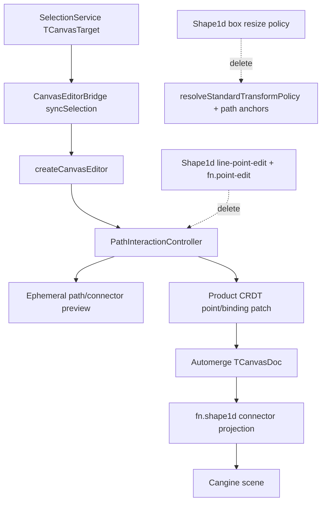

# S115 - canvas: adopt Cangine PathInteractionController for lines/arrows
[Overview](../BASED.md)

Wire `@omnidraw/cangine` 0.2.2 `PathInteractionController` into the canvas
editor bridge, stop forcing box-transform handles on lines/arrows, and delete
the homemade Shape1d point-edit session. Keep Automerge as the only durable
authority; path edits must commit through CRDT projection, not mutate the
engine scene as source of truth.

## Context

Cangine `@omnidraw/cangine@0.2.2` adds path-like selection and point editing
through `@omnidraw/cangine/editor`. The consumer guide is:

- `/Users/omarezzat/Workspace/vibecanvas/canvas-engine/library-guide.md`
- PathInteractionController setup, attach/destroy order, and behavior
- transform policy table: single path/connector uses path-specific anchors;
  multi-selection containing paths/connectors is move/rotate only
- composer note: `paths: {}` (or omit; disable with `paths: false`)

Vibecanvas already vendors
`packages/canvas/vendor/omnidraw-cangine-0.2.2.tgz` and pins it from
`packages/canvas/package.json`. The dependency bump is done. This task adopts
the new controller.

Today the editor stack in
[`CanvasEditorBridge.ts`](../../packages/canvas/src/engine/editor/CanvasEditorBridge.ts)
attaches widgets → contextMenu → editor only. There is no path controller.

Line/arrow vertex editing is still application-owned:

- [`Shape1d.plugin.ts`](../../packages/canvas/src/plugins/shape1d/Shape1d.plugin.ts)
  starts a `line-point-edit` active session on double-click
- [`fn.point-edit.ts`](../../packages/canvas/src/plugins/shape1d/fn.point-edit.ts)
  draws transient vertex/midpoint overlays and previews
- [`active-session/typed.ts`](../../packages/canvas/src/services/active-session/typed.ts)
  includes `"line-point-edit"`
- compatibility matrix marks `point-editing` as canvas-owned `adapter`

Shape1d also overrides transform policy with box handles
(`move` / `rotate` / `resize-ne` / `resize-sw`), which fights Cangine 0.2.2
policy where a single selected path/connector must not get generic box
handles.

Connector projection in
[`fn.shape1d.ts`](../../packages/canvas/src/engine/projection/projectors/fn.shape1d.ts)
builds a manual Catmull-Rom path from CRDT `data.points` and does not round-trip
Cangine `connector.waypoints`. Elbow/midpoint edits from the controller will
not survive Automerge unless projection and persistence are updated.

Pens project as polygons via
[`fn.pen.ts`](../../packages/canvas/src/engine/projection/projectors/fn.pen.ts).
They are out of scope unless explicitly promoted to editable `path` nodes later.

Capsule is unchanged in 0.2.2 and is not part of this task. Do not adopt
`@omnidraw/cangine/integrations/capsule` here. Do not switch the whole bridge
to `createStandardEditorSession` unless a later subtraction needs its other
defaults; keep the existing manual editor composition.

No new product screen. Path editing already exists; this task moves ownership
to Cangine and deletes duplicate code. SCREENS.md needs no new capture unless
path-edit affordances visibly diverge from current line selection.

## Fixed decisions

- Import path APIs only from `@omnidraw/cangine/editor`.
- Keep `createCanvasEditor()` + manual controller composition. Opt into paths
  with `createPathInteractionController`; do not require the standard session
  composer.
- Automerge remains the authoritative document. Path controller previews are
  ephemeral; durable commits must become CRDT line/arrow point (and optional
  binding) patches, then reproject.
- `SelectionService` stays semantic owner. Sync editor node IDs through the
  projection index as today.
- Single selected line/arrow: PathInteractionController owns anchors, point
  resize, rotate, edit mode, midpoint split, and segment mode.
- Multi-selection containing lines/arrows: move/rotate only; no resize.
- Delete homemade `line-point-edit` once the controller covers the same
  product outcomes (vertex move, midpoint insert, endpoint rebinding where
  product still requires it).
- Pens stay polygon-projected and non path-editable in this task.
- Capsule / portal ownership unchanged.

## Plan

### 1. Expose and mount PathInteractionController

- Re-export or wrap `createPathInteractionController` from
  [`CanvasEngineAdapter.ts`](../../packages/canvas/src/engine/CanvasEngineAdapter.ts)
  the same way widgets/menu/context-menu factories are exposed.
- Construct one controller in
  [`CanvasEditorBridge.ts`](../../packages/canvas/src/engine/editor/CanvasEditorBridge.ts)
  with `{ engine, editor, onCallbackError }`.
- Attach order: widgets → contextMenu → **paths** → editor.
- Destroy order: paths before widgets/menu/editor teardown reverse of today.
- Subscribe to `paths.state` / `paths.subscribe` for product cursor composition
  and any segment-mode UI hooks.
- Keep CRDT custom history; do not let path edits use LinearEditorHistory.

### 2. Align transform policy with Cangine 0.2.2

- Remove Shape1d `getTransformPolicy` box-handle override that forces
  `resize-ne` / `resize-sw` on lines/arrows.
- Keep using `resolveStandardTransformPolicy` in
  [`CanvasProductTransformService.ts`](../../packages/canvas/src/engine/product-runtime/CanvasProductTransformService.ts).
- Ensure
  [`fn.selection-policy.ts`](../../packages/canvas/src/plugins/transform/fn.selection-policy.ts)
  and
  [`Transform.plugin.ts`](../../packages/canvas/src/plugins/transform/Transform.plugin.ts)
  do not reintroduce generic resize for single path-like selection or while
  path edit mode is active.
- Verify multi-selection containing connectors: move/rotate only.

### 3. Replace Shape1d point-edit with controller behavior

- Remove double-click → `line-point-edit` session orchestration from
  `Shape1d.plugin.ts`.
- Delete or gut `fn.point-edit.ts` and its transient overlay/preview path.
- Remove `"line-point-edit"` from active-session types and any cancel/conflict
  matrix entries that exist only for that session.
- Preserve line/arrow **creation** via `beginConnector` and existing CRDT
  commit; creation is not replaced by PathInteractionController.
- Preserve endpoint binding semantics if the product still requires them:
  either map controller endpoint attachments into existing binding fields, or
  keep a thin product adapter on commit. Do not leave bindings broken.
- If product UI needs routing modes, wire `paths.setSegmentMode`
  (`straight` | `smooth` | `elbow`) without a second overlay system.

### 4. Round-trip connector geometry through Automerge

- Decide the durable mapping:
  - preferred: keep CRDT `data.points` as authority and project controller
    anchors/waypoints back into points (and bindings); or
  - alternate: store Cangine `waypoints` explicitly if the Automerge schema
    already has a clean place without a breaking schema change.
- Update `fn.shape1d.ts` so projected `TConnectorNode` geometry matches what
  the controller edits, including waypoints when used.
- Ensure commit → reproject → remote peer sees the same vertices.
- Add failure tests for empty/short point lists (existing fallback stays).

### 5. Cursor and session conflicts

- Compose `paths.state.cursor` (`"move" | null`) after widget cursors and before
  tool/transform cursors wherever host cursor is derived today.
- Ensure `CanvasActiveSessionService` / tool cancel paths call
  `paths.exitEditMode()` or destroy/recreate cleanly on tool switch, Escape,
  and remote conflict cancellation.
- Confirm select hit tolerance: if Vibecanvas relies on Cangine standard select
  routing for connectors, keep the 6 CSS-px stroke band; if a custom select
  path bypasses it, port the tolerance or path strokes stay hard to hit.

### 6. Tests, matrix, and docs

- Bridge tests: controller created, attach-before-editor, destroy cleanup.
- Transform tests: single line has no product box resize handles; multi with
  line is move/rotate only; path edit mode suppresses conflicting overlay.
- Shape1d tests: replace homemade point-edit cases with controller-driven
  vertex move, midpoint insert, and durable CRDT assert.
- Update
  [`compatibility.matrix.ts`](../../packages/canvas/tests/canvas-engine/compatibility.matrix.ts)
  `point-editing` from canvas `adapter` to engine-owned compatible (or
  adapter only for binding persistence glue).
- Update internal canvas/cangine docs only where they still claim point editing
  is application-owned.
- Gates:
  - `bun run --cwd packages/canvas test`
  - `bunx tsc -p packages/canvas/tsconfig.json --noEmit`
  - `bun run lint:functional-core:agent`

## TODOS

- [ ] Expose `createPathInteractionController` from `CanvasEngineAdapter`
- [ ] Construct, attach (before editor), subscribe, and destroy paths in `CanvasEditorBridge`
- [ ] Compose `paths.state.cursor` into host cursor policy
- [ ] Remove Shape1d box-handle `getTransformPolicy` override
- [ ] Verify standard + product transform merge for single and multi path-like selection
- [ ] Delete `line-point-edit` session and `fn.point-edit` overlay path
- [ ] Preserve `beginConnector` creation and CRDT line/arrow commit
- [ ] Map controller commits into Automerge points/bindings (and waypoints if needed)
- [ ] Update `fn.shape1d` projection to round-trip edited connector geometry
- [ ] Wire Escape / tool switch / remote cancel to `exitEditMode` or equivalent
- [ ] Optional: `setSegmentMode` product UI for connector routing
- [ ] Update bridge, transform, and Shape1d tests
- [ ] Flip compatibility matrix `point-editing` ownership
- [ ] Update docs that still call point editing canvas-owned
- [ ] Run canvas test, tsc, and functional-core lint gates

## Acceptance criteria

- Selecting one line/arrow shows Cangine path anchors (not generic box resize
  handles) and supports move, point-only resize, rotate, and double-click edit
  with midpoint split.
- Multi-selection that includes lines/arrows allows move/rotate only.
- Vertex and midpoint edits persist through Automerge and appear for remote
  peers after reprojection.
- Homemade Shape1d point-edit session/transients are gone.
- Pens remain unchanged (polygon projection, no path controller).
- No Capsule / `integrations/capsule` changes.
- Artifact pin remains `@omnidraw/cangine@0.2.2` via the vendor tarball.

## NOTES

- Guide text says composer opt-in via `paths: {}`; shipped
  `createStandardEditorSession` enables paths unless `paths: false`. Vibecanvas
  is not on the composer, so explicit `createPathInteractionController` is the
  clear path.
- Do not confuse this with Capsule work (`S114`) or widget-frame adoption
  (`S113`). This is path/connector interaction only.
- Endpoint rebinding is the sharp edge: controller attachments must not silently
  drop existing line/arrow binding fields.

### LOGS

- 2026-07-26: Task created after vendor bump to `@omnidraw/cangine@0.2.2`.
  Investigation found PathInteractionController unused; Shape1d still owns
  point-edit and box-handle policy; connector projection lacks waypoints
  round-trip; Capsule integration unchanged and out of scope.

---
