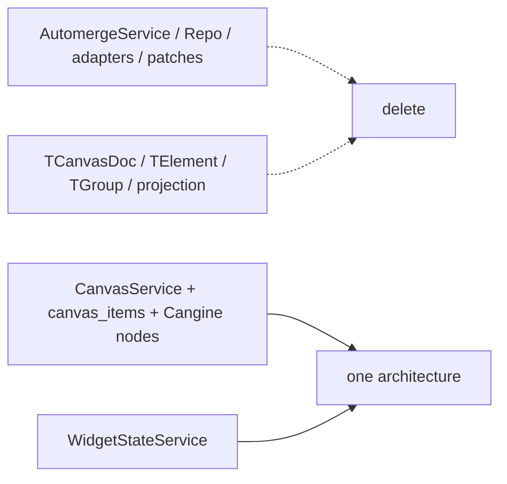

# S116 - canvas: delete Automerge and the parallel element/group architecture
[Overview](../BASED.md)

Immediately after A92 cutover, delete the unused Automerge implementation,
legacy canvas document vocabulary, projection machinery, compatibility
fixtures, and patch tooling.

## Context

The previous S116 waited for a migrated Automerge v2 observation and rollback
window. That condition is removed. There is no deployed data and no
rollback-compatible dual architecture: [`A92`](../a/A92.md) cuts production
composition to CanvasService, then this task removes all dead source.

The retained architecture is:

- `canvas_items` JSONB as current authored state;
- CanvasService as the central authority;
- Cangine nodes as the one geometry vocabulary;
- WidgetStateService as centralized widget JSON state;
- local, bounded, current-user-only history.

## Plan

### 1. Delete Automerge implementation and wiring

- Delete `packages/service-automerge`.
- Delete the server Automerge plugin and all `/automerge` connection handling.
- Delete browser Automerge Repo, IndexedDB, WebSocket, handle/lease/cache, and
  tenant-scope lifecycle code.
- Remove all Automerge dependencies and type imports from applications and
  packages.
- Remove collaboration document/chunk schema tests and obsolete baselines.

### 2. Delete the legacy canvas vocabulary

- Delete `TCanvasDoc`, `TElement`, `TGroup`, their Zod schemas, and legacy
  element discriminator contracts.
- Delete custom CRDT builders, operation application, snapshot hashing, origin
  markers, document diff summaries, and Automerge history tests.
- Delete element/group-to-Cangine projectors, projection signatures,
  persistent projection records, product/derived ID mapping, and compatibility
  placeholders that exist only for the old model.
- Delete migration/exploration adapters that are no longer production or
  ongoing test evidence.

Retain only application-owned widget/resource/portal/gesture policy that now
operates directly on Cangine IDs and canvas item events.

### 3. Remove obsolete patch and package machinery

After proving no `@automerge/*` dependency remains:

- delete `scripts/patch-automerge-repo-throttle.mjs`;
- remove the root postinstall hook;
- remove patch verification from test scripts;
- regenerate the lockfile;
- remove Automerge-specific Vite optimization/configuration;
- update package exports, tsconfigs, FILES.md, architecture docs, and AGENTS
  guidance.

This intentionally satisfies the repository note requiring the patch and hook
to be removed together only after the upstream package is no longer used.

### 4. Prove the subtraction

Add architecture checks that fail on:

- `@automerge/` imports or dependencies;
- `AutomergeService`, `DocHandle`, `CrdtService`, or `/automerge`;
- `automerge_url`, `collaboration_documents`, or `collaboration_chunks`;
- production `TCanvasDoc`, `TElement`, `TGroup`, or legacy projectors;
- whole-canvas JSON hashing/diffing;
- a second geometry or persistence compatibility layer.

Run full repository tests, typecheck, builds, compiled binary smoke,
CanvasService two-client tests, browser canvas/widget qualification, and
performance/leak gates.

## TODOS

- [ ] Confirm A92 production composition and empty-DB acceptance pass
- [ ] Delete `packages/service-automerge` and server/browser Automerge wiring
- [ ] Delete legacy canvas schema/types and CRDT builders/diffs/history glue
- [ ] Delete element/group projection and product/derived ID architecture
- [ ] Remove collaboration schema/tests/baselines
- [ ] Remove all Automerge dependencies and Vite/package configuration
- [ ] Delete throttle patch, root postinstall hook, and patch verification
- [ ] Regenerate lockfile and update exports/config/docs/FILES/AGENTS
- [ ] Add no-Automerge/no-legacy architecture checks
- [ ] Pass repository, binary, browser, widget, performance, and leak gates

## Acceptance criteria

- Repository search finds no production or test dependency on Automerge,
  Automerge Repo, `AutomergeService`, document handles, or the Automerge route.
- Repository search finds no `TCanvasDoc`, `TElement`, `TGroup`, legacy
  projector, whole-document hash diff, or compatibility document adapter.
- Root install has no Automerge patch hook or script.
- One persisted canvas vocabulary (`canvas_items` Cangine nodes), one server
  authority (CanvasService), and one widget state authority
  (WidgetStateService) remain.
- Relevant production concepts and code are materially smaller than the prior
  CRDT/projection baseline.

## NOTES

- This task starts immediately after A92; there is no observation window,
  migration compiler retention, or rollback approval.
- A UI mockup is not useful; deletion proof is architectural and behavioral.

### LOGS

- 2026-07-26: Original delayed legacy-projection deletion task created from E39.
- 2026-07-27: Original plan dropped and replaced in place with immediate
  Automerge and legacy architecture deletion.

---
