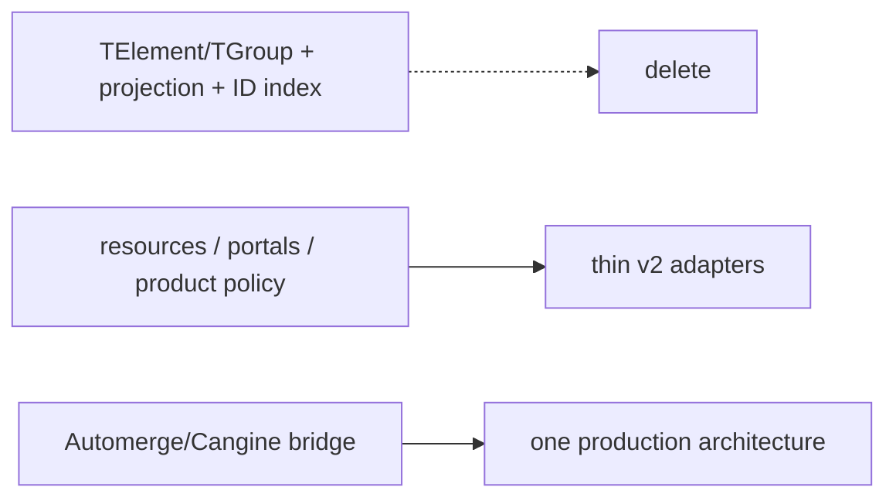

# S116 - canvas: delete the parallel element/group projection architecture
[Overview](../BASED.md)

After v2 cutover and its rollback window, delete the v1 document vocabulary,
runtime projector, derived IDs, custom CRDT diff machinery, and compatibility
fixtures.

## Context

[`E39`](../e/E39.md) counts success only when the system has one persisted
Cangine scene vocabulary and one Automerge bridge. This task follows
[`A92`](../a/A92.md); starting it earlier would remove the migration rollback
path.

The precise disposition is in
[`llm.canvas-document-architecture.md`](../../docs/internal/llm.canvas-document-architecture.md).

## Plan

1. Remove v1 schema/types and old new-canvas initialization.
2. Delete runtime projectors, projection registry/index/signatures/diffs,
   `ProjectionCoordinator`, and `CrdtProjectionService`.
3. Delete element/group snapshot hashing, custom change summaries,
   `fxBuilder`, `tx.apply-ops`, and obsolete history inverses.
4. Remove product/derived ID mappings and product geometry conversion; retain
   only genuinely application-owned gesture/resource/portal/widget policy.
5. Delete migration-only compiler after all supported documents are migrated
   and backups/retention policy permit it.
6. Remove v1 tests/docs/dependencies and verify no legacy type import or
   permanent compatibility branch remains.

## TODOS

- [ ] Confirm A92 observation and rollback window is closed
- [ ] Delete `canvas-doc.*` and all `TElement`/`TGroup` consumers
- [ ] Delete projection registry/index/projectors/signatures/diffs/coordinator
- [ ] Delete custom CRDT hashing/change-summary/op inversion
- [ ] Delete product/derived ID and geometry conversion
- [ ] Simplify retained resources, portals, widgets, and gesture policy
- [ ] Delete migration compiler after final retention approval
- [ ] Remove obsolete fixtures, tests, docs, exports, and dependencies
- [ ] Prove one document vocabulary and one bridge by architecture test

## Acceptance criteria

- Production contains no `TCanvasDoc`, `TElement`, `TGroup`,
  `ProjectionIndex`, element projector, or whole-document JSON hash.
- `service-automerge` is generic and canvas semantics live in
  `canvas-document`.
- There is no runtime v1 adapter, dual write, or old-client compatibility path.
- Relevant production code and concepts are materially smaller than the
  7,229-line CRDT/projection baseline.
- Full tests, typecheck, architecture checks, browser collaboration, and
  performance gates pass.

## NOTES

- Preserve the Automerge Repo negative-timeout postinstall patch until an
  upstream fix is separately verified.

### LOGS

- 2026-07-26: Created as the explicit deletion/exit task from E39.

---
