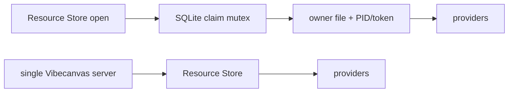

# S117 - resource runtime: remove cross-process Resource Store ownership locks
[Overview](../BASED.md)

Delete the filesystem owner marker, SQLite claim mutex, PID liveness recovery,
and cross-process ownership contract. Vibecanvas runs one server for a data
home, so Resource Store startup should not create or inspect lock artifacts.

## Context

The local Resource Store currently creates
`.vibecanvas-resource-owner` and
`.vibecanvas-resource-owner-claim.db` under each organization's resource root.
[`ResourceOwnerLock.ts`](../../packages/resource-runtime/src/local/ResourceOwnerLock.ts)
records an owner ID, PID, token, and claim time, then rejects a second live
process with `RESOURCE_OWNER_CONFLICT`.

This protects a deployment model Vibecanvas does not support: two servers
opening the same `VIBECANVAS_HOME`. Production composition already has one
server and one Resource Service owner for its data. The filesystem fence adds
startup/recovery code, public configuration, tests, persistent artifacts, and
failure modes without serving a valid topology.

The problem is especially visible in Codex worktrees. Their setup copies
`.vibecanvas`, so a copied owner marker can name a PID that is alive in the
source checkout even though the worktree has an independent resource directory.
The resulting `RESOURCE_OWNER_CONFLICT` is false.

Relevant surfaces:

- [`ResourceOwnerLock.ts`](../../packages/resource-runtime/src/local/ResourceOwnerLock.ts)
- [`ResourceStoreService.ts`](../../packages/resource-runtime/src/local/ResourceStoreService.ts)
- [`ResourceService.ts`](../../apps/cli/src/services/ResourceService.ts)
- [`resource-owner-lock.test.ts`](../../packages/resource-runtime/tests/resource-owner-lock.test.ts)
- [`ResourceServiceOwnership.test.ts`](../../apps/cli/tests/ResourceServiceOwnership.test.ts)
- [`environment.toml`](../../.codex/environments/environment.toml)
- [`m4-resource-runtime.md`](../../docs/internal/baselines/m4-resource-runtime.md)

## Plan

### Delete cross-process ownership

- Delete `ResourceOwnerLock.ts`, its fixture, and its focused tests.
- Remove `ResourceOwnerLease`, `claimResourceOwner`, and related exports.
- Remove the `root` and `ownerId` fields from `TResourceStoreServiceConfig`
  when they are no longer used by the Store.
- Construct `ResourceStoreService` directly without filesystem setup,
  PID probing, fencing tokens, stale-lock quarantine, or a claim database.
- Remove `RESOURCE_OWNER_CONFLICT` from the public resource error vocabulary.
- Do not replace the deleted mechanism with another file, socket, PID, SQLite,
  or process-wide ownership lock.

### Simplify service lifecycle

- Remove the scoped owner-ID construction from CLI `ResourceService.start()`.
- Preserve process-local start/stop state checks, call quiescing, draining,
  provider closure, and retry after a failed close.
- Use an existing lifecycle/provider error where an invalid transition still
  needs to fail; do not describe provider-close failures as retained ownership.
- Treat one server per `VIBECANVAS_HOME` as a composition invariant rather than
  a Resource Store responsibility.

### Remove obsolete tests, setup, and documentation

- Delete tests that race contenders, inspect owner records, simulate stale
  PIDs, or require a second same-root Store to be rejected.
- Rewrite close-failure coverage around provider cleanup and lifecycle retry,
  without starting a competing Store against the same data.
- Remove ownership assertions from CLI integration and resource-runtime
  baselines while preserving WAL recovery, write serialization, drain, and
  descriptor-isolation evidence.
- Remove the temporary worktree `rsync` owner-marker exclusion because no
  runtime owner artifacts remain to copy.
- Update `FILES.md` and repository documentation.

## TODOS

- [x] Delete ResourceOwnerLock implementation, fixture, tests, and exports
- [x] Remove owner/root configuration from ResourceStoreService
- [x] Remove CLI owner-ID construction and cross-process startup errors
- [x] Remove `RESOURCE_OWNER_CONFLICT` from the resource error contract
- [x] Preserve in-process lifecycle, drain, close, and retry behavior
- [x] Rewrite ownership-oriented Store and CLI tests
- [x] Remove ownership claims from resource-runtime documentation
- [x] Remove the worktree owner-marker copy exclusion
- [x] Update FILES.md and pass affected package/CLI checks

## Acceptance criteria

- Repository search finds no `.vibecanvas-resource-owner`,
  `.vibecanvas-resource-owner-claim.db`, `ResourceOwnerLock`,
  `ResourceOwnerLease`, `claimResourceOwner`, or
  `RESOURCE_OWNER_CONFLICT`.
- Starting a Resource Store creates no ownership or claim files.
- Resource Store configuration has no root path or owner identity used only
  for cross-process fencing.
- CLI composition documents and assumes exactly one server per
  `VIBECANVAS_HOME`; the resource runtime does not enforce unsupported
  multi-server access.
- Shutdown still rejects new work, drains admitted work, closes providers, and
  supports a clean retry after a provider-close failure.
- Existing resource persistence, WAL recovery, per-resource write
  serialization, placement checks, and capability checks continue to pass.

## NOTES

- This is an intentional topology simplification, not a replacement locking
  design.
- A UI mockup is not useful because this task removes runtime and filesystem
  coordination with no user-interface change.

### LOGS

- 2026-07-27: Task created after a copied live owner marker caused a false
  conflict in a Codex worktree.
- 2026-07-27: Deleted the cross-process owner implementation and artifacts,
  removed Store owner/root configuration and the public conflict code, and
  switched CLI construction to a direct process-local Store.
- 2026-07-27: Reworked Store and CLI shutdown coverage around drain, provider
  cleanup retry, and lifecycle conflict behavior; updated runtime baselines,
  the worktree setup, and `FILES.md`.
- 2026-07-27: Passed `bun run test:resource-runtime`, resource-runtime/CLI/
  service-db TypeScript checks, `bun run lint:functional-core`,
  `git diff --check`, and the forbidden-symbol repository audit.

---
