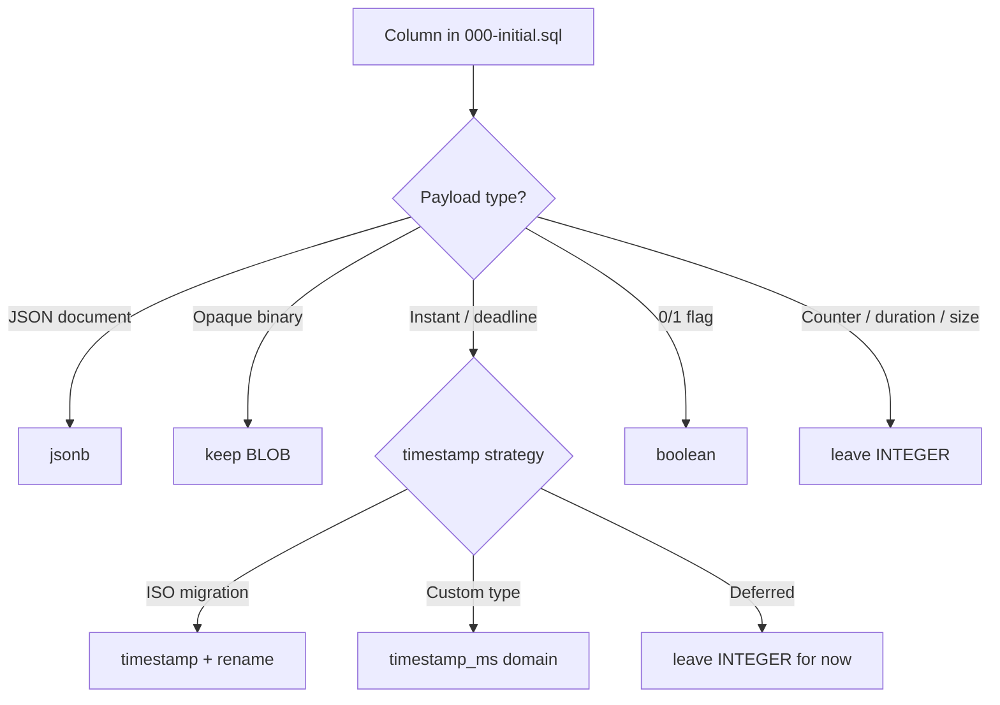

# S120 - db: adopt Turso JSONB for canvas and widget-state payloads
[Overview](../BASED.md)

Adopt Turso `JSONB` for `canvas_items.item_json` and
`widget_instance_states.state_json`, keep the other JSON storage contracts
unchanged, and normalize built-in SQL type names to uppercase. Edit the
existing SQL files only (no new migrations).

## Context

Host schema lives in [`packages/service-db/src/migrations/000-initial.sql`](../../packages/service-db/src/migrations/000-initial.sql). Migrations `001`–`003` are unreleased ledger placeholders that point back to `000-initial.sql`.

Tables are already `STRICT`. Several columns still use plain SQLite storage classes instead of Turso built-ins documented at [Turso built-in custom types](https://docs.turso.tech/sql-reference/data-types#built-in-custom-types):

| Legacy type | Target built-in | Notes |
| --- | --- | --- |
| `BLOB` (JSON payloads) | `jsonb` | Binary JSON; validated at storage layer |
| `JSON` | `jsonb` | Same payload semantics; prefer one JSON column type |
| `INTEGER` (epoch-ms instants) | `timestamp` | Turso `timestamp` is ISO 8601 TEXT, not epoch ms |
| `boolean` / `INTEGER` 0/1 flags | `boolean` | Built-in 0/1 integer constraint |

**In scope for `JSONB`**

- `canvas_items.item_json`
- `widget_instance_states.state_json`

**Out of scope for `JSONB`**

- Existing `JSON` columns — retain their current text JSON contract
- `key_values.blob_value` — opaque binary KV payload
- `resource_encryption_keys.key_material` — fixed 32-byte key material
- `media_files.data` — raw image bytes

**Timestamp columns**

Roughly 130 `*_ms` instant/deadline columns (`created_at_ms`, `updated_at_ms`, `applied_at_ms`, `expires_at_ms`, etc.) are `INTEGER` today. Application code reads/writes epoch milliseconds via [`packages/service-db/src/DbServiceTurso/`](../../packages/service-db/src/DbServiceTurso/) helpers such as `fnTimestampFromMs`.

Turso's built-in `timestamp` stores ISO 8601 datetime strings. Pick one approach before editing SQL:

1. **Storage migration** — rename `*_at_ms` → `*_at`, store ISO strings, update TypeScript row mappers and callers.
2. **Custom ms type** — `CREATE TYPE timestamp_ms ... ENCODE/DECODE` if we must keep millisecond semantics without renaming.
3. **Defer timestamps** — land `jsonb` / `boolean` first if ms ↔ ISO migration is too wide for one pass.

Do **not** retag counters, durations, byte sizes, epochs, or policy integers (`revision`, `timeout_ms`, `cpu_ms`, `placement_epoch`, etc.) as `timestamp`.

**Boolean columns**

Fourteen columns already use `BOOLEAN` (`is_autogenerated`, `allow_read`,
`cold_start`, `billable`, …). Confirm no remaining `INTEGER` 0/1 flag columns.

**Follow-on files (same task, not new migrations)**

- [`packages/service-db/src/schema/expected-schema.ts`](../../packages/service-db/src/schema/expected-schema.ts) — mirrored CHECK strings for `item_json` / `state_json`
- [`packages/service-db/src/CanvasItemStoreTurso.ts`](../../packages/service-db/src/CanvasItemStoreTurso.ts) — `json(item_json)` SELECT casts
- [`packages/service-db/src/WidgetInstanceStateStoreTurso.ts`](../../packages/service-db/src/WidgetInstanceStateStoreTurso.ts) — `json(state_json)` SELECT casts
- [`packages/service-db/src/verification/pinned-runtime-features.test.ts`](../../packages/service-db/src/verification/pinned-runtime-features.test.ts) — feature probe tables
- Service-db tests seeding raw SQL with old column types

## Plan

### 1. Inventory and classify columns

Audit `000-initial.sql` and classify every candidate column:

### 2. Update baseline SQL (in place)

Edit [`000-initial.sql`](../../packages/service-db/src/migrations/000-initial.sql) only:

- Change `canvas_items.item_json` and `widget_instance_states.state_json` from
  `BLOB` to `JSONB`.
- Drop or replace blob-specific CHECKs (`typeof(item_json) = 'blob'`, `json_valid(json(...))`) with jsonb-appropriate constraints.
- Defer timestamp storage changes.
- Uppercase built-in SQL type names, including `BOOLEAN`, `JSON`, and `JSONB`.

### 3. Align application layer

Update stores, row mappers, expected-schema snapshots, and raw SQL in tests to match new column types and any renamed timestamp columns.

### 4. Verify on pinned Turso runtime

Extend [`pinned-runtime-features.test.ts`](../../packages/service-db/src/verification/pinned-runtime-features.test.ts) to assert:

- `jsonb` columns accept direct JSON text binds, reject pre-encoded `jsonb(?)`
  BLOBs, and generated columns still extract `$.kind`
- `BOOLEAN` columns enforce domain constraints; timestamp conversion is deferred
- Fresh baseline migration applies cleanly on a temp database

Run service-db tests and typecheck.

## TODOS

- [x] Audit `000-initial.sql` and record include/exclude list per column.
- [x] Decide timestamp strategy (ISO rename vs custom ms type vs defer).
- [x] Convert `canvas_items.item_json` and
  `widget_instance_states.state_json` from `BLOB` to `JSONB` in
  `000-initial.sql`.
- [x] Update jsonb-related CHECK constraints and generated columns.
- [x] Apply timestamp built-in (or document defer) for instant columns.
- [x] Confirm all flag columns use built-in `BOOLEAN`.
- [x] Sync `expected-schema.ts`, stores, and test fixtures.
- [x] Extend pinned-runtime feature probe and run service-db test suite.

## NOTES

- Raw binary columns stay `BLOB`.
- Existing `JSON` columns stay `JSON`; only `canvas_items.item_json` and
  `widget_instance_states.state_json` move to `JSONB`.
- `json(item_json)` casts in SELECT may become unnecessary once columns are native `jsonb`; verify read paths return the shape callers expect.
- S110 covered Turso domains (`sha256_hex`, status enums); this task is the next pass for built-in storage types.
- JSONB include inventory: `canvas_items.item_json` and
  `widget_instance_states.state_json`.
- BLOB exclusion inventory: `key_values.blob_value`,
  `resource_encryption_keys.key_material`, and `media_files.data`.
- Timestamp strategy: deferred. The pinned runtime rejects epoch-ms integers for
  `timestamp` and normalizes ISO input to second precision, while the current
  application contract depends on millisecond numbers and ordering. Converting
  safely requires the wider rename and TypeScript contract migration described
  in option 1.
- The baseline has 14 flag columns and all use built-in `BOOLEAN`; no
  remaining `INTEGER` 0/1 flag columns were found. Turso requires the two
  boolean-to-true CHECK comparisons to retain `CAST(1 AS BOOLEAN)`.
- Declared `JSONB` columns accept JSON text binds directly and return decoded
  JSON text. Passing `jsonb(?)` pre-encodes a `BLOB` and is rejected by the
  custom-type encoder, so store and fixture writes use raw parameters.

### LOGS

- 2026-07-28: Task created for in-place migration SQL type upgrades (jsonb, timestamp, boolean).
- 2026-07-28: Narrowed the implementation to convert only
  `canvas_items.item_json` to `JSONB`; restored `state_json` to checked `BLOB`
  and every existing `JSON` column to `JSON`.
- 2026-07-28: Expanded the selected JSONB payloads to include
  `widget_instance_states.state_json` and updated its store bindings.
- 2026-07-28: Uppercased built-in SQL type names and updated the canvas store
  bindings, schema manifest/fingerprint, raw SQL fixtures, and pinned runtime
  probe for declared `JSONB`.
- 2026-07-28: Deferred application timestamp conversion because the pinned
  runtime rejects epoch milliseconds and drops fractional-second precision.
- 2026-07-28: Verified 125 service-db tests (1,148 assertions), service-db
  TypeScript, functional-core lint, every configured workspace test,
  external-composition, and architecture checks.

---
