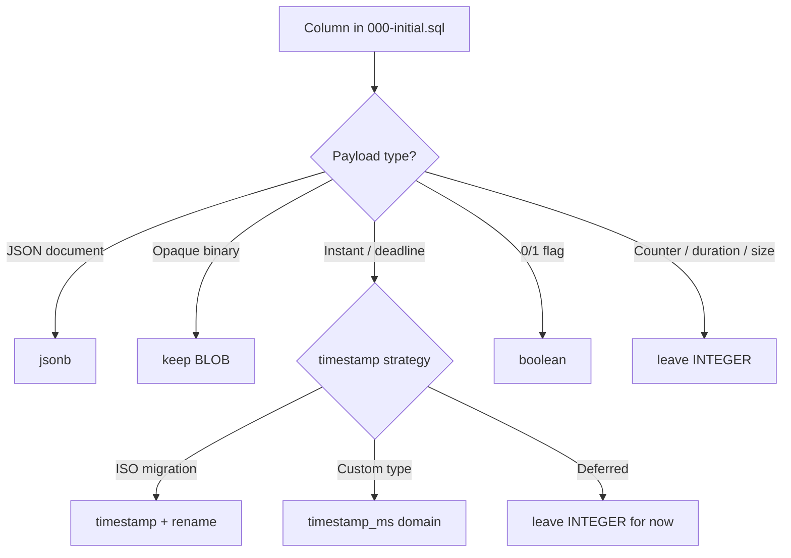

# S120 - db: adopt Turso built-in jsonb, timestamp, and boolean column types
[Overview](../BASED.md)

Replace legacy SQLite storage classes in the baseline migration with Turso built-in types where they fit, editing the existing SQL files only (no new migrations).

## Context

Host schema lives in [`packages/service-db/src/migrations/000-initial.sql`](../../packages/service-db/src/migrations/000-initial.sql). Migrations `001`–`003` are unreleased ledger placeholders that point back to `000-initial.sql`.

Tables are already `STRICT`. Several columns still use plain SQLite storage classes instead of Turso built-ins documented at [Turso built-in custom types](https://docs.turso.tech/sql-reference/data-types#built-in-custom-types):

| Legacy type | Target built-in | Notes |
| --- | --- | --- |
| `BLOB` (JSON payloads) | `jsonb` | Binary JSON; validated at storage layer |
| `JSON` | `jsonb` | Same payload semantics; prefer one JSON column type |
| `INTEGER` (epoch-ms instants) | `timestamp` | Turso `timestamp` is ISO 8601 TEXT, not epoch ms |
| `boolean` / `INTEGER` 0/1 flags | `boolean` | Built-in 0/1 integer constraint |

**In scope for `jsonb`**

- `canvas_items.item_json`
- `widget_instance_states.state_json`
- All `*_json` columns currently declared as `JSON`

**Out of scope for `jsonb` (keep `BLOB`)**

- `kv_entries.blob_value` — opaque binary KV payload
- `secret_store_keys.key_material` — fixed 32-byte key material
- `media_files.data` — raw image bytes

**Timestamp columns**

Roughly 130 `*_ms` instant/deadline columns (`created_at_ms`, `updated_at_ms`, `applied_at_ms`, `expires_at_ms`, etc.) are `INTEGER` today. Application code reads/writes epoch milliseconds via [`packages/service-db/src/DbServiceTurso/`](../../packages/service-db/src/DbServiceTurso/) helpers such as `fnTimestampFromMs`.

Turso's built-in `timestamp` stores ISO 8601 datetime strings. Pick one approach before editing SQL:

1. **Storage migration** — rename `*_at_ms` → `*_at`, store ISO strings, update TypeScript row mappers and callers.
2. **Custom ms type** — `CREATE TYPE timestamp_ms ... ENCODE/DECODE` if we must keep millisecond semantics without renaming.
3. **Defer timestamps** — land `jsonb` / `boolean` first if ms ↔ ISO migration is too wide for one pass.

Do **not** retag counters, durations, byte sizes, epochs, or policy integers (`revision`, `timeout_ms`, `cpu_ms`, `placement_epoch`, etc.) as `timestamp`.

**Boolean columns**

Sixteen columns already use lowercase `boolean` (`is_autogenerated`, `allow_read`, `cold_start`, `billable`, …). Confirm no remaining `INTEGER` 0/1 flag columns; normalize CHECK expressions off `CAST(1 AS boolean)` if the built-in type makes them redundant.

**Follow-on files (same task, not new migrations)**

- [`packages/service-db/src/schema/expected-schema.ts`](../../packages/service-db/src/schema/expected-schema.ts) — mirrored CHECK strings for `item_json` / `state_json`
- [`packages/service-db/src/CanvasItemStoreTurso.ts`](../../packages/service-db/src/CanvasItemStoreTurso.ts) — `json(item_json)` SELECT casts
- [`packages/service-db/src/WidgetInstanceStateStoreTurso.ts`](../../packages/service-db/src/WidgetInstanceStateStoreTurso.ts) — `json(state_json)` SELECT casts
- [`packages/service-db/src/verification/pinned-runtime-features.test.ts`](../../packages/service-db/src/verification/pinned-runtime-features.test.ts) — feature probe tables
- Service-db tests seeding raw SQL with old column types

## Plan

### 1. Inventory and classify columns

Audit `000-initial.sql` and classify every candidate column:

### 2. Update baseline SQL (in place)

Edit [`000-initial.sql`](../../packages/service-db/src/migrations/000-initial.sql) only:

- Change JSON payload columns from `BLOB` / `JSON` to `jsonb`.
- Drop or replace blob-specific CHECKs (`typeof(item_json) = 'blob'`, `json_valid(json(...))`) with jsonb-appropriate constraints.
- Apply chosen timestamp strategy to instant columns.
- Ensure boolean columns use built-in `boolean` consistently.

### 3. Align application layer

Update stores, row mappers, expected-schema snapshots, and raw SQL in tests to match new column types and any renamed timestamp columns.

### 4. Verify on pinned Turso runtime

Extend [`pinned-runtime-features.test.ts`](../../packages/service-db/src/verification/pinned-runtime-features.test.ts) to assert:

- `jsonb` columns accept `jsonb(?)` binds and generated columns still extract `$.kind`
- `timestamp` / `boolean` columns enforce domain constraints
- Fresh baseline migration applies cleanly on a temp database

Run service-db tests and typecheck.

## TODOS

- [ ] Audit `000-initial.sql` and record include/exclude list per column.
- [ ] Decide timestamp strategy (ISO rename vs custom ms type vs defer).
- [ ] Convert JSON payload `BLOB` / `JSON` columns to `jsonb` in `000-initial.sql`.
- [ ] Update jsonb-related CHECK constraints and generated columns.
- [ ] Apply timestamp built-in (or document defer) for instant columns.
- [ ] Confirm all flag columns use built-in `boolean`.
- [ ] Sync `expected-schema.ts`, stores, and test fixtures.
- [ ] Extend pinned-runtime feature probe and run service-db test suite.

## NOTES

- Raw binary columns must stay `BLOB`; only JSON document columns move to `jsonb`.
- `json(item_json)` casts in SELECT may become unnecessary once columns are native `jsonb`; verify read paths return the shape callers expect.
- S110 covered Turso domains (`sha256_hex`, status enums); this task is the next pass for built-in storage types.

### LOGS

- 2026-07-28: Task created for in-place migration SQL type upgrades (jsonb, timestamp, boolean).

---
