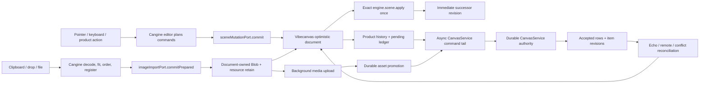

# S121 - canvas: replace recorder persistence with Cangine controlled transactions
[Overview](../BASED.md)

Make Vibecanvas the synchronous local document authority for every Cangine
editor command, keep `CanvasService` as the only durable server authority, and
reduce Cangine to command planning, interaction, resources, and rendering.

## Context

Cangine `0.2.4` adds the host boundaries Vibecanvas was missing:

- `IEditorSceneMutationPort.commit()` receives one immutable incremental
  command batch for every durable standard-editor action.
- `IEditorImageImportPort.commitPrepared()` receives the same mutation request
  plus final `TImageNode`s, intrinsic sizes, MIME types, resource IDs, and
  original `Blob`s after Cangine finishes image preparation.
- A successful port call must synchronously update the host's local document,
  project the exact accepted commands through one `engine.scene.apply()`, and
  return the immediate successor scene revision.
- The port must not wait for upload, server persistence, or collaboration.
  Cangine does not rewrite, retry, or fall back to a direct scene mutation when
  the host rejects the request.

The audited upstream evidence is:

- package `@omnidraw/cangine@0.2.4`;
- upstream commit `d77e343` (`feat(editor): add controlled host mutations`);
- immutable artifact SHA-256
  `b20642d15fa83d7ab9363cc6a3be0e2e608aff077a3bc6abf66cdb206c54c0bd`.

No Cangine change is required. Do not edit Cangine source, generated
declarations, `dist/`, or create a local dependency patch.

### Current ownership is backwards

[`CanvasDocumentService.ts`](../../packages/canvas/src/services/CanvasDocumentService.ts)
currently describes Cangine as the "optimistic authored-scene model":

1. the editor writes `engine.scene`;
2. the Cangine recorder publishes a journal entry after the scene changed;
3. Vibecanvas reconstructs before/after node images from that journal;
4. Vibecanvas diffs those images into `TCanvasOperation`s;
5. an asynchronous command tail sends them to `CanvasService`; and
6. the server acknowledgement is applied to `engine.scene` again.

That makes the rendering layer the first writer and uses the recorder as an
application command bus. It also creates two scene publications for one local
action, makes transaction rejection visible only after Cangine already
accepted the scene, and forces product history to infer intent from renderer
journal output.

Direct product writers bypass even that path:

- [`tx.selection-style.ts`](../../packages/canvas/src/components/SelectionStyleMenu/tx.selection-style.ts)
  calls `engine.scene.transaction()`.
- [`ui-ai-chat/src/canvas-extension/index.ts`](../../packages/ui-ai-chat/src/canvas-extension/index.ts)
  directly writes AI widget payloads, published widget placement, and widget
  close through `engine.scene.apply()` / `transaction()`.

Clipboard image import is disabled in
[`runtime.ts`](../../packages/canvas/src/runtime.ts) because the previous
Cangine controller could not hand a prepared image to a host-owned local
document before committing the scene.

### Required authority model

There are two legitimate Vibecanvas authorities at different durability
levels:

| State | Owner | Meaning |
| --- | --- | --- |
| Current-session optimistic document | Browser `CanvasDocumentService` | The first accepted local state for editor commands and pending image Blobs |
| Durable accepted document | Server `CanvasService` | The only cross-session authority, one authored Cangine node per `canvas_items` row |
| Render projection | Cangine `engine.scene` | An exact synchronous mirror of the browser document, never the source of truth |
| Editor policy | Cangine standard editor | Gesture/tool planning, immutable command batches, selection, previews, and transient interaction |
| Media bytes | Vibecanvas media service | Upload, durable URL, retention, deletion, and retry/cleanup policy |

The browser document must separately track:

- the latest server-accepted revision and item snapshots, including per-item
  revision guards;
- the current optimistic runtime-node map shown to the user;
- pending local transaction records and their affected IDs;
- custom history/coalescing state; and
- locally adopted image Blobs whose server persistence is media-gated.

Conflating the accepted server map with the optimistic map will either make
local rendering wait on the network or make conflict guards describe state the
server has never accepted.

## Plan

### 1. Consume Cangine 0.2.4 as a public dependency

- Update the package and lockfile to the immutable `0.2.4` release.
- Add a consumer contract test importing
  `IEditorSceneMutationPort`, `IEditorImageImportPort`,
  `TEditorSceneMutationRequest`, and `TPreparedImageImportRequest` only from
  `@omnidraw/cangine/editor`.
- Verify the packed release, not an upstream workspace source checkout.
- Delete any local Cangine patch mechanism introduced for B60.
- Do not copy upstream controlled-transaction or image-controller code into
  Vibecanvas.

### 2. Add a small pure local-document command core

Create a deterministic pure reducer beside `CanvasDocumentService` that:

- accepts the current optimistic runtime-node map plus one
  `TEditorSceneMutationRequest`;
- verifies `affectedNodeIds` against the actual command effects;
- applies the exact public serialized command semantics for upsert, remove
  with descendant policy, reparent, and reorder;
- rejects `replace-snapshot` on the incremental path;
- returns a staged successor map plus bounded before/after node images;
- preserves Cangine hierarchy/order semantics for group/ungroup/delete; and
- never touches the engine, transport, resource manager, timers, or globals.

Keep [`fn.scene-node-diff.ts`](../../packages/canvas/src/services/fn.scene-node-diff.ts)
only for the application-to-server edge: convert affected authored before/after
nodes into `insert`, `patch`, `delete`, `reparent`, and `reorder` operations
with the existing value/revision preconditions. Runtime-only root parenting
and widget portal decoration remain explicit projection-edge conversions, not
a second durable node model.

Do not create a generic duplicate of Cangine's editor or scene store. The
reducer exists only because Vibecanvas must own and persist its local document
before Cangine renders it.

### 3. Make `CanvasDocumentService` the controlled mutation port

Implement `IEditorSceneMutationPort` directly on the browser document service.
Its synchronous `commit(request)` must:

1. reject disposal, reentrancy, duplicate transaction IDs, and a
   `basisSceneRevision` different from both the tracked projection revision and
   `engine.scene.revision`;
2. stage the exact commands against the optimistic document through the pure
   reducer;
3. derive the server plan and history step before publishing mutable state;
4. install the staged optimistic state and pending transaction record;
5. call `engine.scene.apply([...request.commands], { source,
   coalesceKey })` exactly once;
6. roll back the staged document, pending record, and unpublished history if
   Cangine atomically rejects projection;
7. record the custom history step only after successful projection;
8. schedule server work without awaiting it; and
9. return `{ projectedSceneRevision: engine.scene.revision }`, which must equal
   `basisSceneRevision + 1`.

Use the existing custom history adapter, but make undo and redo enter the same
local-first document boundary. They may not call `engine.scene.apply()`
independently and then queue persistence as a second step.

Configure `createStandardEditorSession()` with:

- `sceneMutationPort: documentService`;
- `{ kind: "custom", adapter: documentService.history }`; and
- no engine recorder solely for persistence.

Delete the recorder subscription, `TSceneJournalEntry` dependency,
`#onJournalEntry`, excluded recorder-source bookkeeping, and the `record`
engine configuration when no remaining diagnostic consumer requires them.

### 4. Route every product mutation through the same boundary

Replace direct durable scene writes with
`editor.commitSceneMutation({ source, coalesceKey?, commands })`:

- selection style changes;
- AI widget preference/session payload updates;
- published widget placement and any sibling order rebalance;
- widget close/delete;
- future extension tools and commands.

Selection, focus, camera, portals, resources, transients, and previews remain
outside the durable mutation port.

Add an architecture check that permits:

- `CanvasDocumentService` to call `scene.apply()` for accepted local,
  authoritative remote, history, and reconciliation projections;
- bootstrap/resync code to call `scene.replace()`; and
- read-only `engine.scene` access everywhere.

It must reject `scene.transaction()` / `scene.apply()` writes from UI
components and runtime extensions. The document service becomes the one
Vibecanvas scene-projection writer.

### 5. Replace recorder inference with an explicit async pending ledger

One accepted editor request should normally create one pending application
transaction and one `TCanvasCommand`. Keep the network tail asynchronous and
serialized, but make its inputs explicit at port time rather than inferred
from a later scene journal entry.

Each pending record must retain at least:

- Cangine `transactionId`, source, optional coalescing key, and affected IDs;
- the generated Vibecanvas command ID;
- authored before/after images or the already-derived server plan;
- whether it is ready for server persistence or blocked on media; and
- enough rollback/reconciliation data to remove the optimistic effect without
  reading old engine state.

Server reconciliation rules:

- **Own acknowledgement:** advance the accepted revision/item snapshots and
  retire the matching pending entry. Do not project an echo when the
  optimistic node already equals the accepted server node.
- **Canonical difference:** update the browser document first, then project
  only the accepted difference once.
- **Disjoint remote event:** update accepted state, then optimistic local state,
  then Cangine. Do not overwrite IDs covered by an unresolved local mutation.
- **Overlapping remote event or command rejection:** use one explicit
  conservative policy—reload the authoritative snapshot, invalidate dependent
  pending entries, reconcile the browser document before Cangine, clear
  incompatible history, and notify the user. Never silently mark the rejected
  local action durable.
- **Revision gap / `resync-required`:** serialize resync against the command
  tail; do not replace the scene while a synchronous port commit is active.
- **Subscription echo:** ignore an event already accepted through the execute
  response by revision/command ID.

Cangine's no-retry rule applies to the synchronous editor dispatch. The
application may manage its later server outbox, but it must not rewrite the
already-rendered editor command and pretend Cangine accepted a different local
transaction.

### 6. Adopt prepared images as local-first, media-gated transactions

Enable the Cangine clipboard controller and construct the Cangine image-drop
controller for drop/file-picker input. Pass the same document-owned
`IEditorImageImportPort`; do not add local clipboard parsing, decode, fit,
offset, order, or node-factory logic.

`commitPrepared(request)` must synchronously:

1. validate one unused import ID and the mutation/image-node correspondence;
2. adopt the original `Blob`s into document-owned pending media state;
3. establish any independent resource retain needed after the controller
   releases its temporary registration;
4. apply `request.mutation` through the same staged local mutation primitive;
5. mark the pending transaction media-blocked;
6. schedule upload work only after projection succeeds, without awaiting it;
   and
7. return the exact projected successor revision.

The immediate render uses the Cangine-prepared Blob/resource; it must not wait
for `uploadImage()`. Pending image move/resize/style changes update the
optimistic document immediately but remain dependent on the image's first
durable insert.

After upload succeeds:

- promote the stable image `resourceId` to a durable resource descriptor by
  writing a minimal validated `extensions["vibecanvas:image"]` record containing
  schema version, durable URL, and MIME type;
- perform that promotion through the same local-first document primitive,
  excluded from user history, rather than writing the scene directly;
- keep the current session's prepared Blob resource alive so promotion cannot
  cause a blank frame;
- on reload, derive the Cangine URL descriptor from that extension through one
  document registration owner;
- collapse the pending image creation and any local edits into a complete
  server-valid insertion/update sequence; and
- release preparation ownership only after document/resource ownership is
  established.

The Cangine `resourceId` stays a stable identifier; do not encode a mutable or
signed transport URL as resource identity.

If upload fails or the pending insertion is cancelled:

- never persist a source-less `canvas_items` row;
- roll back the pending local image transaction and dependent edits through
  the document boundary;
- release the Blob/resource ownership;
- delete any partially uploaded media through the existing image port; and
- report one useful error.

This preserves [B45](../b/B45.md). Do not solve reversible backend-media
deletion by hard-deleting the file from a live history entry; [B55](../b/B55.md)
continues to own that retention/undo decision.

### 7. Subtract obsolete adapters and prove the boundary

Delete code whose only purpose was:

- treating the Cangine recorder as the persistence command bus;
- diffing a scene only after an editor action already committed;
- replaying the server's echo of the same local action into Cangine;
- bypassing the document service from style/widget product features; or
- locally recreating Cangine image extraction, decode, fit, placement,
  ordering, and controller cleanup.

Retain only Vibecanvas-specific functions for:

- local document command application and application-to-server conversion;
- server preconditions, accepted revision state, pending/reconciliation policy;
- custom history/coalescing;
- media upload/promotion/cleanup;
- resource descriptor projection from durable application metadata; and
- product widget/portal business behavior.

## TODOS

- [x] Pin and verify `@omnidraw/cangine@0.2.4`; add no Cangine patch.
- [x] Add the pure optimistic-document serialized-command reducer.
- [x] Split server-accepted item state from optimistic local node state.
- [x] Implement `IEditorSceneMutationPort` with synchronous atomic projection.
- [x] Route undo/redo through the same local-first mutation primitive.
- [x] Install `sceneMutationPort` on the standard editor session.
- [x] Remove recorder-driven persistence and the engine `record` requirement.
- [x] Route selection-style and AI/widget extension mutations through
      `editor.commitSceneMutation`.
- [x] Add a direct-scene-writer architecture guard.
- [x] Add the explicit pending command/ack/remote/conflict ledger.
- [x] Implement `IEditorImageImportPort` Blob adoption and resource ownership.
- [x] Enable Cangine clipboard, drop, and file-picker image controllers.
- [x] Add durable image asset metadata and background upload promotion.
- [x] Remove duplicate Vibecanvas image preparation/orchestration.
- [x] Cover local-first timing, rollback, history, ack echo, remote events,
      resync, pending image edits, upload success/failure, and reload.
- [x] Run canvas, canvas-contract, service-canvas, ui-ai-chat, frontend
      typechecks/tests, functional-core lint, production build, and focused
      browser interaction verification.
- [x] Record deleted code and final authority evidence in this task.

## Acceptance criteria

- Every durable standard editor action reaches exactly one synchronous
  Vibecanvas port and one immediate Cangine scene successor revision.
- A transform uses Cangine transient preview during drag and performs no
  server write per pointer move; pointer-up updates the local document and
  render layer before network completion.
- `CanvasDocumentService`, not Cangine, is the first local writer; `CanvasService`
  remains the only durable server writer.
- Cangine recorder output is not used to infer persistence or product history.
- UI and runtime extensions contain no direct durable Cangine scene writes.
- One local action is not rendered again merely because its server
  acknowledgement arrives.
- Stale basis, engine validation failure, server rejection, remote overlap,
  revision gaps, and teardown have explicit tested outcomes with no false
  durable acknowledgement.
- Clipboard, drop, and file-picker images render from the prepared local Blob
  before upload resolves.
- No source-less image row reaches `CanvasService`; successful upload/reload
  resolves the stable resource ID to its durable media URL.
- Cangine remains unmodified. Vibecanvas consumes only the public `0.2.4`
  package exports.
- The implementation removes the recorder/image/direct-write adapters it
  replaces and does not introduce a second editor, renderer node union, or
  Cangine fork.

## NOTES

- `commit()` and `commitPrepared()` are deliberately synchronous. Returning a
  Promise, awaiting transport, or performing upload before local projection
  violates Cangine's controlled-mode contract.
- Cangine plans exact renderer commands; Vibecanvas owns their application
  meaning, history, pending status, server conversion, and durable outcome.
- The browser optimistic document is authoritative only for the current
  session. It does not outrank a server rejection or make an unuploaded Blob
  durable.
- Keep engine bootstrap/resync replacement separate from incremental editor
  transactions. `replace-snapshot` is not accepted through the controlled
  port.
- No UI mockup is needed. The ownership/data-flow diagram and executable
  transaction ordering are the relevant design artifacts.

### LOGS

- 2026-07-28: Audited Vibecanvas against Cangine `0.2.4`. Confirmed the new
  controlled scene and prepared-image ports eliminate the need for the
  provisional Cangine patch and allow recorder persistence to be removed.
- 2026-07-28: Superseded B60's remaining image adapter work with this broader
  local-first authority migration.
- 2026-07-28: Pinned all consumers and `bun.lock` to the packed public
  `@omnidraw/cangine@0.2.4` release. Verified its source artifact at SHA-256
  `b20642d15fa83d7ab9363cc6a3be0e2e608aff077a3bc6abf66cdb206c54c0bd`
  and added a consumer test that resolves the compiled `dist/editor` entrypoint
  rather than an upstream workspace checkout.
- 2026-07-28: Replaced recorder inference with `fnReduceLocalDocument()` and a
  controlled `CanvasDocumentService` implementation. The service now separates
  accepted rows from optimistic runtime nodes, projects one synchronous scene
  successor, records custom history afterward, and feeds an explicit
  media-aware pending ledger.
- 2026-07-28: Reconciliation now validates acknowledgement targets, suppresses
  equal own echoes, merges disjoint remote rows, clears incompatible history,
  and enters a write-blocked retry loop on rejection, overlap, revision gaps,
  malformed structural results, registration failure, or `resync-required`.
  Epoch invalidation lets resync proceed around a hung request; outcome-uncertain
  image media remains retained until any late committed event is reconciled.
- 2026-07-28: Added `extensions["vibecanvas:image"]` schema/version/URL/MIME
  validation, prepared Blob retention, background upload promotion by stable
  resource ID, dependent image-command gating, reload URL registration, and
  cleanup tests including clone, partial-upload, reload-failure, late-success,
  and teardown cases.
- 2026-07-28: Deleted the recorder subscription, `TSceneJournalEntry`
  reconstruction path, excluded-recorder-source bookkeeping, recorder-derived
  history/outbox adapter, engine `record` configuration, direct
  selection/widget scene writers, and the disabled clipboard-image
  configuration. Clipboard, drop, and file-picker input now use Cangine's
  public prepared-image controllers; no local extraction/decode/fit/order
  implementation was added.
- 2026-07-28: Final authority scan and AST guard confirm that production
  `scene.apply()` / `scene.replace()` calls exist only in
  `CanvasDocumentService`; selection style, AI payload, widget placement/order,
  and widget close all enter `editor.commitSceneMutation()`.
- 2026-07-28: Validation passed: canvas 75 tests, canvas-contract 8,
  service-canvas 12, service-db 126, ui-ai-chat 205, frontend 42,
  architecture 12; all five
  requested TypeScript checks; functional-core lint; `git diff --check`; and
  the four-target production build.
- 2026-07-28: Review fixes require durable image descriptors at the service
  boundary, invalidate local history across remote ancestor/descendant changes,
  and make ordinary local reductions copy-on-write without scanning untouched
  document rows.
- 2026-07-28: Final review fixes enforce one durable URL/MIME descriptor per
  image resource across untouched rows, restrict prepared-image batches to new
  image upserts plus Cangine's existing-sibling reorders, and maintain
  incremental image reachability/descriptor indexes so ordinary commits do not
  scan the optimistic document or replace resource registrations.
- 2026-07-28: Browser verification on a fresh local home created a rectangle,
  applied and repeated a selection-style color change without errors, reloaded
  the page with the styled rectangle durably restored, and verified the image
  picker opens a multiple-file chooser backed by a hidden input accepting only
  JPEG, PNG, GIF, and WebP. The page reported no browser console errors.

---
