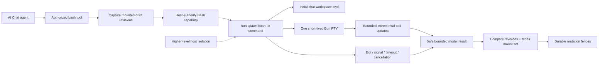

# S122 - agent: restore host-authority Bash with Bun PTY
[Overview](../BASED.md)

Replace the permanently unavailable AI Chat Bash stub with a real Bun-powered
host command capability. Start every command in the conversation workspace,
stream bounded PTY output to the agent, preserve authorization and durable
widget mutation fences, and keep process confinement outside this layer.

## Context

S85 established the intended cooperative local-user trust model:

- Bash starts in the chat workspace;
- `cwd` is a starting directory, not a filesystem sandbox;
- relative traversal, absolute paths, subprocesses, inherited executable
  lookup, and host network access are allowed; and
- any filesystem, process, data, or network confinement is owned by a
  higher-level host boundary.

That contract regressed during the neutral authoring cutover. The current
surface always registers `bash`, but production cannot execute it:

- [`AgentService.ts`](../../packages/service-agent/src/AgentService.ts) accepts
  an optional `bashCapability` and forwards it to every chat tool registry.
- [`ToolRegistry.ts`](../../packages/service-agent/src/tools/ToolRegistry.ts)
  always registers `bash`, including when no capability exists.
- [`tool.bash.ts`](../../packages/service-agent/src/tools/tool.bash.ts) returns
  `BASH_UNAVAILABLE` when the optional capability is absent.
- [`setup-services.ts`](../../apps/cli/src/setup-services.ts) creates the
  production `AgentService` without providing `bashCapability`.
- No production implementation of `TAgentBashCapability` exists. Tests inject
  only synthetic runners.

The current capability comments incorrectly require this layer to confine
commands to the chat workspace even though
[`CONSTANTS.ts`](../../packages/service-agent/src/tools/CONSTANTS.ts) and S85
state the opposite trust model. This contradiction is why the production host
never supplied a runner.

Bun 1.3.14 provides the required process primitives:

- `Bun.spawn()` accepts an explicit `cwd`, environment, `AbortSignal`, timeout,
  and kill signal;
- the `terminal` option attaches a native PTY on macOS/Linux and ConPTY on
  Windows;
- PTY data is streamed through the terminal callback;
- `proc.exited` remains the authoritative subprocess exit status; and
- the terminal can be explicitly closed after the child settles.

Reference:
<https://bun.com/docs/runtime/child-process#terminal-pty-support>.

S103 removed the persistent canvas terminal service, PTY API, SQL metadata, and
terminal widget. Do not restore any of those systems. Agent Bash is one
short-lived child process and PTY per tool call, owned entirely by the calling
`AgentService`.

No UI mockup is useful. This task repairs a backend tool capability and its
model-visible streaming/result contract.

## Fixed decisions

- Agent Bash deliberately has the same filesystem, process, environment, and
  network authority as the Vibecanvas host process.
- Higher-level deployment or operating-system isolation owns confinement. This
  capability does not implement a jail, path allowlist, container, network
  filter, or command parser.
- The chat workspace is the initial `cwd` only. `cd ..`, absolute paths,
  symlink traversal, subprocesses, and host commands are allowed.
- Use `Bun.spawn([bash, "-lc", command], { cwd, terminal, signal, timeout })`.
  Pass the command as one Bash program argument; do not interpolate it into a
  second wrapper command.
- Resolve the Bash executable through host executable lookup and return a
  stable actionable error when Bash is unavailable.
- Create one PTY per call. Do not persist terminal sessions or add a PTY
  service, API route, WebSocket protocol, database table, replay buffer, or
  frontend terminal.
- PTY is transport, not authority. It provides TTY behavior and incremental
  combined output.
- Keep the existing 120-second default and 600-second maximum timeout unless
  an implementation test demonstrates that Bun requires a narrower bound.
- Forward caller cancellation and apply the requested timeout at the spawn
  edge. Always await process settlement and close the terminal.
- Bound retained and model-visible output. Continue draining discarded PTY
  data after the retention limit so a noisy child cannot block on output.
- Preserve command exit code, signal, timeout/cancellation state, duration, and
  output-truncation status in the safe model-visible result.
- Preserve the existing per-call authorizer. A denied Bash call must spawn
  nothing.
- Preserve the existing post-command widget revision comparison, durable
  mutation fencing, mount-set repair, and failure aggregation, including when
  the child exits non-zero, times out, or is cancelled.
- Prefer structured `read`, `edit`, `patch`, and `grep` for ordinary widget
  file changes. Bash remains available for builds, tests, package commands,
  formatting, and general host work.
- Protected resource mutations, publication, and approvals remain separate
  authoritative workflows. Shell access must not manufacture a successful
  protected operation result.

## Target architecture

## Plan

### 1. Restore the honest Bash capability contract

- Change `TAgentBashCapability` documentation from “pre-confined” to explicit
  host-authority execution.
- Add the resolved conversation `cwd` to `TAgentBashRunArgs`. The capability
  must not infer a workspace from global process state.
- Pass the registry's exact chat workspace `cwd` into every capability call.
- Keep `command`, timeout, signal, update callback, tool call ID, and extension
  context forwarding.
- Remove `BASH_UNAVAILABLE` as the normal production outcome. Retain a stable
  missing-runtime or missing-executable error for genuinely unsupported hosts.
- Update package guidance and the system prompt so no text claims that Bash is
  confined to mounted widget files.

### 2. Implement the Bun PTY runner at the CLI host edge

- Add one small CLI-owned `TAgentBashCapability` implementation under
  `apps/cli/src/services/`.
- Inject process primitives for tests, but use `Bun.spawn` and `Bun.which` in
  production.
- Resolve `bash`, then spawn it with:
  - `["bash-path", "-lc", command]`;
  - the exact chat workspace `cwd`;
  - inherited host environment;
  - the caller's abort signal;
  - the bounded timeout converted to milliseconds;
  - an explicit termination signal; and
  - one fresh Bun `terminal` configuration.
- Use a streaming `TextDecoder` so UTF-8 split across PTY chunks remains valid.
- Normalize PTY output only as needed for a stable tool result. Preserve useful
  ANSI/TTY behavior during live updates and avoid corrupting carriage-return
  progress output.
- Throttle/coalesce live updates so a high-output process cannot generate an
  unbounded number of model/UI events.
- Retain a bounded output head/tail or another deterministic bounded summary,
  mark truncation explicitly, and continue draining all later PTY data.
- Await `proc.exited`, flush the decoder, publish the final update/result, and
  close the PTY on every exit path.
- Return stable errors for spawn failure and missing Bash. Represent ordinary
  non-zero exits, signals, timeouts, and cancellation with explicit process
  result metadata rather than an unbounded native exception.

### 3. Wire the capability into production composition

- Construct the Bun Bash capability once at the CLI composition edge.
- Pass it into every tenant `AgentService` created by
  `setup-services.ts`.
- Keep chat identity and cwd selection inside `AgentService`; do not give the
  shared capability mutable per-chat state.
- Verify development mode and the compiled Vibecanvas binary resolve and spawn
  Bash consistently.
- Do not add a new runtime service registration unless lifecycle ownership
  proves necessary. A stateless capability with per-call child ownership is
  preferred.

### 4. Preserve the authoring mutation boundary

- Run the existing before/after draft revision capture around the real child
  process, not only test fakes.
- Prove one Bash call changing multiple files in one draft emits one durable
  draft mutation fence.
- Prove changes to multiple mounted drafts fence each changed draft once.
- Preserve mutation fencing after non-zero exit, timeout, cancellation, and
  output truncation.
- Preserve mount-set restoration when a command removes or replaces a
  workspace mount, while reporting the lifecycle violation.
- Keep the bounded mounted-draft limit and serialized draft authoring
  operations.

### 5. Verify real process and PTY behavior

- Add a CLI capability test that proves:
  - `pwd` starts in the exact chat workspace, including a path with spaces;
  - `cd ..` succeeds, documenting that cwd is not confinement;
  - stdout and stderr arrive through the PTY;
  - split UTF-8 output decodes correctly;
  - TTY detection is true inside the child;
  - exit zero and non-zero statuses are reported exactly;
  - timeout and caller cancellation terminate and settle the child;
  - noisy output is bounded, marked truncated, and cannot block completion;
  - live updates are bounded and ordered; and
  - the PTY closes with no retained per-call state.
- Add a production-composition test that obtains Bash through an actual
  `AgentService` registry and no longer receives `BASH_UNAVAILABLE`.
- Preserve authorizer-denial and mutation-fence regressions.
- Add a compiled-binary smoke test if the existing binary harness can execute
  a harmless Bash command without broadening its test authority.

### 6. Update documentation and gates

- Update S85 notes only where they incorrectly describe the now-removed Pi
  adapter; retain its accepted host-authority decision.
- Update `llm.widget-system.md`, service-agent guidance, and prompt text with
  the real Bun Bash behavior.
- Update `FILES.md` if implementation source files are added.
- Run service-agent and CLI tests/typechecks, compiled-mode coverage,
  functional-core lint, architecture tests, and `git diff --check`.

## TODOS

- [ ] Make the Bash capability contract explicitly host-authority.
- [ ] Add exact chat cwd to capability invocation arguments.
- [ ] Implement the short-lived Bun PTY Bash capability.
- [ ] Bound and stream PTY output with exact exit metadata.
- [ ] Forward timeout and cancellation and close every PTY.
- [ ] Inject Bash capability into production `AgentService` composition.
- [ ] Preserve authorization, mutation fencing, and mount-set repair.
- [ ] Add real cwd, traversal, TTY, output, exit, timeout, and cancellation tests.
- [ ] Add production-composition and compiled-binary smoke coverage.
- [ ] Update prompt, architecture documentation, `FILES.md`, and task logs.
- [ ] Run affected tests, typechecks, functional-core lint, and diff checks.

## Acceptance criteria

- A normal AI Chat Bash call no longer returns `BASH_UNAVAILABLE`.
- `pwd` begins in the exact conversation workspace.
- `cd ..` and absolute host paths work; tests and documentation state that cwd
  is not a confinement boundary.
- The child observes a TTY and streams bounded output through Bun's PTY.
- Success, non-zero exit, signal, timeout, cancellation, spawn failure, missing
  Bash, and output truncation are distinguishable in bounded model-visible
  results.
- Authorization denial spawns no process.
- Bash-authored widget changes receive the same durable mutation fences as
  structured file-tool changes, including failure paths.
- No child or PTY remains owned after a completed, failed, timed-out, or
  cancelled foreground command.
- Development and compiled Vibecanvas hosts both provide the capability.
- The persistent PTY service/API/database/frontend removed by S103 remains
  absent.
- Relevant tests, typechecks, architecture checks, functional-core lint, and
  `git diff --check` pass.

## Non-goals

- Filesystem, process, environment, data, or network confinement
- Command allowlists or shell-language parsing
- Container, VM, chroot, namespace, or OS sandbox implementation
- Persistent or reconnectable terminal sessions
- Canvas terminal widgets or terminal UI
- PTY WebSocket/API endpoints or database metadata
- Replacing structured widget/resource tools
- Model-callable approval or publication

## NOTES

- This task restores S85's original trust decision. It does not weaken a
  deployed confinement guarantee; production currently has no Bash runner.
- Bun PTY solves terminal transport and streaming. Higher-level isolation owns
  the security boundary.
- The command runs with host authority by design. Keep that fact obvious in
  types, comments, prompts, and tests.
- A short-lived per-call PTY is compatible with S103. Reintroducing a PTY
  service or terminal product surface is not.

### LOGS

- 2026-07-28: Investigated `BASH_UNAVAILABLE`. Confirmed the fixed registry
  advertises Bash, `AgentService` forwards an optional capability, production
  composition supplies none, and no real capability implementation exists.
- 2026-07-28: Reaffirmed S85's cooperative local-user boundary: chat cwd is a
  starting directory, host traversal is allowed, and higher-level isolation
  owns confinement. Selected one short-lived Bun PTY per command.

---
