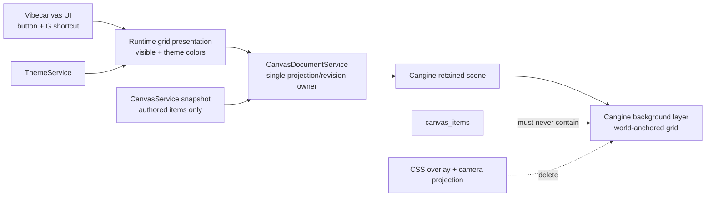

# S126 - canvas: delete the CSS grid and use Cangine background rendering
[Overview](../BASED.md)

Make Cangine the only renderer of the infinite-canvas grid, while Vibecanvas
keeps ownership of the grid button, keyboard shortcut, visibility preference,
and theme choice.

This is a subtraction task. The migration is not complete until the local CSS
grid projection, its camera subscription, its tests, and its obsolete styling
plumbing are deleted.

## Context

[`Canvas.tsx`](../../packages/canvas/src/components/Canvas.tsx) currently
renders the grid as a separate absolutely positioned DOM element above the
canvas host. Vibecanvas:

- subscribes to the Cangine camera solely to trigger Solid updates;
- projects the world origin into viewport coordinates;
- reads camera zoom;
- runs local power-of-two spacing logic in
  [`fn.canvas-grid.ts`](../../packages/canvas/src/components/fn.canvas-grid.ts);
- builds two CSS `linear-gradient` backgrounds; and
- keeps a dedicated test for that duplicate projection.

Cangine `0.3.0` already supports a runtime `background` scene node with a
`grid` definition. Its renderer anchors the grid to world origin and
quantizes the base world interval by powers of two so minor lines remain
between 24 and 96 CSS pixels. That is the same rendering policy currently
implemented by Vibecanvas.

Vibecanvas already treats `background` and `layer` nodes as runtime-only in
[`validation.ts`](../../packages/canvas-contract/src/validation.ts). They
cannot be persisted as authored `canvas_items`. The existing theme model also
already contains `canvasGridMinor` and `canvasGridMajor`; these colors should
feed Cangine directly instead of being exposed as unused DOM CSS variables.

The important boundary is scene authority:

- `CanvasService` remains the only durable canvas authority.
- `CanvasDocumentService` remains the only coordinator of the retained
  Cangine scene projection and its revision.
- The grid background is runtime presentation, never authored canvas data.
- `Canvas.tsx` and theme hooks must not become independent callers of
  `engine.scene.apply()` or `engine.scene.replace()`.

No mockup is useful because the grid control and intended placement do not
change. Browser qualification should compare the actual render across all
built-in themes.

## Target ownership

## Plan

### 1. Define the runtime-only grid contract

- Reserve stable IDs for a runtime background layer and its grid node. Reject
  those IDs from authored canvas items just like the existing synthetic
  content-layer ID.
- Represent the grid as:
  - a root `layer` with role `background` and world coordinate space;
  - one child `background` node with `pointerEvents: "none"`;
  - `background.type: "grid"`;
  - a base `minorSize` of 64 world units;
  - a 1-pixel line-width policy;
  - deliberate minor/major colors from the active theme; and
  - visibility expressed by the runtime node, not DOM display styling.
- Put the background root before the synthetic content root in
  `rootLayerIds`. Keep all authored top-level nodes under the existing content
  layer.
- Add a small pure runtime-scene composition helper beside the document
  projection code. It should take authored nodes plus an explicit grid
  presentation value and return a valid Cangine snapshot.
- Keep the durable validation materializer concerned with authored-item
  validation. Do not make durable contract validation depend on a UI theme.
- Parse theme colors into Cangine `TColor` values through one tested pure
  function. Support the actual color syntax accepted by `TThemeColors`;
  do not read computed CSS or create a hidden DOM color parser.

### 2. Keep one retained-scene writer

- Add one narrow runtime-presentation entry point to
  `CanvasDocumentService`, for example a single
  `setRuntimeGridPresentation({ visible, minorColor, majorColor })` operation.
- Make that entry point:
  - semantic-no-op safe;
  - illegal before start and after disposal;
  - unable to target authored node IDs;
  - unable to enqueue a server command;
  - unable to add a pending transaction or history entry;
  - unable to modify accepted authored items; and
  - responsible for advancing `#projectionRevision` exactly with the Cangine
    scene revision.
- Project a visibility or theme update as one atomic Cangine scene
  transaction through this entry point. Do not expose generic arbitrary
  runtime scene mutation to UI code.
- Include the current runtime background during initial load, full snapshot
  replacement, reconciliation, and recovery so `scene.replace()` cannot
  silently remove it.
- Keep runtime-only layer/background nodes out of durable diff planning,
  preconditions, transport payloads, image indexing, undo/redo, and
  `canvas_items`.
- Ensure editor creation, selection styling, hit testing, marquee selection,
  layer ordering, and deletion cannot select or mutate the background nodes.
- Do not add a second scene writer in `Canvas.tsx`, `ThemeService`, a Solid
  effect, or a runtime extension.

### 3. Wire host-owned visibility and theme policy

- Keep the Floating Canvas Toolbar grid button and its pressed state.
- Keep the `G` keyboard shortcut and current input/focus guards.
- Route both controls to the narrow runtime grid-presentation API.
- Keep grid visibility ephemeral unless a separate product decision adds
  preference persistence. It must not become part of the canvas document.
- Seed the runtime grid from `themeService.getTheme()` during boot.
- Subscribe to `ThemeService.hooks.change` for live minor/major color changes,
  and release that subscription during runtime shutdown.
- Coalesce visibility and theme changes into one presentation update when
  they occur together.
- Preserve the existing canvas surface background. This task moves grid
  rendering, not the page/surface color, into Cangine.

### 4. Delete the replaced Vibecanvas implementation

- Delete
  [`fn.canvas-grid.ts`](../../packages/canvas/src/components/fn.canvas-grid.ts)
  in full.
- Delete
  [`fn.canvas-grid.test.ts`](../../packages/canvas/tests/components/fn.canvas-grid.test.ts)
  in full. Grid spacing, world anchoring, and zoom quantization are now
  Cangine responsibilities and must not be reimplemented in a renamed test.
- Remove the `fnCanvasGridStyle` import and `gridStyle()` projection from
  `Canvas.tsx`.
- Remove the absolute `aria-hidden` CSS-grid overlay element from
  `Canvas.tsx`.
- Remove `cameraRevision`, `setCameraRevision`, `unsubscribeCamera`, the
  camera subscription, and its cleanup after confirming they have no
  non-grid consumer.
- Remove direct `camera.worldToViewport({ x: 0, y: 0 })` and
  `camera.state.zoom` reads that existed only for grid painting.
- Remove grid `background-image`, `background-position`, `background-size`,
  and display styling owned by the deleted overlay.
- Remove `--vc-canvas-grid-minor` and `--vc-canvas-grid-major` from the
  theme-to-DOM CSS-variable export table once Cangine consumes the typed theme
  colors directly.
- Search for and delete stale grid-overlay comments, test fixtures, mocks,
  imports, CSS selectors, and documentation.
- Keep `TThemeColors.canvasGridMinor` and `canvasGridMajor`; they become the
  direct renderer inputs and are not dead theme fields.
- Update [`FILES.md`](../../FILES.md) for every added, moved, and deleted
  implementation file.

### 5. Test the ownership boundary

- Add pure tests for runtime background/layer construction:
  - stable reserved IDs;
  - background root precedes content root;
  - authored roots remain parented to the content layer;
  - grid node is non-interactive;
  - theme colors convert to the expected `TColor`; and
  - malformed theme colors fail explicitly rather than silently changing the
    grid.
- Extend canvas-contract tests to reject both reserved grid IDs and persisted
  `background`/`layer` nodes.
- Extend `CanvasDocumentService` tests to prove:
  - initial snapshot projection includes the runtime grid;
  - visibility and theme updates produce one scene revision;
  - an equal update produces no revision;
  - update/reload/recovery preserves the current grid presentation;
  - no transport command is executed;
  - pending transaction count and history do not change; and
  - authored snapshots returned by the service contain no grid nodes.
- Keep only consumer-level assertions for presence, visibility, colors, and
  revision coordination. Do not duplicate Cangine tests for grid drawing,
  power-of-two zoom quantization, world anchoring, or renderer internals.
- Update component/runtime tests so the toolbar button and `G` shortcut call
  the runtime presentation boundary without relying on a camera event.

### 6. Qualify rendering and reduction

- Run canvas-contract, canvas runtime/component/service tests, typechecks, and
  architecture checks.
- Browser-check light, dark, sepia, and graphite themes at minimum.
- At several pan positions and zoom levels, confirm:
  - grid lines stay anchored to world space;
  - line spacing stays usable;
  - the grid remains behind authored nodes and widget portals;
  - pointer input, picking, marquee, and selection are unaffected;
  - toolbar and keyboard toggles respond immediately; and
  - switching theme updates the retained grid without reload.
- Inspect a CanvasService snapshot and storage write to confirm no runtime
  layer or background node crosses the transport boundary.
- Record deleted and added production/test line counts. The final tree must
  contain no Vibecanvas grid projection algorithm or DOM grid renderer.
- Run `git diff --check` and record exact verification results in this task.

## TODOS

- [ ] Reserve runtime background-layer and grid-node IDs.
- [ ] Add pure runtime scene/background construction and color conversion.
- [ ] Add the narrow document-owned runtime grid presentation boundary.
- [ ] Preserve the runtime grid across load, reconciliation, and recovery.
- [ ] Wire toolbar, `G`, initial theme, and live theme changes.
- [ ] Delete the CSS grid helper and its unit test.
- [ ] Delete the overlay DOM and camera-only subscription/state.
- [ ] Delete obsolete grid CSS-variable exports and stale fixtures/docs.
- [ ] Update `FILES.md`.
- [ ] Add contract, projection, runtime, and UI boundary tests.
- [ ] Run package tests, typechecks, architecture checks, and browser QA.
- [ ] Record storage inspection, verification, and exact code reduction.

## Acceptance criteria

- Cangine is the only code that draws, anchors, spaces, and zoom-quantizes the
  canvas grid.
- Vibecanvas retains only product policy: visibility controls and theme
  values.
- `CanvasDocumentService` remains the single coordinator of the retained
  Cangine scene revision; no UI/theme path writes directly to the scene.
- Runtime grid updates are atomic and semantic-no-op safe.
- Grid nodes never appear in CanvasService commands, snapshots,
  `canvas_items`, pending transactions, or undo/redo history.
- Reload, server reconciliation, recovery, and runtime replacement preserve
  the current runtime grid presentation.
- The toolbar button and `G` shortcut still work, and all built-in themes
  provide their typed minor/major grid colors directly to Cangine.
- The grid cannot be picked, selected, styled, ordered with authored content,
  copied, exported as authored data, or deleted by editor commands.
- `fn.canvas-grid.ts`, `fn.canvas-grid.test.ts`, the CSS overlay element, and
  the camera-only subscription/state are deleted rather than retained behind
  dead code.
- No Vibecanvas function reproduces Cangine's grid spacing, world-origin
  projection, or zoom-quantization algorithm.
- Production ownership is smaller and clearer. Any new projection-boundary
  code is narrowly scoped and the exact deletion/addition totals are logged.
- Tests, typechecks, architecture checks, browser qualification, storage
  inspection, and `git diff --check` pass with results recorded.

## NOTES

- The existing CSS helper paints one undifferentiated grid using a mixed
  `--border` color. Cangine supports minor and major lines, and the theme
  service already defines deliberate colors for both. Use those typed colors
  and browser-approve the intended minor/major result instead of preserving
  the accidental `--border` mix.
- A runtime scene node is still part of Cangine's retained scene, but it is
  not an authored Vibecanvas item. “Runtime-only” is the key distinction.
- The solid canvas surface background remains CSS in this task. It can move
  to a separate Cangine solid background node later if that produces a clear
  ownership or rendering benefit.
- Do not solve this with Cangine transients. Background nodes are retained
  scene nodes, while transients are intended for temporary interaction
  visuals.

### LOGS

- 2026-07-30: Created from candidate 5 of the Cangine ownership audit. The
  audit confirmed that Cangine `0.3.0` already owns the grid rendering
  algorithm and that Vibecanvas's CSS overlay duplicates it.

---
