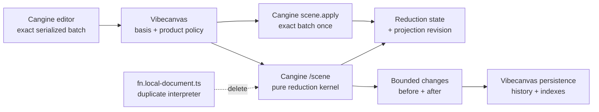

# S127 - canvas: delete the local command reducer and adopt Cangine scene reduction
[Overview](../BASED.md)

Replace Vibecanvas's duplicate serialized-scene-command interpreter with
Cangine's accepted renderer-free reduction API, then delete the superseded
implementation and semantic tests.

## Status and release gate

**Completed on 2026-07-30 against the qualified Cangine 0.4.0 artifact.**

The 0.4.0 release gate was qualified on 2026-07-30. The immutable artifact at
`artifacts/omnidraw-cangine-0.4.0.tgz` has SHA-256
`800c517e3705fddefd4c72bc572ee824310134be8ee7ace4eae727679337f130`;
its packed exports and declarations match the supported `/scene` contract,
and isolated Bun, Node, TypeScript, browser-bundle, and node-bundle consumers
passed.

The qualified artifact is now published to the configured Vibecanvas local
registry as 0.4.0. Its registry SHA-512 matches the package metadata and
`bun.lock`; all active workspace consumers resolve that exact version.

The release gate required all of the following:

- a released `@omnidraw/cangine` package exports the supported API from
  `@omnidraw/cangine/scene`;
- the release documentation defines the final reduction types, validation,
  no-op, replacement, and revision behavior;
- the package states that the reducer and `ISceneStore.apply()` use the same
  exhaustive private transition kernel;
- the two open integration questions in this task are answered; and
- the released version passes Vibecanvas's normal package consumer/type
  resolution.

Do not use private Cangine paths, an unreleased checkout, or copied source to
fill the production API.

## Context

Cangine's controlled editor sends Vibecanvas an immutable
`TEditorSceneMutationRequest`. Vibecanvas must synchronously accept the exact
`TSerializedSceneCommand[]` batch into its optimistic document before
projecting it exactly once through `engine.scene.apply()`.

Cangine 0.3.0 does not expose a pure command reducer. Vibecanvas therefore
duplicates Cangine's command semantics in:

- [`fn.local-document.ts`](../../packages/canvas/src/services/fn.local-document.ts):
  351 lines of production code; and
- [`fn.local-document.test.ts`](../../packages/canvas/tests/services/fn.local-document.test.ts):
  289 lines of semantic tests.

That local code interprets command ordering, upserts, reparenting, reordering,
subtree removal, descendant reparenting, missing nodes, child indexes,
immutable cloning, net no-ops, deterministic affected IDs, and bounded
before/after images. It can drift whenever Cangine adds a command or changes
an edge case.

The feature request in
[`cangine-feature-request-pure-serialized-command-reducer.md`](../../docs/internal/cangine-feature-request-pure-serialized-command-reducer.md)
was accepted by the Cangine team. They selected an opaque persistent immutable
state backed by the same private transition kernel as `ISceneStore.apply()`.
This is the correct upstream ownership: Cangine owns the meaning of Cangine
commands; Vibecanvas owns persistence, collaboration, product history,
authorization, transaction IDs, retries, and networking.

No mockup is useful because this is an internal authority and code-reduction
change with no intended visual behavior change.

## Accepted upstream contract

The planned renderer-free import is:

```ts
import {
  createSceneReductionState,
  reduceSerializedSceneCommands,
  sceneReductionStateSnapshot,
} from "@omnidraw/cangine/scene";
```

The planned public contract is:

```ts
export interface TSceneReductionOptions {
  readonly validationLimits?: Partial<TSceneValidationLimits>;
  readonly threeDLimits?: Partial<TThreeDLimits>;
}

export interface TSceneReductionState {
  get(nodeId: TNodeId): Readonly<TSceneNode> | null;
  has(nodeId: TNodeId): boolean;
  childrenOf(
    parentId: TNodeId | null,
  ): readonly Readonly<TSceneNode>[];
}

export interface TSceneNodeChange {
  readonly nodeId: TNodeId;
  readonly before: Readonly<TSceneNode> | null;
  readonly after: Readonly<TSceneNode> | null;
}

export type TSerializedSceneCommandReduction =
  | Readonly<{
      mode: "incremental";
      state: TSceneReductionState;
      changes: readonly TSceneNodeChange[];
    }>
  | Readonly<{
      mode: "replacement";
      state: TSceneReductionState;
      changes: readonly TSceneNodeChange[];
      beforeSnapshot: TSceneSnapshot;
      afterSnapshot: TSceneSnapshot;
      threeDChanged: boolean;
    }>;

export function createSceneReductionState(
  snapshot: TSceneSnapshot,
  options?: TSceneReductionOptions,
): TSceneReductionState;

export function reduceSerializedSceneCommands(
  current: TSceneReductionState,
  commands: readonly TSerializedSceneCommand[],
): TSerializedSceneCommandReduction;

export function sceneReductionStateSnapshot(
  state: TSceneReductionState,
): TSceneSnapshot;
```

Re-audit the released declarations before implementation. The code above is
the accepted planned contract, not permission to recreate missing exports
inside Vibecanvas.

The upstream team also committed to these semantics:

- the reduction state is nominal, immutable, indexed, and package-owned;
- validation and 3D limits are fixed when a state is created and inherited by
  descendant states;
- commands execute in array order and the entire batch is atomic;
- `changes` contains each net-changed 2D node exactly once in deterministic
  node-ID order;
- creation uses `before: null`, and removal uses `after: null`;
- equal writes, missing removals, create-then-remove, and
  change-then-restore are omitted;
- a complete semantic no-op returns the exact input state object;
- `changes.map(change => change.nodeId)` is the authoritative net-changed ID
  list;
- replacement includes original/final snapshots and `threeDChanged`;
- state handles are not structured-cloneable; snapshot serialization is the
  worker/process transfer boundary;
- the `/scene` subpath loads no editor, DOM, canvas, GPU, renderer, portals, or
  engine lifecycle; and
- the reducer and retained scene store share one exhaustive private command
  transition kernel.

## Resolved integration questions

The final 0.4.0 contract and qualified upstream integration answer the two
questions:

1. **Semantic no-op revision:** `ISceneStore.apply(commands)` does not advance
   `scene.revision` for a complete semantic no-op. The controlled editor
   requires every successful receipt to represent exactly one successor
   revision, so Vibecanvas must reject a no-op request before document
   acceptance and projection. It must not create persistence, pending state,
   or history for that request.
2. **Runtime-only scene changes:** The reduction state must be created from
   and advanced with the complete retained snapshot paired to
   `engine.scene.revision`. In Vibecanvas today that includes the runtime grid
   layer/background nodes and every command that mutates them. They remain in
   the reduction/projection state but are filtered from CanvasService
   persistence, product history, and transport. An authored-only reduction
   state would not share the same initial snapshot and transition basis
   required for reducer/`SceneStore.apply()` parity.

Convert both answers into explicit Vibecanvas boundary tests during
implementation.

## Target ownership



## Plan

### 1. Qualify the released API

- Upgrade the workspace to the released Cangine version that contains the
  reduction API.
- Read the final changelog, `/scene` declarations, documentation, validation
  defaults, and migration notes.
- Compare the released API and behavior against the accepted contract above.
  Update this task before coding if names or semantics changed materially.
- Verify `@omnidraw/cangine/scene` resolves in Bun, TypeScript, browser builds,
  and server/test environments without pulling renderer or DOM modules.
- Confirm the package version is represented consistently in workspace
  manifests and the lockfile.
- Do not use private Cangine paths, `@omnidraw/cangine/testing`, a local
  workspace link, or copied source to fill a missing production API.

### 2. Establish one reduction-state/revision pair

- Add a private `TSceneReductionState` field to `CanvasDocumentService`.
- Pair it explicitly with the Cangine projection revision. At every stable
  boundary, these must describe the same retained scene generation:

  ```text
  request.basisSceneRevision
  = CanvasDocumentService projection revision
  = reduction-state revision pairing
  = engine.scene.revision
  ```

- Create the state from the exact final projected snapshot during initial
  load and every full reload/recovery. This means after authored nodes have
  been converted to runtime nodes and after any synthetic/runtime-only nodes
  required by the released integration policy are composed.
- Use the same validation and 3D limits as the retained engine scene.
- Clear the state during disposal and never reuse it across engine/runtime
  replacement.
- Do not structured-clone or serialize the opaque handle. If state crosses a
  worker or process boundary in the future, serialize a snapshot and create a
  new state there.

### 3. Adapt bounded changes to product data

- Convert `reduction.changes` into the bounded before/after maps currently
  consumed by:
  - durable operation planning;
  - precondition planning;
  - product undo/redo entries;
  - pending transaction overlap tracking;
  - image validation and resource indexing; and
  - observability events.
- Keep this adapter mechanical: it may map, validate, and expose product
  types, but it must not switch on `command.type` or reproduce scene-command
  behavior.
- Treat `changes.map(change => change.nodeId)` as the authoritative net effect.
- Replace the current sorted-array equality assertion with the upstream
  boundary:

  ```text
  netChangedNodeIds ⊆ request.affectedNodeIds
  ```

- Reject under-reporting: every net-changed ID must appear in the editor's
  affected IDs.
- Permit conservative extra affected IDs because commands may become semantic
  no-ops. Continue deriving persistence, history, indexes, and overlap policy
  from the reducer's actual `changes`, not from the conservative request list.
- Preserve appropriate validation for duplicate/invalid request IDs as host
  policy.
- Follow the clarified upstream no-op contract. Do not create an empty durable
  command, pending transaction, or history entry merely because the editor
  conservatively reported an ID.

### 4. Make local commit adoption atomic

- Preserve the existing stale-basis check before reduction.
- Reduce the exact readonly `request.commands` against the current state.
- Derive image gates, durable operations, preconditions, pending state,
  observability data, and history from the bounded upstream changes.
- Do not assign the returned reduction state yet.
- Project the exact original command batch once through
  `engine.scene.apply()`; do not rewrite, filter, retry, split, or regenerate
  it from `changes`.
- Verify the engine revision using the clarified no-op rules.
- Only after successful projection:
  - adopt the returned reduction state;
  - advance its paired projection revision;
  - publish the derived optimistic product view;
  - retain the pending transaction; and
  - record product history.
- If reduction, product validation, durable planning, or projection fails,
  retain the previous reduction state and revision pair.
- If Cangine reduction succeeds but scene projection rejects the same exact
  batch, treat that as an invariant failure: restore all tentative product
  state, report it, and schedule authoritative recovery.

### 5. Keep the product read model mechanical

- Do not assume the opaque state can replace every use of
  `#optimisticNodes`. Vibecanvas needs iteration for image indexes, durable
  planning, remote-event effects, product queries, and recovery.
- It is acceptable to retain an application-owned node map as a derived read
  model.
- Initialize that map from the loaded projected snapshot and update it only
  by applying `reduction.changes`:
  - `after === null` deletes the ID;
  - otherwise set the exact immutable `after` node.
- Do not apply serialized commands to this map.
- Do not call `sceneReductionStateSnapshot()` on every incremental commit just
  to rebuild the map; preserve the upstream reducer's bounded-update benefit.
- Add an invariant helper/test proving the derived map, reduction state, and
  engine scene agree for changed IDs and after reload/recovery.

### 6. Advance every retained-scene write path

- Audit every `engine.scene.apply()`, `engine.scene.replace()`, and retained
  scene transaction in `packages/canvas`.
- Local editor commits, accepted server projections, runtime-only presentation
  mutations, undo/redo, image flows, and any extension-owned retained writes
  must not leave the reduction state behind the engine scene.
- Feed serialized command batches through the pure reducer before applying
  them, then atomically adopt the result after the engine accepts them.
- For full authoritative load/recovery, replace the engine snapshot and create
  a fresh reduction state from that same projected snapshot.
- If the final upstream answer allows an authored-only reduction state,
  document the separate revision model precisely and test it. Otherwise keep
  synthetic/background/portal runtime nodes in the same reduction state.
- Ensure accepted remote events update the reduction state even though their
  durable before/after authority comes from CanvasService.
- Keep `CanvasDocumentService` as the one projection/revision coordinator. Do
  not let UI components, theme hooks, or extensions advance the engine without
  the paired state.

### 7. Handle replacement explicitly

- Narrow the ordinary editor port to incremental reduction if standard editor
  requests still forbid `replace-snapshot`.
- When a trusted application path uses `replace-snapshot`, branch on
  `reduction.mode === "replacement"` and use `beforeSnapshot`,
  `afterSnapshot`, and `threeDChanged`.
- Do not pretend 3D replacement can be represented only by 2D node changes.
- Keep replacement out of ordinary item-level persistence unless the
  application explicitly translates the authoritative snapshot into its
  durable schema.
- Test both incremental and replacement discrimination so a new result mode
  cannot fall through silently.

### 8. Delete the duplicate implementation

- Delete
  [`fn.local-document.ts`](../../packages/canvas/src/services/fn.local-document.ts)
  in full.
- Delete
  [`fn.local-document.test.ts`](../../packages/canvas/tests/services/fn.local-document.test.ts)
  in full.
- Remove `fnReduceLocalDocument`, `TLocalDocumentReduction`,
  `TLocalDocumentNodeImage`, and all related imports.
- Delete the local command-type switch, overlay map, lazy child index,
  hierarchy traversal, clone/freeze implementation, deep equality,
  net-change calculation, exact affected-ID assertion, and
  `replace-snapshot` rejection owned by that file.
- Delete or simplify service fixtures that exist only to verify Cangine
  command semantics.
- Do not move the interpreter into a new adapter, `/core` folder, service, or
  test helper.
- Keep only small product-specific functions for subset admission,
  before/after mapping, read-model updates, durable planning, and invariant
  reporting. Follow the repository `fn.*.ts` rules for any new pure helper.
- Update [`FILES.md`](../../FILES.md) for deleted and added implementation
  files.

### 9. Retain product-boundary tests

- Rely on Cangine for exhaustive command-order, hierarchy, replacement,
  validation, immutability, structural-sharing, and performance tests.
- Keep focused Vibecanvas tests for:
  - importing the production `/scene` subpath without renderer/DOM loading;
  - creating state from the projected load snapshot;
  - stale basis rejection before reduction;
  - accepting conservative extra affected IDs;
  - rejecting a net-changed ID omitted by the request;
  - clarified complete no-op behavior;
  - deriving durable operations and history from upstream changes;
  - image-index and resource-gate updates from upstream changes;
  - adopting state only after successful scene projection;
  - preserving old state after reduction or projection failure;
  - local pending-command acknowledgement;
  - accepted server event projection;
  - undo/redo through the same controlled path;
  - reload and recovery state recreation;
  - runtime-only node/revision synchronization;
  - incremental versus replacement result handling; and
  - absence of CanvasService writes for runtime-only nodes.
- Add one consumer equivalence test that compares the reduction-state snapshot,
  derived read model, and engine snapshot after representative local and
  remote batches. Do not rebuild Cangine's full differential test matrix.

### 10. Verify the subtraction

- Run canvas, canvas-contract, service-canvas, architecture, and affected
  frontend tests.
- Run all affected typechecks and the package consumer/build verification.
- Browser-check ordinary create, move, reorder, group, delete, undo, redo,
  image import, and runtime grid/theme behavior.
- Search production Vibecanvas code for a local exhaustive
  `TSerializedSceneCommand` interpreter; none may remain.
- Measure deleted and added production/test lines separately.
- Run `git diff --check` and record exact results in this task.

## TODOS

- [x] Confirm the released Cangine 0.4.0 `/scene` API and shared-kernel claim.
- [x] Resolve and log semantic no-op revision behavior.
- [x] Resolve and log runtime-only node/revision-state behavior.
- [x] Upgrade Cangine manifests and lockfile.
- [x] Add the document-owned reduction-state/revision pair.
- [x] Initialize/recreate state from the exact projected snapshot.
- [x] Adapt bounded changes to durable planning, history, indexes, and events.
- [x] Replace affected-ID equality with net-change subset admission.
- [x] Make local commit state adoption atomic with scene projection.
- [x] Keep the product node map as a mechanical derived read model if needed.
- [x] Synchronize remote, runtime-only, reload, recovery, and replacement paths.
- [x] Delete the local reducer implementation and its semantic test suite.
- [x] Update `FILES.md`.
- [x] Run boundary tests, typechecks, builds, architecture checks, and browser QA.
- [x] Record exact code reduction and verification results.

## Acceptance criteria

- Vibecanvas imports the released reducer only from the supported
  `@omnidraw/cangine/scene` production subpath.
- Cangine's shared transition kernel is the only implementation of
  `TSerializedSceneCommand` semantics used by Vibecanvas.
- The reduction state, its paired projection revision, the derived product
  node view, and `engine.scene` remain synchronized across every local,
  remote, runtime-only, reload, recovery, and replacement path.
- A local commit reduces first, projects the exact original batch once, and
  adopts the returned state only after projection succeeds.
- Reducer `changes` are the only source for durable effects, product history,
  image/index updates, and pending overlap IDs.
- Vibecanvas accepts conservative request IDs but rejects
  `netChangedNodeIds ⊄ request.affectedNodeIds`.
- Semantic no-ops follow the documented upstream projection/revision contract
  and create no empty durable operation or product history entry.
- Ordinary editor replacement is explicitly rejected; authoritative reload
  recreates the paired state from the complete admitted snapshot rather than
  translating replacement or 3D meaning into item-level effects.
- Runtime-only nodes never cross into CanvasService persistence.
- `fn.local-document.ts` and `fn.local-document.test.ts` are deleted.
- No renamed command interpreter, hierarchy reducer, or duplicate Cangine
  semantic test matrix remains in Vibecanvas.
- The 351-line production reducer and 289-line test file are removed. Any
  replacement adapter is materially smaller and contains product policy only.
- All affected tests, typechecks, builds, browser checks, architecture checks,
  and `git diff --check` pass with results logged.

## NOTES

- The Cangine team explicitly recommends
  `netChangedNodeIds ⊆ request.affectedNodeIds`, not equality. The existing
  equality check remains unchanged until this task because changing it safely
  requires the released reducer's no-op contract.
- The opaque state intentionally exposes lookup and child queries rather than
  internal maps. Maintaining a bounded derived product map from `changes` is
  acceptable and does not duplicate command semantics.
- `sceneReductionStateSnapshot()` is appropriate for load/recovery,
  equivalence checks, and process transfer. It should not become a per-commit
  full-scene projection.
- The accepted upstream response is copied into this task so implementation
  does not depend on an external message or attachment remaining available.

### LOGS

- 2026-07-30: Cangine accepted the feature request, chose an opaque immutable
  indexed state from `@omnidraw/cangine/scene`, and targeted a future 0.4.0
  release without a committed date.
- 2026-07-30: Task created blocked on the published API and two outstanding
  integration clarifications. No Vibecanvas implementation should begin
  against unreleased source.
- 2026-07-30: Qualified the immutable 0.4.0 artifact with SHA-256
  `800c517e3705fddefd4c72bc572ee824310134be8ee7ace4eae727679337f130`.
  Its package exports `@omnidraw/cangine/scene`; the final declarations match
  the accepted reducer types; and the changelog/spec state that the reducer
  and `SceneStore.apply()` share one exhaustive private transition authority.
- 2026-07-30: Isolated consumers passed strict TypeScript 7 resolution, Bun
  execution, native Node execution, and Bun browser/node builds. Importing
  `/scene` did not reference editor, DOM, canvas, GPU, backend, or engine
  lifecycle modules.
- 2026-07-30: Resolved no-op behavior from the final store contract and
  qualified whiteboard integration: a semantic no-op publishes no scene
  revision, while a successful controlled-editor receipt must publish exactly
  one successor revision. Vibecanvas must reject the request without
  projection or durable/history effects.
- 2026-07-30: Resolved retained runtime behavior from the complete-snapshot
  and same-basis parity contract: while runtime grid nodes share
  `engine.scene`, they must also exist in and advance with the reduction state.
  Product adapters must continue excluding them from durable persistence.
- 2026-07-30: Before implementation, the configured local registry still
  listed only Cangine 0.3.0. The qualified 0.4.0 tarball was subsequently
  published there without introducing an absolute or workspace-link
  dependency.
- 2026-07-30: Published the qualified Cangine 0.4.0 artifact to the configured
  registry. Registry metadata, `bun.lock`, and the tarball agree on SHA-512
  `zHGmdgnwX/iQihjv3DjDs/hwvtqEtiA/uzqY35aY1pp8GZRWxKHQzyAtPSNdo5Ra5WWkxETveyYlub0nx2oDCg==`.
  All four declaring manifests pin exact 0.4.0; the carried editor-font patch
  applies cleanly and does not touch `/scene`.
- 2026-07-30: Replaced the local interpreter with Cangine's opaque reduction
  state paired atomically to `engine.scene.revision`. Local, remote,
  runtime-grid, reload, recovery, history, and image paths now derive their
  product effects from upstream bounded changes. Semantic no-ops create no
  projection, pending transaction, durable operation, or history entry.
- 2026-07-30: Deleted the 351-line production reducer and its 289-line
  semantic test matrix. Core production changes add 314 lines and delete 522
  lines for a net reduction of 208 lines. Product tests add 441 lines and
  delete 384 lines; production plus product tests remain net 151 lines
  smaller.
- 2026-07-30: The focused consumer boundary now imports `/scene` in an
  isolated Bun process with renderer globals poisoned. Native Node import,
  strict TypeScript resolution, frozen install, browser and node bundle
  qualification, and the frontend production build all pass.
- 2026-07-30: Verification passed: canvas 107 tests; canvas-contract 9 tests;
  the four protected canvas regression suites 261 tests total; service-canvas
  12 tests; ui-ai-chat 268 tests and typecheck; frontend 36 Bun tests, 6
  Vitest tests, and a 2,431-module production build; architecture 12 tests
  with 153 assertions; canvas and canvas-contract typechecks; functional-core
  lint; frozen lockfile install; and `git diff --check`.
- 2026-07-30: The bounded reproduction measurement completed 2,000 iterations
  per case. Latest results were 101.39 µs (100 nodes) and 88.91 µs (10,000
  nodes) without recording, and 81.85 µs / 108.80 µs with recording.
- 2026-07-30: Browser QA passed create, move, reorder, group/ungroup, delete,
  undo, redo, file-picker image import, runtime grid visibility, and light/dark
  theme synchronization. The imported QA image and shapes were removed, the
  theme/grid were restored, and the browser error log was empty.
- 2026-07-30: Production scan found exactly one incremental retained-scene
  write and one authoritative replacement, both in `CanvasDocumentService`;
  no local exhaustive serialized-command interpreter or stale active Cangine
  0.3 reference remains.

---
