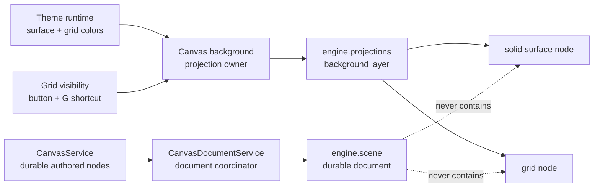

# S128 - canvas: immediate migrations for Cangine 0.5 projections
[Overview](../BASED.md)

Adopt Cangine 0.5's application-owned projection API for the two runtime
visuals Vibecanvas already owns today: the canvas surface background and grid.
Then delete the temporary retained-scene bridge, CSS background path, and
document-contract exceptions that only exist because Cangine 0.4 has no
durable-scene-excluded visual layer.

## Status and release gate

**Completed on 2026-07-30 and qualified against Cangine 0.5.1.**

Do not implement this task from a local Cangine checkout, unreleased branch,
copied declarations, or a Vibecanvas compatibility implementation. Unblock it
only when all of the following are true:

- a released `@omnidraw/cangine` 0.5 package publicly exports
  `engine.projections`;
- the final declarations and documentation define owner creation, ordered
  layers, atomic replacement, semantic no-ops, independent revisions,
  lifecycle cleanup, resource retention, and optional hit testing;
- projection content demonstrably survives every `engine.scene.replace()`;
- projection nodes are excluded from document snapshots, persistence,
  collaboration, history, recording, SVG export, accessibility projection,
  portals, and 3D state;
- `engine.transients` retains its current preview and clone-handoff behavior;
  and
- the released package passes Vibecanvas's normal consumer, type, and browser
  resolution.

Cangine 0.4.0 remains immutable. Cangine implementation, qualification,
release, and this Vibecanvas migration are separate delivery gates.

## Context

S126 removed Vibecanvas's DOM/CSS grid and moved grid rendering into Cangine.
Because Cangine 0.4 has only the durable retained scene and temporary
transients, S126 had to compose a runtime-only grid into
`CanvasDocumentService`'s scene snapshot. That temporary bridge currently:

- reserves runtime background and grid IDs in `canvas-contract`;
- stores grid presentation state in `CanvasDocumentService`;
- merges runtime nodes with authored nodes for scene replacement;
- preserves the grid across reload and recovery;
- guards the runtime IDs from authored mutation; and
- couples theme and grid visibility changes to the document scene revision.

The canvas surface color still follows a separate CSS path through
`--vc-canvas-background`. The result is split ownership: Cangine renders the
grid while the host DOM renders the solid surface under it.

Cangine accepted the feature request in
[`cangine-feature-request-retained-runtime-projections.md`](../../docs/internal/cangine-feature-request-retained-runtime-projections.md)
for 0.5.0. The accepted `engine.projections` capability is an application-owned
retained visual layer that renders through Cangine without entering the
durable document. It is the correct home for both existing visuals.

This task is intentionally limited to immediate migrations of systems that
already exist. Multiplayer presence, agent activity, comments, guides,
diagnostics, presentation pointers, and decorative scenes are future product
features, not scope to invent here.

No mockup is useful because the expected result is visually equivalent to the
current canvas in every built-in theme.

## Accepted upstream capability

Cangine 0.5 is expected to provide:

- ordered `background`, `world-overlay`, and `screen-overlay` layers;
- explicit ordering between projection owners;
- owner-local node IDs that cannot collide with document content;
- projection survival across every `engine.scene.replace()`;
- atomic owner replacement, semantic no-op detection, independent revisions,
  and automatic cleanup;
- normal Cangine 2D nodes, including grid, dots, image, solid, and trusted
  animated backgrounds;
- optional owner-qualified hit testing without exposing projection nodes to
  document selection or editor commands;
- normal resource retention for images, fonts, patterns, icons, and
  backgrounds;
- owner-qualified animations on Cangine's shared clock and scheduler; and
- strict exclusion from durable and document-derived systems.

Re-audit the released declarations before implementation. Do not preserve
names or call shapes from the feature request if the final supported API
differs.

## Target ownership

The projection owner belongs at the canvas runtime edge because it owns the
Cangine engine, theme subscription, grid setting, and disposal lifecycle.
`CanvasDocumentService` must return to coordinating authored document content
only.

## Plan

### 1. Qualify and adopt the released package

- Upgrade workspace manifests and the lockfile to the released Cangine 0.5
  version.
- Read the final projection API, lifecycle, ordering, revision, node,
  resource, hit-test, renderer, and migration documentation.
- Verify the production export in Bun, TypeScript, browser builds, package
  consumers, and every renderer backend used by Vibecanvas.
- Confirm projection owners can be created before the first document load,
  survive authoritative scene replacement, and be disposed with the engine.
- Confirm an equal atomic replacement is a semantic no-op and does not advance
  the owner's independent revision.
- Do not add a local abstraction that imitates missing Cangine behavior.

### 2. Create one canvas-background projection owner

- Create one runtime-owned projection owner in Cangine's `background` layer.
- Give the owner an explicit order at the bottom of application projections.
- Atomically replace the owner's complete node set with:
  1. a solid node covering the canvas surface; and
  2. the current Cangine grid node above the solid.
- Use owner-local IDs. Do not reuse, reserve, namespace, or expose durable
  `TNodeId` values for either node.
- Keep the projection non-interactive. Do not opt it into owner-qualified hit
  testing, editor selection, commands, portals, or accessibility projection.
- Treat the owner handle and its revision as runtime state. Do not serialize
  them or put them into CanvasService, widget state, URL state, or product
  history.
- Dispose the owner during canvas-runtime teardown and verify Cangine's
  automatic cleanup is sufficient when engine construction or disposal is
  interrupted.

### 3. Route theme and grid settings directly to the owner

- Preserve the current public `initialGridVisible` and `setGridVisible`
  behavior used by the toolbar and `G` shortcut.
- Have the canvas runtime combine current theme presentation and grid
  visibility into the owner's desired node list.
- Replace the owner atomically on relevant theme or visibility changes.
- Let Cangine's semantic no-op detection suppress equal replacements; do not
  maintain a second application revision or deep-equality engine.
- Handle startup ordering so the first frame cannot flash a CSS background,
  default grid color, or stale theme.
- Ensure theme subscriptions cannot write after owner/runtime disposal.
- Keep any pure node-construction logic small and local beside the runtime.
  If a new `fn.*.ts` file is justified, print and follow the repository's
  function-file rules: exported functions start with `fn`, imports obey the
  allowed leaf rules, logic is deterministic, runtime globals are injected,
  and only functions/types are exported.

### 4. Move the solid canvas surface out of CSS

- Normalize `canvasBackground` at the theme boundary to the Cangine color type
  used by projection nodes. Prefer one reusable canvas-theme color type over a
  new parser or CSS round trip.
- Preserve the exact light, dark, soft, and high-contrast built-in theme
  appearance.
- Render the surface color through the background projection's solid node.
- Remove the `--vc-canvas-background` declaration, default, DOM theme mapping,
  and `Canvas.tsx` background style once no consumer remains.
- Keep host layout and input behavior unchanged; the canvas host may be
  transparent because Cangine now owns the complete visual surface.
- Do not migrate general UI colors or DOM component styling into Cangine.

### 5. Delete the temporary document-scene grid bridge

- Remove runtime grid presentation state, options, setters, and recovery
  preservation from `CanvasDocumentService`.
- Remove the authored-plus-runtime scene composition helper and delete
  `fn.runtime-scene.ts` if no product-specific logic remains.
- Restore document load, authoritative reload, and recovery to replace the
  retained scene from authored document materialization only.
- Remove direct grid-driven `engine.scene.apply()` or
  `engine.scene.replace()` calls. Theme and grid toggles must not advance
  `engine.scene.revision`.
- Delete special mutation guards that exist only for the runtime background
  and grid IDs. Preserve unrelated protection for any synthetic document
  content that still belongs to the retained scene.
- Keep `CanvasDocumentService` as the durable projection coordinator; do not
  move persistence or collaboration authority into the canvas runtime.

### 6. Remove contract and validation residue

- Delete the runtime background/grid node IDs and their reserved-ID validation
  from `canvas-contract`.
- Remove related fixtures, error cases, imports, and tests that only protect
  the temporary bridge.
- Preserve the durable rule that authored Cangine background/layer nodes are
  rejected when they are not supported canvas items. Projection support must
  not broaden the persisted canvas schema.
- Verify canvas snapshots and service events contain only the synthetic
  document content still required by the product plus authored nodes.
- Update `FILES.md` for every deleted, added, or materially repurposed
  implementation file.

### 7. Reconcile S127's revision model

- Record that Cangine 0.5 projections answer S127's runtime-only scene
  question for the background and grid: these nodes are no longer part of
  `engine.scene` or its revision.
- If S127 lands first on Cangine 0.4, remove any reduction-state synchronization
  added only for the temporary grid bridge during this migration.
- If Vibecanvas upgrades directly to Cangine 0.5 before S127 lands, implement
  S127 against an authored/durable scene reduction state and keep projection
  revisions independent.
- Do not make S128 depend on the unreleased 0.4 reducer API. The tasks may land
  independently as their upstream releases become available.

### 8. Keep only product-boundary tests

- Rely on Cangine for projection storage, collision isolation, semantic
  no-ops, resource retention, renderer ordering, clock/scheduler behavior,
  and exhaustive scene-replacement survival.
- Keep focused Vibecanvas tests for:
  - creating one bottom-ordered background owner;
  - solid-below-grid node ordering;
  - initial theme and grid visibility;
  - theme changes and toolbar/keyboard toggles;
  - atomic owner replacement and equal-update no-ops;
  - disposal and late-subscription safety;
  - authoritative `engine.scene.replace()` leaving the projection intact;
  - document scene revisions remaining unchanged on projection updates;
  - snapshots, service events, history, and collaboration excluding the
    surface and grid;
  - placement ghosts continuing through `engine.transients`; and
  - no regression to editor selection, transforms, widget portals, or DOM UI.
- Delete tests that reproduce Cangine's internal projection semantics or only
  exercise the removed bridge.

### 9. Verify appearance, behavior, and subtraction

- Run affected canvas, canvas-contract, service-theme, service-canvas,
  architecture, and frontend tests and typechecks.
- Run package consumer/build verification against the released Cangine 0.5
  package.
- Browser-check all built-in themes, grid on/off, the `G` shortcut, pan, zoom,
  resize, reload, recovery, widget portals, selection, transforms, and
  placement previews.
- Check every supported renderer backend. Confirm document SVG export remains
  unchanged and excludes the runtime surface/grid as promised.
- Search for the deleted runtime IDs, `--vc-canvas-background`, runtime scene
  composition, and grid writes through `engine.scene`; none may remain.
- Measure production and test lines deleted and added separately.
- This is a subtraction task: production code must be net-negative, and the
  total change should be net-negative after obsolete tests are removed. If it
  is not, stop and explain which application-owned behavior Cangine 0.5 still
  cannot provide before accepting a larger local abstraction.
- Run `git diff --check` and record exact verification and line-count results
  in this task.

## Out of scope

- Multiplayer cursors, selections, names, or presence.
- Agent-working regions, generated-content previews, or activity indicators.
- Comments, pins, guides, rulers, snapping visuals, or laser pointers.
- Diagnostics, performance overlays, debug labels, or developer HUDs.
- Animated backgrounds, virtual pets, or decorative multi-node scenes.
- Migrating `engine.transients` placement previews or clone handoff.
- Replacing Cangine editor selection/transform overlays.
- Migrating interactive, accessible DOM UI such as toolbars, menus, dialogs,
  toasts, chat, or widget/AI portals.
- Adding a generic Vibecanvas projection registry before a second real owner
  requires one.

## TODOS

- [x] Confirm and qualify the released Cangine 0.5 projection API.
- [x] Upgrade Cangine manifests and lockfile.
- [x] Add one bottom-ordered canvas-background projection owner.
- [x] Render the solid surface and grid as ordered owner-local nodes.
- [x] Route theme and grid visibility directly to atomic owner replacement.
- [x] Normalize the canvas background theme value to a Cangine color type.
- [x] Remove the CSS canvas-surface background path.
- [x] Remove runtime grid state and scene composition from
      `CanvasDocumentService`.
- [x] Delete temporary runtime scene helpers and their bridge-only tests.
- [x] Delete runtime background/grid IDs and validation from
      `canvas-contract`.
- [x] Reconcile the independent projection revision with S127.
- [x] Update `FILES.md`.
- [x] Run focused tests, typechecks, builds, architecture checks, and browser
      QA.
- [x] Record exact code reduction and verification results.

## Acceptance criteria

- The published Cangine 0.5 `engine.projections` API is the sole renderer for
  the canvas surface background and grid.
- One explicitly bottom-ordered background owner contains a solid node below
  the grid, using only owner-local IDs.
- The surface and grid survive authoritative `engine.scene.replace()` without
  Vibecanvas recomposition or recovery preservation.
- Theme and grid visibility updates atomically replace the projection and do
  not advance the durable scene revision.
- `CanvasDocumentService` contains no grid presentation state and coordinates
  authored/durable scene content only.
- Canvas snapshots, persistence, collaboration, history, recording, SVG
  export, accessibility projection, portals, and 3D state exclude the surface
  and grid by construction.
- Runtime background/grid IDs and their reserved-ID contract validation are
  deleted.
- `--vc-canvas-background` and the host CSS surface rendering path are
  deleted.
- The existing toolbar control, `G` shortcut, theme appearance, transforms,
  previews, portals, and interactive DOM UI behave unchanged.
- `engine.transients` and Cangine editor overlays remain on their existing
  APIs.
- No local projection polyfill, duplicate retained store, generic owner
  registry, or scene-composition replacement is introduced.
- Production and total code changes are net-negative, with exact counts
  logged.
- All affected tests, typechecks, builds, browser checks, architecture checks,
  and `git diff --check` pass with results logged.

## NOTES

- The immediate migration is deliberately small: one owner, two nodes, and no
  new product feature.
- The solid surface and grid belong to the same owner because they share
  theme, visibility, ordering, engine lifetime, and the canvas-background
  responsibility.
- Future world/screen overlays should use their own owners with explicit
  ordering. They should not expand this background owner into a general scene
  store.
- Projections are visual runtime state, not a second document. Durable canvas
  authority remains `CanvasService`, and widget-instance state authority
  remains `WidgetStateService`.
- Owner-qualified hit testing is unnecessary for the surface and grid. Leave
  it disabled.
- If the final Cangine 0.5 API cannot express a required accepted behavior,
  update the upstream request or block the migration. Do not rebuild the
  capability inside Vibecanvas.

### LOGS

- 2026-07-30: Cangine accepted application-owned retained projections for
  0.5.0, including ordered layers/owners, owner-local IDs, independent
  revisions, atomic replacement, scene-replacement survival, resource and
  animation integration, optional owner-qualified hit testing, automatic
  cleanup, and strict durable/document exclusion.
- 2026-07-30: Repository audit selected the current solid surface background
  and grid as the only immediate migrations. Existing transients, editor
  overlays, portals, and interactive DOM UI remain on their current systems.
- 2026-07-30: Task created blocked on the published Cangine 0.5.0 package and
  final supported declarations. The implementation is required to delete more
  Vibecanvas code than it adds.
- 2026-07-30: Qualified the published 0.5.0 artifact at SHA-256
  `d14a96266ba7548a6b1ba6ad8a3713f08582b2094948baeadcc1b0ab9b118d9b`.
  Bun, Node, TypeScript, the frontend browser build, and the packed public
  entrypoints resolve the installed registry package.
- 2026-07-30: Added one bottom-ordered, non-interactive background projection
  owner with owner-local `surface` and `grid` nodes. Theme and visibility
  changes now atomically replace that owner without touching the durable scene
  or its revision.
- 2026-07-30: Deleted the document grid state/recovery bridge, runtime
  background/grid contract IDs, CSS surface path, and obsolete bridge tests.
  S127's reduction state now covers only the synthetic content layer and
  authored runtime nodes; projection revisions remain independent.
- 2026-07-30: Production code added 99 lines and deleted 221 (net -122).
  Product tests added 173 and deleted 210 (net -37). Production plus tests are
  159 lines smaller overall.
- 2026-07-30: Verification passed: canvas 110 tests; canvas-contract 9;
  service-theme 5; service-canvas 12; ui-ai-chat 268; frontend 36 Bun and 6
  Vitest tests; affected typechecks; Bun/Node entrypoint imports; frozen
  install; functional-core lint; architecture 13 tests with 157 assertions;
  and the 2,432-module frontend production build.
- 2026-07-30: Browser QA passed light/dark surfaces, grid toolbar and `G`
  toggles, authoritative reload, pan, zoom, selection overlays, and state
  restoration. Exact projection-color tests cover all four built-in themes.
- 2026-07-30: Qualified the immutable Cangine 0.5.1 artifact at SHA-256
  `fe04385e30cb8427b691795bbe803e52332a2cbb91a4d0e3ed7f7ef211ae98e0`.
  The public editor now owns copied `creation.textFontFamilies` defaults, so
  Vibecanvas upgraded every consumer, removed `patchedDependencies`, deleted
  the Cangine patch and empty `patches/` directory, and regenerated the lock.

---
