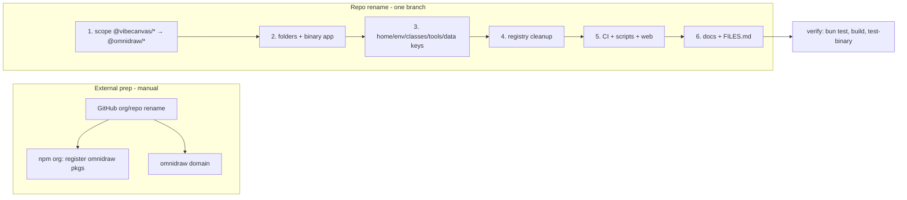

# S129 - rename: vibecanvas → omnidraw for 0.5.0 (hard reset)
[Overview](../../BASED.md)

Rename project and org from `vibecanvas` to `omnidraw` for the 0.5.0 release.
Hard reset: nothing is deployed, so no migrations, no back-compat aliases, no
deprecation shims. Every identifier is renamed in place.

## Context

The `@omnidraw` npm scope already exists and is consumed for external engine
packages (`@omnidraw/cangine`, `@omnidraw/capsule`) via a local Verdaccio
registry (see `.npmrc` and [A95](../a/A95.md)). The rename moves our own
packages under that same scope.

Key decision: **this repo's own packages no longer go through the local
registry.** The registry stays only for consuming cangine/capsule via `.npmrc`.
Today `scripts/local-registry.mjs` publishes `packages/tenant-core`,
`packages/resource-runtime`, `packages/widget-contract`, `packages/sdk`
(`VIBECANVAS_PACKAGES`, `publish-vibecanvas` command) so AI-generated widgets
can install them — that path is removed. Widget SDK distribution for 0.5.0
comes from the real npm publish (`@omnidraw/sdk`, see
`.github/workflows/release-sdk.yml`).

Note the `.npmrc` scope-routing tension: `@omnidraw:registry=http://127.0.0.1:4873/`
sends the whole scope to Verdaccio. After the rename our packages live in that
scope too, so the widget-install npm userconfig
(`apps/cli/src/fn.local-registry-npm-userconfig.ts`) must route `@omnidraw/sdk`
to npmjs while cangine/capsule keep using the local registry during dev.

Rename surfaces found during exploration (E-scan, ~810 files contain
`vibecanvas`; `tasks/` history stays untouched):

- Workspace scope `@vibecanvas/*` in all 33 `packages/*/package.json` and
  `apps/*/package.json`, all `workspace:*` deps, all TS imports, root
  `package.json` `--filter` scripts, `scripts/architecture-boundaries.test.ts`
- Binary app [apps/vibecanvas](../../apps/vibecanvas): publishes `vibecanvas`,
  `vibecanvas-darwin-arm64`, `vibecanvas-linux-arm64`, `vibecanvas-linux-x64`,
  `vibecanvas-linux-x64-baseline`, musl variants; `bin` name, `postinstall.mjs`,
  `install-instructions.mjs`
- Home/data dir `~/.vibecanvas` → `~/.omnidraw`:
  [fn.resolve-vibecanvas-home.ts](../../packages/shared-functions/src/vibecanvas-config/fn.resolve-vibecanvas-home.ts),
  `apps/cli` home-preflight, uninstall-plan, upgrade cmd, `scripts/install.sh`
  (`VIBECANVAS_HOME`, `VIBECANVAS_INSTALL_DIR`)
- Env prefix `VIBECANVAS_*` → `OMNIDRAW_*` (capsule config, build
  version/channel, backend host/port, codesign identity)
- Persisted JSONB extension key `vibecanvas:widget` in
  [000-initial.sql](../../packages/service-db/src/migrations/000-initial.sql)
  generated columns + all code reading it — renamed in place, no DB migration
- DOM class names `.vibecanvasSurface`, `.vibecanvasRole`, `.vibecanvasPortalId`,
  `.vibecanvasNodeId`, `.vibecanvasWidgetShell`, etc.
- Agent tool names `vc_*` (`vc_widget_create`, `vc_resource_*`,
  `vc_publish_widget`, ...) in `packages/service-agent` prompts/tools/tests →
  `od_*`
- Folder names: `packages/capsule-vibecanvas` → `packages/capsule-omnidraw`,
  `packages/shared-functions/src/vibecanvas-config` → `omnidraw-config`,
  `apps/vibecanvas` → `apps/omnidraw`
- GitHub org/repo `github.com/vibecanvas/vibecanvas` → `omnidraw/omnidraw`
  (also `vibecanvas/skills`); release tag scheme `vibecanvas-v*` →
  `omnidraw-v*` in
  [release-vibecanvas.yml](../../.github/workflows/release-vibecanvas.yml)
  and [install.sh](../../scripts/install.sh) tag parsing
- Domain `vibecanvas.dev` → omnidraw domain in
  [apps/web/astro.config.mjs](../../apps/web/astro.config.mjs), ~128 marketing
  content refs, `apps/web/public/install.sh`, SEO/og image, sitemap,
  `vibecanvas.dev/schemas/v1/vibecanvas` schema URL
- Scripts/CI: `scripts/vibecanvas.entitlements.plist`,
  `scripts/build.ts`, `scripts/release.ts`, `scripts/publish-npm.ts`,
  `scripts/release-channel.ts`, `scripts/test-binary.ts`,
  `.github/workflows/{release-vibecanvas,release-sdk,deploy-web,auto-label-pr,test}.yml`,
  `scripts/docker`
- Bookkeeping: `README.md`, `AGENTS.md`, `FILES.md` (regenerate via
  `generate:files`), `docs/internal/*`

## Plan

Hard reset means: old DBs, old `~/.vibecanvas` dirs, old npm packages, and old
env vars are simply abandoned. No shim code anywhere.

### 1. Scope rename (mechanical, do first)
- `@vibecanvas/X` → `@omnidraw/X` in every package.json name, `workspace:*`
  dep, TS/TSX import, root `--filter` scripts, boundary tests
- `.npmrc`: drop `@vibecanvas:registry` line

### 2. Folder + binary rename
- `git mv apps/vibecanvas apps/omnidraw`,
  `git mv packages/capsule-vibecanvas packages/capsule-omnidraw`,
  `git mv packages/shared-functions/src/vibecanvas-config .../omnidraw-config`
- npm binary packages `vibecanvas*` → `omnidraw*`; `bin` command `omnidraw`

### 3. Runtime identifiers
- `~/.omnidraw`, `OMNIDRAW_*` env prefix, `fn.resolve-vibecanvas-home` →
  `fn.resolve-omnidraw-home` (file + function rename)
- `vibecanvas:widget` → `omnidraw:widget` in SQL + readers
- DOM classes `.vibecanvas*` → `.omnidraw*`
- `vc_*` tool names → `od_*` including prompts and tests

### 4. Local registry cleanup
- Remove `VIBECANVAS_PACKAGES`, `publish-vibecanvas` command from
  `scripts/local-registry.mjs`, drop `registry:publish:vibecanvas` root script,
  shrink `OWNED_SCOPES` to `@omnidraw/` (external packages only)
- Rework `fn.local-registry-npm-userconfig` so widget installs resolve
  `@omnidraw/sdk` from npmjs, not Verdaccio
- Keep registry lifecycle (`registry:start/ensure/...`) for cangine/capsule dev

### 5. CI, release, web
- Rename workflows + tag scheme to `omnidraw-v*`; update npm package-availability
  checks for the 8 binary packages; codesign identity/entitlements rename
- `scripts/install.sh`: `APP=omnidraw`, `REPO=omnidraw/omnidraw`, install dir,
  release-tag parsing
- apps/web: astro `site`, all content URLs, public `install.sh`, SEO assets

### 6. Docs + bookkeeping
- README, AGENTS.md, docs/internal; regenerate FILES.md
- `tasks/*` stays as historical record (do not rewrite)

### Verify
- `bun install && bun run test` green
- `bun run build` + `bun run test:binary` with renamed artifacts
- `grep -ri vibecanvas --exclude-dir=node_modules --exclude-dir=.git --exclude-dir=tasks .`
  returns only intentional history (tasks/, CHANGELOG if any)

## TODOS
- [ ] external: GitHub org/repo renamed to omnidraw/omnidraw (manual)
- [ ] external: npm `omnidraw` + `omnidraw-*` platform package names secured (manual)
- [ ] external: omnidraw domain secured (manual)
- [x] scope: `@vibecanvas/*` → `@omnidraw/*` everywhere (package.json, imports, filters, tests)
- [x] npmrc: drop `@vibecanvas` registry line
- [x] folders: apps/vibecanvas, packages/capsule-vibecanvas, vibecanvas-config renamed
- [x] binary: npm package names + `bin` command renamed to omnidraw
- [x] runtime: `~/.omnidraw` home dir + resolve-home function/file rename
- [x] runtime: `VIBECANVAS_*` → `OMNIDRAW_*` env vars
- [x] data: `vibecanvas:widget` → `omnidraw:widget` JSONB key in SQL + code
- [x] ui: `.vibecanvas*` DOM class names renamed
- [x] agent: `vc_*` → `od_*` tool names + prompts + tests
- [x] registry: remove repo-package publishing (VIBECANVAS_PACKAGES, publish-vibecanvas, registry:publish:vibecanvas script)
- [x] registry: widget npm userconfig routes `@omnidraw/sdk` to npmjs
- [x] ci: workflows renamed, `omnidraw-v*` tag scheme, npm availability checks, codesign/entitlements
- [x] install: scripts/install.sh + apps/web/public/install.sh rewritten
- [x] web: domain, astro site, content URLs, SEO/sitemap
- [x] docs: README, AGENTS.md, docs/internal, FILES.md regenerated
- [x] verify: full test suite + build + test-binary green; grep shows no stray vibecanvas

## NOTES

- Hard reset confirmed by owner: no migration of user data, DBs, npm packages,
  or env vars. Not deployed yet, so a clean cut is safe.
- No local registry for this repo's packages: registry stays only for
  consuming cangine/capsule via `.npmrc`.
- `apps/cli/tests/fn.local-registry-npm-userconfig.test.ts` and
  `apps/widget-debug-tools/src/main.ts` also consume the registry userconfig
  helper and must follow the rework.
- `@omnidraw/cangine` / `@omnidraw/capsule` imports stay exactly as they are.

### LOGS
- 2026-07-31: completed the repository hard rename on `codex/S129`,
  including package scope, folders, binary artifacts, runtime identifiers,
  registry routing, CI/release/install scripts, web/docs, and the SEO wordmark.
  Verified with `bun install`, `bun run test`, `bun run build`,
  `bun run test:binary`, `bun run lint:functional-core`,
  `bun run db:schema:verify`, registry-script syntax checking, and the
  old-brand audit. The three external ownership/DNS tasks remain manual.
- explored rename surfaces (~810 files reference `vibecanvas`), confirmed
  `@omnidraw` scope already in use for cangine/capsule, confirmed hard-reset
  and registry decisions with owner; created S129

---
