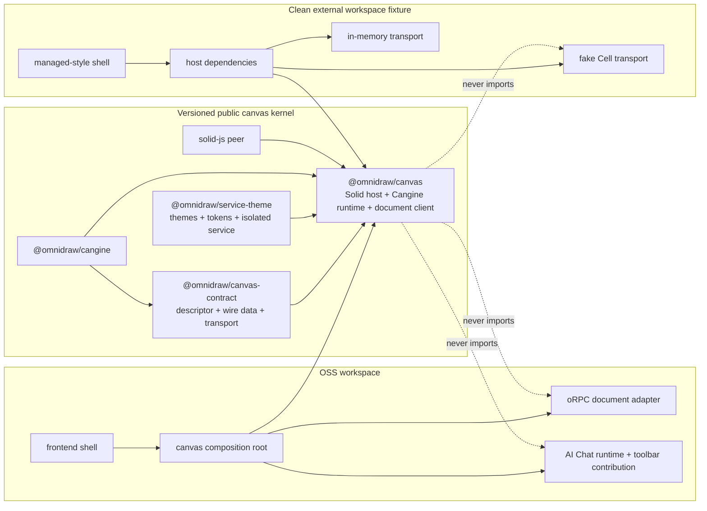

# S132 - packages: make the canvas kernel workspace-split ready
[Overview](../BASED.md)

Remove the remaining OSS-workspace, private-package, shell-UI, global-style,
and root-asset assumptions from `@omnidraw/canvas-contract`,
`@omnidraw/service-theme`, and `@omnidraw/canvas`. Finish with versioned,
independently packable public packages that the OSS frontend and a clean
external managed-style host can compose without copying canvas code or
installing the OSS server.

## Context

The hard architectural work is already present:

- [`CanvasDocumentService`](../../packages/canvas/src/services/CanvasDocumentService.ts)
  owns the current-session optimistic document and talks through a
  protocol-neutral `getSnapshot` / `execute` / `subscribe` transport.
- [`canvas-document-transport.ts`](../../apps/frontend/src/services/canvas-document-transport.ts)
  adapts the OSS oRPC client outside the canvas package.
- [`Canvas.tsx`](../../packages/canvas/src/components/Canvas.tsx) and
  [`runtime.ts`](../../packages/canvas/src/runtime.ts) already receive theme,
  image, notification, transport, ID, diagnostics, and runtime-extension
  behavior through partial injection seams.
- [S88](S88.md) moved AI Chat, concrete widgets, and the sidebar into
  `@omnidraw/ui-ai-chat` behind the public runtime-extension seam.
- [D1](../d/D1.md) established public tenant/function/resource/widget
  contracts and a clean external managed-composition fixture.

The packages are not yet safe to move to or consume from another workspace:

- [`packages/canvas/package.json`](../../packages/canvas/package.json) is
  private, exports raw workspace source, pins workspace/catalog dependencies,
  and depends on private `@omnidraw/service-db`.
- [`Canvas.tsx`](../../packages/canvas/src/components/Canvas.tsx) imports the
  database `TCanvas` model even though it only reads `canvas.id`; it also
  constructs IDs from global `crypto`, owns diagnostics browser effects, and
  requires OSS sidebar state.
- [`FloatingCanvasToolbar`](../../packages/canvas/src/components/FloatingCanvasToolbar/index.tsx)
  statically labels the Cangine `widget` tool as **AI Chat** and renders the
  OSS sidebar toggle. [S118](S118.md) intentionally preserved the dedicated
  AI Chat button and `C` shortcut, so this task must preserve that product UX
  through host composition rather than deleting it.
- [`fn.browser-tenant-scope.ts`](../../packages/canvas/src/fn.browser-tenant-scope.ts)
  owns OSS browser storage keys and deployment-origin identity even though
  these are frontend/session concerns, not canvas-kernel behavior.
- [`runtime.ts`](../../packages/canvas/src/runtime.ts) and the selection-style
  CSS assume fonts exist at the host root under `/fonts/*`.
- [`base.css`](../../packages/canvas/src/base.css) changes `:root`, `html`,
  `body`, all elements, form controls, headings, lists, and media globally.
  Importing the package can therefore restyle an unrelated host shell.
- [`packages/canvas-contract/package.json`](../../packages/canvas-contract/package.json)
  has no release version, public publish metadata, files list, or prepublish
  gate.
- [`packages/service-theme/package.json`](../../packages/service-theme/package.json)
  is private. [`ThemeService.ts`](../../packages/service-theme/src/ThemeService.ts)
  reaches directly into sibling `runtime/src` and `tapable/src` files, and
  `@omnidraw/tapable` is private.
- [`scripts/fixtures/external-composition`](../../scripts/fixtures/external-composition)
  and [`test-packed-public-composition.ts`](../../scripts/test-packed-public-composition.ts)
  prove five backend/public-contract packages only. They do not pack, install,
  build, mount, or exercise canvas and theme.
- The OSS [`orpc-client`](../../packages/orpc-client/src/index.ts) still imports
  portable contracts from the private consolidated `@omnidraw/api` package,
  whose canvas and agent contracts reach private service models. That is a
  real future extraction, but it is not required for a managed Cell to
  implement the public canvas document transport directly.

The focused baseline is healthy as of plan creation: canvas passes 110 tests,
canvas-contract passes 9, service-theme passes 5, architecture passes 13, and
the existing five-package clean packed consumer passes. This task should
change ownership and distribution without redesigning canvas behavior.

No UI mockup is useful because the OSS application must remain visually and
behaviorally equivalent. The material design is the package and composition
flow:

## Plan

### Fixed decisions

- This task makes the packages safe to split; it does not physically move a
  package to another repository or add managed authentication, billing,
  organizations, routing, placement, or infrastructure to OSS.
- `CanvasService` remains the only durable canvas authority.
  `CanvasDocumentService` remains the only browser optimistic-document owner,
  and `WidgetStateService` remains the only widget-instance state authority.
- The public kernel contains `canvas-contract`, `service-theme`, and `canvas`.
  It may consume already-public Cangine and tenant contracts only when source
  code genuinely requires them. Do not add Capsule, widget, API, or managed
  dependencies from an architecture diagram alone.
- The minimal canvas descriptor contains `id` only. Product names, revisions,
  timestamps, membership, and database fields stay in shell/API DTOs until
  canvas itself has a concrete rendering requirement for one.
- Canvas receives an opaque, stable host scope key for runtime replacement.
  Do not pass the request-oriented `TTenantContext` merely to build a cache
  key, and do not make authorization decisions in canvas. The transport and
  product extensions own tenant authorization.
- Preserve the dedicated OSS **AI Chat** tool and `C` shortcut required by
  S118 through a narrow injected toolbar/tool contribution. Do not restore a
  generic widget catalog or hard-code AI/sidebar semantics in public canvas.
- `service-theme` exports a stable service capability plus its default
  implementation. Canvas depends on the capability, not the concrete class.
- Package-owned fonts and other required canvas assets travel with the canvas
  distribution and use package-relative URLs. Host injection is justified
  only for a resource that truly differs between products.
- Keep `@omnidraw/api`, `@omnidraw/orpc-client`, and
  `@omnidraw/ui-ai-chat` OSS/product-private in this task. A broad
  `@omnidraw/api-contract` extraction is a separate successor if the managed
  shell must share the complete OSS API client rather than implement the
  canvas transport directly.
- Do not introduce a global service locator, hidden singleton, `if (managed)`
  branch, source copy, compatibility fork, or workspace path alias in an
  external consumer.

### 1. Freeze the current consumer and distribution baseline

- Record all runtime and type imports of `canvas`, `canvas-contract`, and
  `service-theme`, including source deep imports and CSS/asset assumptions.
- Record the three package manifests, packed file lists, dependency closure,
  current bundle/build behavior, and whether a consumer resolves package
  source or built output.
- Run and log canvas, canvas-contract, service-theme, frontend, architecture,
  canvas-regression, and existing packed-composition baselines before changing
  contracts.
- Add failing architecture/packaging assertions for the known violations so
  the work cannot appear complete after only removing `private: true`.
- If implementation touches any `fn.*.ts`, `fx.*.ts`, or `tx.*.ts` file,
  print and follow the repository function-file rules before editing: `fn`
  exports are pure/deterministic, `fx` is a two-parameter injected read,
  `tx` is a two-parameter injected write, imports obey the allowed leaves, and
  no function file directly accesses runtime globals.

### 2. Make `canvas-contract` the complete portable canvas boundary

- Add and export `TCanvasDescriptor` with only `id: string`.
- Move `TCanvasDocumentTransport` from `CanvasDocumentService.ts` into
  `canvas-contract` so an adapter can compile without importing Solid, canvas
  CSS, or implementation classes.
- Keep snapshot, command, event, item, query, and validation data in the same
  public contract package. Do not import database models, API routers, oRPC,
  server services, browser globals, or managed types.
- Preserve the current async-iterable subscription model and document its
  cancellation rule: `AsyncIterator.return()` must promptly close the
  underlying stream. Prove OSS, in-memory, and fake-Cell adapters obey it on
  runtime replacement and disposal.
- Give the package a release version aligned with the current public package
  line, public `publishConfig`, a deliberate `files`/exports surface, exact
  release dependencies, `prepublishOnly`, typecheck, tests, and package
  provenance/license metadata consistent with other public packages.
- Build and pack from only declared files. No generated declaration may refer
  to a repository-relative source path or private Omnidraw package.

### 3. Make `service-theme` public, self-contained, and instance-safe

- Remove `private: true`, add a release version, public publish metadata,
  explicit package files/exports, exact release dependencies, typecheck,
  tests, and a prepublish gate.
- Replace cross-package source imports from `../../runtime/src` and
  `../../tapable/src`. Prefer a package-owned minimal subscription capability
  over publishing `tapable` solely to support theme events.
- Export a stable `IThemeService`-style capability covering the behavior
  consumed by canvas and shells: current theme, registry, palette/tokens,
  theme change subscription, style resolution, and remembered-style API.
  Keep `ThemeService` or a service factory as the default implementation.
- Migrate canvas, frontend, and UI/widget theme adapters from concrete class or
  `SyncHook` knowledge to the public capability/subscription surface.
- Prove two theme service instances can select themes, register themes, and
  mutate remembered style independently with no shared module state.
- Preserve current runtime background synchronization and DOM theme-token
  synchronization. Apply canvas UI variables to the canvas host element so a
  canvas instance can use a different theme from the surrounding shell.
- Preserve the existing remembered-style service API and tests without
  reintroducing a second selection-style authority beside Cangine. The current
  canvas does not consume remembered-style methods; do not claim or invent new
  tool-memory behavior in this packaging task.
- Keep theme independent of frontend, API, database, managed code, and canvas
  implementation types.

### 4. Define one explicit public canvas composition contract

- Export a readonly `TCanvasProps` and `TCanvasDependencies` shape. Exact
  names may follow final conventions, but the boundary must separate:
  - canvas descriptor data;
  - an opaque stable host scope key;
  - document transport;
  - theme service capability;
  - image service;
  - notification service;
  - ID creation;
  - deterministic retry/wait scheduling used by the document client;
  - optional diagnostics owner/port; and
  - runtime and UI extensions.
- Replace flat `transport`, `image`, `notification`, `themeService`, `store`,
  and hard-coded ID construction props with the dependency bundle.
- Inject `createId`; remove the `crypto.randomUUID()` fallback from canvas.
- Inject or derive deterministic retry timing through the composition
  boundary so `CanvasDocumentService` no longer sleeps through the ambient
  global `setTimeout` and disposal can cancel pending waits.
- Move reproduction-trace environment construction, clipboard, download,
  object URL, browser metadata, and wall/monotonic clock effects to an
  injected diagnostics owner or host factory. Canvas may own trace semantics,
  but it must not silently own product/browser export effects.
- Derive unavoidable DOM access from the canvas container's `ownerDocument`
  and `defaultView`. Avoid ambient `document`/`window` listeners so embedded
  documents, tests, and multiple roots attach and detach against the correct
  browser realm.
- Keep extensions ordered, disposable, and host-constructed. Expose only
  public canvas capabilities through extension context; do not leak private
  server clients or a broad application service bag.

### 5. Remove OSS tenant, AI, sidebar, and shell state from canvas

- Move `TBrowserTenantScope`, local OSS tenant defaults, storage-key helpers,
  tenant activation comparison, and frontend-store keys out of canvas and
  into the OSS frontend composition area. Update frontend callers and tests.
- Use the host scope key plus canvas ID solely for runtime replacement.
  Product extensions receive tenant-specific capabilities when the host
  constructs them rather than reading an OSS tenant object from base canvas
  config.
- Remove `store.sidebarVisible`, `onToggleSidebar`, `onToggleSidebar` runtime
  config, `Ctrl+B` shell handling, and the fixed sidebar button from the base
  canvas API.
- Add the smallest typed toolbar contribution seam needed to preserve
  host-owned actions and product tools. It must support the dedicated AI Chat
  tool metadata/action and the OSS sidebar toggle without introducing a
  generic catalog, dynamic service locator, or package cycle.
- Have `@omnidraw/ui-ai-chat` or the OSS composition root supply the AI Chat
  contribution together with the existing runtime extension. The managed
  host may supply different or no contributions.
- Keep core canvas tools, selection-style UI, grid, import image, undo, redo,
  pan, zoom, and Cangine lifecycle in canvas.
- Add a canvas-with-no-product-extensions test that renders and edits ordinary
  shapes without an AI service, sidebar store, API client, server, or widget
  runtime.

### 6. Remove database and private-package leakage

- Replace the `service-db/model` import and `TBackendCanvas` alias in canvas
  with `TCanvasDescriptor` from `canvas-contract`.
- Remove `@omnidraw/service-db` from the canvas manifest and lockfile edge.
- Add an architecture allowlist for public canvas dependencies and reject
  imports or manifest dependencies on:
  - `@omnidraw/api`;
  - `@omnidraw/orpc-client`;
  - `@omnidraw/service-db`;
  - `@omnidraw/service-canvas`;
  - `@omnidraw/service-agent`;
  - OSS application source;
  - `@omnidraw/ui-ai-chat`; and
  - managed/private package families.
- Apply the same private-dependency scan recursively to declarations and
  packed source/output for canvas-contract and service-theme.
- Do not add an adapter inside canvas that merely renames an OSS client or DB
  model. OSS conversion belongs in the frontend composition root.

### 7. Make CSS, fonts, and package output host-safe

- Remove global `:root`, `.dark`, `html`, `body`, universal selector, form,
  list, heading, and media resets from the canvas package. Move shell-wide
  resets to the OSS frontend or scope required component defaults below the
  canvas host class/data attribute.
- Scope dark/theme selectors to the specific canvas root updated by its
  injected theme service. Two canvases or a canvas and shell must not overwrite
  each other's theme classes or variables.
- Move the current canvas/editor font files into the canvas distribution (or
  one explicitly shared public asset package only if reuse justifies it), use
  package-relative URLs, and register the same packaged resource URLs with
  Cangine. Delete all `/fonts/*` assumptions from canvas source and CSS.
- Produce normal consumable ESM and declaration output rather than requiring
  an external workspace to transpile repository `.ts`/`.tsx` source through
  path aliases. Export package CSS/assets deliberately and mark CSS side
  effects explicitly when required.
- Make `solid-js` a compatible peer dependency and development dependency so
  a host owns one Solid runtime. Keep Cangine and internal public package
  versions exact according to the repository release policy.
- Verify the packed tarball contains every referenced CSS/font asset, no
  undeclared file, no workspace/catalog specifier, and no absolute repository
  path.
- Verify importing public non-UI/type subpaths does not unexpectedly install
  global CSS.

### 8. Create one explicit OSS canvas composition root

- Add or consolidate one frontend module that constructs the public canvas
  dependencies from the active OSS tenant session, oRPC document adapter,
  theme instance, media API, toasts, diagnostics/browser ports, and product UI
  contributions.
- Keep [`pages/canvas.tsx`](../../apps/frontend/src/pages/canvas.tsx) as a thin
  renderer of descriptor + scope key + dependencies + extensions.
- Preserve tenant switching by rebuilding or replacing the composition when
  the active deployment/org/account/cell/epoch identity changes. Close the old
  event iterator, diagnostics owner, runtime extensions, and pending waits.
- Keep canvas list/create/update/delete DTOs and the complete oRPC client
  private to OSS. Pass only the minimal public descriptor and document
  transport into canvas.
- Preserve the dedicated AI Chat button, `C` shortcut, sidebar toggle behavior,
  theme switching, image upload/clone/delete, notifications, diagnostics, and
  all existing drawing/widget behavior through explicit OSS adapters.
- Do not publish the frontend shell or move product routing, settings,
  billing, authentication, or error/session recovery into canvas.

### 9. Prove a clean external browser consumer

- Add a dedicated canvas-kernel consumer fixture rather than overloading the
  existing backend managed-composition fixture. It must have its own package
  manifest and TypeScript/build configuration with no workspace protocol,
  repository path alias, root tsconfig extension, source copy, patch, or
  private package import.
- Provide a reusable in-memory `TCanvasDocumentTransport` that:
  - loads an initial snapshot;
  - validates and executes commands with monotonic revisions;
  - broadcasts events to active subscribers;
  - resumes from `afterRevision`; and
  - closes subscriptions promptly on iterator return.
- Provide a separate fake managed-Cell adapter implementing the same public
  transport while using different internal request/client objects. Canvas must
  receive no protocol flag or managed branch.
- Construct independent theme, image, notification, ID, wait, diagnostics,
  scope, and optional toolbar-extension fakes using only documented public
  exports.
- Pack canvas-contract, service-theme, and canvas into isolated tarballs;
  install them into a temporary clean consumer; assert installed roots are
  outside this repository; and reject workspace paths in package manifests,
  lockfiles, source maps, declarations, and runtime resolution.
- Typecheck and production-build the clean consumer, then run a real-browser
  smoke that mounts canvas, loads a snapshot, creates/edits one shape, observes
  an event, switches theme, verifies packaged CSS/font loading, and unmounts
  without leaked subscriptions or browser errors.
- Run the same component against the in-memory adapter and fake Cell adapter.
  Include a no-extension composition and a host-contribution composition.
- Prove the consumer installs no OSS API, oRPC client, service-db,
  service-canvas, service-agent, frontend, or managed implementation package.

### 10. Extend permanent architecture and release gates

- Add canvas-contract, service-theme, and canvas to the public-package version,
  publish metadata, exact dependency, documented export, and private-import
  assertions in `architecture-boundaries.test.ts`.
- Extend or add a packed canvas-kernel command without weakening the existing
  five-package backend composition gate.
- Add explicit checks for global CSS selectors, root-relative font URLs,
  private dependency names, cross-package source imports, raw workspace or
  catalog versions, undeclared packed imports, and duplicate Solid ownership.
- Add the clean consumer gate to the complete repository/final acceptance
  commands at the point where browser dependencies are available.
- Update `packages/canvas/AGENTS.md`, canvas architecture documentation,
  public package READMEs, root package scripts, and release documentation with
  supported entrypoints, dependency construction, CSS import, assets,
  extension lifecycle, and version compatibility.
- Regenerate `FILES.md` for implementation/configuration files added, deleted,
  or materially repurposed. Task markdown itself is intentionally outside the
  generated file index.
- Run package tests/typechecks, functional-core lint, frontend tests/build,
  canvas regression, widget-host regression, architecture gates, clean packed
  consumers, full workspace tests, and `git diff --check`. Record exact
  results and tarball/package versions in this task.

## TODOS

- [ ] Capture import, manifest, packed-output, CSS, asset, and test baselines.
- [ ] Add failing permanent gates for every known workspace-split violation.
- [ ] Add the minimal `TCanvasDescriptor` to canvas-contract.
- [ ] Move `TCanvasDocumentTransport` to canvas-contract and document stream cancellation.
- [ ] Version and make canvas-contract independently publishable.
- [ ] Remove service-theme cross-package source imports and private tapable dependency.
- [ ] Export a stable theme service capability and keep isolated instances.
- [ ] Version and make service-theme independently publishable.
- [ ] Introduce the explicit canvas dependency bundle and stable host scope key.
- [ ] Inject ID, retry/wait, diagnostics, image, notification, transport, and theme behavior.
- [ ] Move OSS browser tenant/storage helpers out of canvas.
- [ ] Replace database canvas metadata with the public descriptor.
- [ ] Remove sidebar and AI semantics from base canvas props/runtime/UI.
- [ ] Add narrow host toolbar/tool contributions preserving AI Chat and sidebar UX.
- [ ] Scope canvas CSS and remove all shell-global resets.
- [ ] Package canvas fonts/assets and remove root-relative asset assumptions.
- [ ] Build standard ESM/declarations/CSS assets with Solid as a peer.
- [ ] Version and make canvas independently publishable.
- [ ] Add one OSS canvas composition root and keep the canvas page thin.
- [ ] Add a reusable in-memory document transport.
- [ ] Add a distinct fake managed-Cell transport adapter.
- [ ] Add and pack-install a clean external browser consumer with no path aliases.
- [ ] Run real-browser smoke against in-memory and fake-Cell compositions.
- [ ] Extend architecture, packed-package, release, and final-acceptance gates.
- [ ] Update package docs and regenerate `FILES.md` for code/config changes.
- [ ] Run and log all focused, repository-wide, build, browser, and diff checks.

## Acceptance criteria

- `@omnidraw/canvas-contract`, `@omnidraw/service-theme`, and
  `@omnidraw/canvas` are versioned, public, independently packable packages
  with deliberate exports, files, release dependencies, publish metadata, and
  prepublish verification.
- Their packed manifests, declarations, source maps, runtime output, CSS, and
  assets contain no workspace/catalog specifier, repository path, source-copy
  dependency, or private Omnidraw import.
- Canvas imports no API, oRPC client, database, server service, OSS frontend,
  UI-AI package, managed package, or private package implementation.
- Canvas receives document, theme, image, notification, ID, retry/wait, and
  diagnostics behavior through one explicit readonly dependency bundle.
- Canvas receives only a public descriptor with `id` and an opaque host scope
  key; it does not import database models or treat request tenant context as a
  UI cache key.
- `TCanvasDocumentTransport` is available from canvas-contract and the OSS,
  in-memory, and fake-Cell adapters load, execute, subscribe, resume, and
  cancel through the same interface.
- `service-theme` exports built-in themes, tokens, types, style helpers, a
  stable service capability, and a default factory/class without depending on
  frontend, API, database, canvas implementation, managed code, private
  tapable, or sibling source paths.
- Separate theme instances have isolated registries, active selections, and
  remembered styles. Runtime background and canvas-host DOM tokens react to
  the supplied instance without changing an unrelated shell or canvas.
- The base canvas toolbar contains no hard-coded AI Chat or sidebar semantics.
  The OSS composition still renders the dedicated AI Chat button, `C`
  shortcut, and sidebar toggle through narrow typed host contributions, with
  no restored generic widget catalog.
- Importing canvas causes no global `html`, `body`, universal, form, heading,
  list, media, `:root`, or unscoped `.dark` style changes.
- Every canvas font/resource URL resolves from the packed distribution; no
  `/fonts/*` host-root convention remains.
- A clean external consumer with no workspace membership or path mapping can
  install the packed packages, typecheck, production-build, mount canvas in a
  real browser, edit a shape, receive an event, switch theme, and dispose
  cleanly without installing the OSS server.
- The same canvas package passes both the in-memory and fake managed-Cell
  compositions without protocol flags, managed branches, source patches, or
  implementation copies.
- `solid-js` is host-owned through a compatible peer dependency and the clean
  consumer resolves one Solid runtime.
- The OSS frontend preserves current drawing, selection/style, grid, image,
  undo/redo, diagnostics, tenant switching, AI Chat, sidebar, widget, theme,
  and document synchronization behavior through its composition root.
- Existing canvas, canvas-contract, service-theme, frontend, widget-host,
  canvas-regression, architecture, packed-composition, full-workspace, build,
  browser, functional-core, and diff gates pass with results logged.

## Out of scope

- Physically moving packages or git history to another repository.
- Publishing a release to npm without a separately authorized release action.
- Building the managed product shell, authentication, organizations, billing,
  settings, placement, Cell implementation, or production infrastructure.
- Publishing the OSS frontend, API handlers, server services,
  `@omnidraw/ui-ai-chat`, or managed implementation packages.
- Extracting the complete `@omnidraw/api-contract` or making the OSS oRPC
  client public. Create a successor task if another workspace must share those
  non-canvas browser routes.
- Redesigning the visible canvas, toolbar, style menu, sidebar, AI Chat, or
  widget UX.
- Forking Cangine, CanvasDocumentService, ThemeService, or the canvas renderer.
- Moving durable authority away from CanvasService or widget-instance state
  authority away from WidgetStateService.
- Adding new widget/catalog behavior, managed feature flags, or a global
  runtime/service registry.

## NOTES

- This is a subtraction task because success removes private dependencies,
  ambient globals, shell semantics, global CSS, root asset assumptions, and
  workspace-only resolution. New adapters and acceptance fixtures are evidence
  for the smaller boundary, not a second implementation.
- Keep the public surface smaller than the internal implementation. A class or
  helper does not become public merely because the package becomes public.
- Browser DOM access is inherent to a Solid canvas component. The goal is to
  bind it to the supplied container realm and inject nondeterministic or
  host-owned behavior, not to wrap every DOM property in a service locator.
- The existing `ThemeService` remembered-style API is real and tested, but the
  current canvas selection-style controller does not consume it. Preserve the
  API and instance isolation; do not silently reopen style-authority ownership.
- The fake managed Cell proves the transport boundary only. It must not place
  managed source, packages, credentials, or product policy in the OSS repo.
- The existing backend external-composition fixture remains valuable and
  should continue proving its five-package capability graph independently of
  the new browser canvas-kernel consumer.

### LOGS

- 2026-07-31: Created S132 after auditing the feature request, current package
  manifests/import graph, Canvas props/runtime, toolbar ownership, OSS oRPC
  adapter, ThemeService, public-package architecture gates, clean external
  composition fixture, CSS, fonts, tenant scope, and API-contract leakage.
- 2026-07-31: Baseline verification passed for canvas (20 files / 110 tests),
  canvas-contract (9 tests), service-theme (5 tests), architecture (13 tests),
  and the existing five-package packed public composition. No implementation
  code changed while creating this plan.

---
