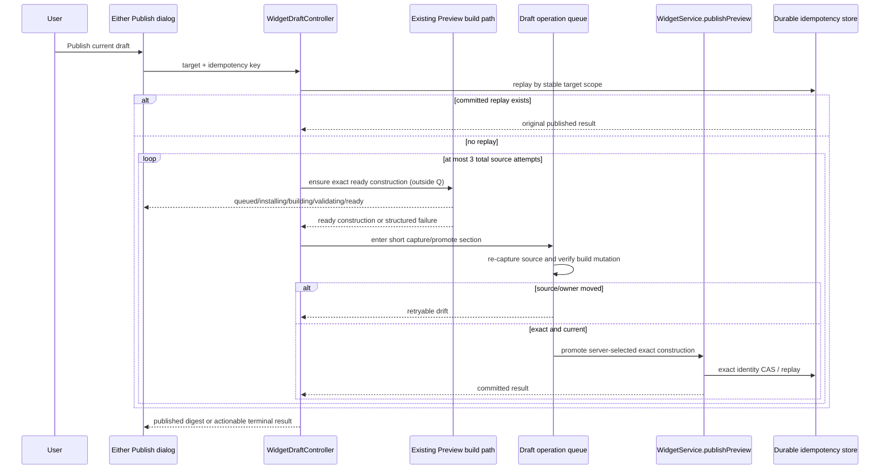
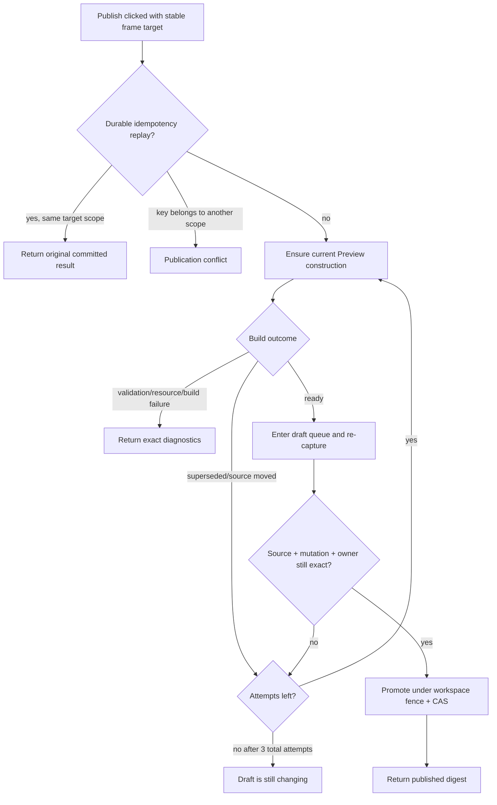

# S133 - widget publish: auto-heal changed drafts, build current source on Publish
[Overview](../BASED.md)

Publish the newest stable, authorized draft source through the user's chosen
Preview frame. A click freezes only the durable publication target
(`draftId + previewId + canvasId + frameNodeId`) and the idempotency key. The
server chooses, validates, and promotes the exact ready construction for the
current source and current authorized binding plan. A moved draft rebuilds
inside the same request instead of producing a stale-selection rejection.

## Context

2026-08-01 incident (Breakout Game): the user edited
`drafts/Breakout Game/ui/main.ts` while the publish confirmation dialog was
open. The dialog froze draft digest `189811c3f502`, build #5, and Preview
revision `3abe4939-36c`. Publish re-hashed the folder, found newer source, and
returned `stale-revision`. The user then had to close the dialog, wait for or
manually trigger a rebuild, review another exact selection, reopen the dialog,
and click Publish again.

The frozen contract exists in two independent UI surfaces and must be removed
from both:

- Canvas Preview confirmation:
  [`PreviewPublicationConfirmationDialog.tsx`](../../packages/ui-ai-chat/src/publication/PreviewPublicationConfirmationDialog.tsx)
  plus `publicationSelection()` / `publish()` in
  [`PreviewPortalRuntime.ts`](../../packages/ui-ai-chat/src/canvas-extension/PreviewPortalRuntime.ts).
- Sidebar/detail publication:
  [`WidgetPublicationDialog.tsx`](../../packages/ui-ai-chat/src/publication/WidgetPublicationDialog.tsx),
  which separately rechecks the draft revision and exact Preview selection.
  Its current coverage is
  [`mount.test.tsx`](../../packages/ui-ai-chat/tests/publication/mount.test.tsx).
- API and server:
  [`api.widgetPublish.publish.ts`](../../packages/api/src/agent/api.widgetPublish.publish.ts)
  forwards `expectedRevision`, and
  [`WidgetDraftController.publish`](../../packages/service-agent/src/widget-drafts/WidgetDraftController.ts)
  rejects it before publication begins.
- Exact promotion:
  [`WidgetService.publishPreview`](../../apps/cli/src/services/WidgetService.ts)
  correctly requires the owner, retained construction, source mutation,
  binding plan, frame, and publication identity to agree. Those checks stay.

The old contract also avoids a build during Publish. That remains the fast
path, not a universal rule. The new contract changes the reviewed object from
"the exact rendered Preview revision selected before confirmation" to "the
current draft source published through this explicit frame target." A healed
construction may be promoted before the browser has mounted it. Validation,
authorization, artifact integrity, exact promotion, release signing, and the
commit fence still apply.

Related tasks:

- [`S99`](./S99.md) introduced the canvas confirmation dialog.
- [`B70`](../b/B70.md) is open and still specifies exact-ready publication
  gating; S133 supersedes that part only.
- [`E33`](../e/E33.md) and [`E40`](../e/E40.md) describe the draft/Preview/
  Publish lifecycle. E40's answers 111-117 are deliberately superseded here.
- [`A96`](../a/A96.md) implemented retained Preview constructions and exact
  promotion. S133 reuses that pipeline but supersedes its "Publish never
  builds" product rule.

## Plan

### 1. Freeze a publication target, not a build selection

- Replace the client/API selection payload with one stable target:
  `idempotencyKey`, `draftId`, `previewId`, `canvasId`, and `frameNodeId`.
- Remove `expectedRevision`, `previewRevisionId`,
  `expectedBindingRevision`, and `expectedBindingPlanDigestSha256` from the
  public `widgetPublish.publish` input. Do not make them optional; there must be
  one contract and one server behavior.
- The server verifies that the target is a persisted, non-closed frame owner
  for the draft and tenant. A stale or missing target is `not-found`; it is not
  silently replaced with a different frame.
- The server obtains the exact source revision, committed mutation ID, Preview
  revision ID, build sequence, binding revision, and binding-plan digest from
  the ready construction returned by the existing build pipeline. These exact
  values, never client guesses, are passed to `publishPreview`.
- Publish is available when a durable target exists and no publication request
  is already active. Readiness decides reuse versus build; it no longer decides
  whether the user may click.

### 2. Reuse the Preview build path without re-entering the draft queue

The current `publish()` holds `#queue('draft:<id>')`, while
`#buildPreviewNow()` enters the same queue. Calling the build coordinator from
inside today's outer publication queue would deadlock. Restructure the
orchestration explicitly:

1. `publish()` does **not** hold the draft queue across the whole request.
2. Outside the queue, verify the stable target and call the existing
   `buildPreview(draftId, ownerRef)` / `PreviewBuildCoordinator` path. That
   path already deduplicates a matching ready construction, joins a matching
   pending build, applies build admission, and publishes progress. Do not call
   `waitForPreview()` after awaiting the coordinator and do not create a second
   build pipeline.
3. When a ready result returns, enter `#queue('draft:<id>')` only for the final
   re-capture and promotion attempt. Re-read the workspace, source digest,
   committed mutation, owner, and active Preview revision there.
4. Run `withDraftRevisionFence` and `publishPreview` only when the re-captured
   state equals the exact ready result. Keep the existing definition CAS,
   frame-owner checks, exact construction checks, signing, and durable records.
5. Leave the queue before deciding whether another source attempt is needed.
   Never recursively acquire the same queue.

Keep a structured internal attempt result such as `ready`, `retryable-drift`,
or `terminal-failure`; do not classify retries by matching error text.

### 3. Define the bounded stabilization loop precisely

- Allow **3 total source attempts**: the first captured source plus at most 2
  retries. A fast-path reuse is one attempt but performs zero guest builds.
- Retry only source/owner movement that can become stable:
  coordinator `superseded`, `WIDGET_BUILD_SUPERSEDED`,
  `WIDGET_DRAFT_REVISION_CHANGED`, a post-build digest/mutation mismatch, or an
  exact promotion that became stale because the same target advanced.
- Before every retry, perform durable idempotency replay. A previous attempt
  may have committed even if its response was lost.
- Validation, manifest identity, resource authorization, install/compiler
  failure, artifact integrity failure, target removal, definition CAS conflict,
  and signing/storage failure are terminal. They are never hidden by retries.
- If retryable movement consumes all 3 attempts, return
  `draft-still-changing` with: "Draft is still changing — publish again when
  edits settle." No partial publication is treated as failure; idempotency
  replay resolves an already committed attempt.

### 4. Make idempotency safe when the server chooses the construction

The existing idempotency fingerprint contains the exact Preview/source/binding
identity. After S133 the client cannot reproduce that identity, so replay must
happen before a new build is selected.

- Add an internal durable lookup/replay operation keyed by tenant/account and
  `idempotencyKey`. Verify its stored stable target scope (`draftId`,
  `previewId`, `canvasId`, `frameNodeId`) against the incoming request before
  returning the original committed result.
- Same key + same stable target returns the original published revision even
  if the draft, active Preview, frame status, or active published revision has
  since advanced. It performs no build, signing, or second commit.
- Same key + different stable target returns `publication-conflict`.
- Recheck replay at request entry, before each retry, and after an exact
  idempotency conflict so concurrent duplicate requests converge on the first
  committed result.
- Keep the exact fingerprint stored at commit. The stable-scope lookup is a
  replay gateway, not a weakening of the exact durable identity.
- Prefer an internal service/store capability. If this requires a runtime
  `src/` change in the versioned `@omnidraw/widget-contract`, apply the required
  semantic version bump and regenerate the lockfile under the published-package
  policy.

### 5. Resolve bindings from the healed build without granting authority

- A heal resolves the current binding plan through the existing authorized
  resource resolver. It may reuse current authorized selections; it must never
  create a resource, select an unrelated resource, or widen a permission grant
  merely because Publish was clicked.
- A changed but authorized plan is allowed. The build updates the owner binding
  revision/digest, and publication promotes those exact server-produced values.
- Missing, provisioning, incompatible, or unauthorized bindings return
  `resource-binding-invalid` with diagnostics. Nothing publishes.
- Any source or binding movement after the build becomes ready is retryable
  drift and must re-enter the full ensure-build step. `publishPreview` keeps all
  current equality checks between owner, construction, bindings, draft, frame,
  and request.

### 6. Use one publication state model across both dialogs

- Replace `TPreviewPublicationSelection` and
  `TWidgetPublicationPreviewSelection` with a shared stable target type. Keep a
  label for sidebar choice, but keep revision/build/binding data out of the
  request identity.
- Canvas Preview:
  remove `isSameSelection`, the frozen `<dl>`, the exact-selection comparison
  in `PreviewPortalRuntime.publish`, and exact-ready `publishSelectionValid`
  invalidation. Expose the current target plus a reactive publication/progress
  projection to the dialog.
- Sidebar/detail:
  remove the pre-submit `current.variant.revision` equality rejection and exact
  Preview-key recheck. Resolve persisted targets, including a target whose
  newest build is queued/building/failed, and let the server reuse or heal it.
- Share the attempt-state/copy projection used by both surfaces so `idle`,
  `queued`, `installing`, `building`, `validating`, `publishing`, `success`, and
  terminal failures cannot drift between dialogs.
- Correlate existing Preview progress by the chosen `previewId`. After `ready`,
  show local `publishing` while release signing/commit completes. Ignore events
  from other frames.
- While a dialog is open but before the click, show live source/build/binding
  details without treating changes as errors. Once clicked, show the digest and
  exact build selected by the server stream. On success show "Published
  <short-digest>" before closing or in the success notification.
- If no persisted frame target exists, keep Publish disabled with one
  actionable instruction to open/place a Preview. Known validation failure may
  be shown, but it must not restore an exact-ready gate.

### 7. Make failures explicit end to end

Update the service result type, Zod schema, API forwarding types, client title
mapping, and both dialogs together.

- Add `draft-still-changing` for exhausted retryable drift.
- Add `build-failed` for install/compiler/construction failures and preserve
  their structured diagnostics.
- Keep `validation-failed`, `resource-binding-invalid`, `not-found`,
  `publication-conflict`, and `publication-failed` distinct.
- Remove `stale-revision` from the public publication result. Internal stale
  conditions either retry, become `draft-still-changing`, or map to the exact
  terminal category. Do not return a generic red-box message for a known cause.

### 8. Reconcile current architecture and task records

- [`B70`](../b/B70.md): replace exact-ready publication gating with stable
  frame-target gating; keep its cross-surface truth and diagnostics work.
- [`E33`](../e/E33.md): record that saved draft edits affect the published
  default at the next successful Publish, which reuses or builds current source.
- [`E40`](../e/E40.md): mark answers 111-117 as superseded by S133 and link the
  new stable-target/current-source contract.
- [`A96`](../a/A96.md): add a historical supersession note beside the
  "Publish runs no npm command" acceptance statement; do not rewrite its logs.
- Update [`llm.widget-system.md`](../../docs/internal/llm.widget-system.md) §8,
  its API summary, and any "publication never reads/builds mutable draft"
  statements. Update the Preview/publish rows in
  [`SCREENS.md`](../../docs/internal/screens/SCREENS.md).

### 9. Tests and validation

Controller/service coverage:

- Ready exact construction: publishes with zero additional guest builds.
- Source edited after ready: one click builds once and publishes the new digest,
  Preview revision, binding revision, construction hash, and source snapshot.
- Source moves once or twice during build/re-capture/commit: the same request
  stabilizes and succeeds; three moving attempts return
  `draft-still-changing` with no publication.
- Queue-liveness regression: a heal request resolves under a short test timeout
  and a queued draft operation runs afterward; no self-deadlock.
- Validation, manifest, binding, install/compiler, integrity, signing, and CAS
  failures retain their own result reason and diagnostics.
- Binding-plan change with existing authorization promotes the exact new plan;
  missing or unauthorized binding publishes nothing.
- Lost response + same idempotency key returns the original result without a
  build, even after source/Preview/published-default movement. Different target
  scope with that key conflicts. Concurrent duplicate requests converge on one
  committed revision.
- Commit-time source and owner races never publish mismatched construction and
  never create a partial durable publication.

API/client coverage:

- Contract rejects removed frozen fields and accepts only the stable target.
- Canvas confirmation updates live, shows owner-scoped phases, succeeds with
  the server-returned digest, and renders each actionable failure.
- Sidebar/detail publication gets equivalent coverage in
  `tests/publication/mount.test.tsx`; its stale-draft, stale-pinned-Preview, and
  exact-binding rejection tests become heal/progress tests.
- Runtime tests prove Publish is enabled for a persisted non-ready target,
  disabled without a target, and unaffected by another frame's progress.
- Fast path, retry cap, build count, signing count, commit count, and
  idempotency replay are asserted numerically.

Run focused service-agent, service-db/widget-contract (if replay capability
changes them), API, and ui-ai-chat tests plus their package typechecks. Run the
repository functional-core checks for any new `fn.*`, `fx.*`, or `tx.*` files.

## TODOS

- [x] Replace the public frozen selection with the stable publication target.
- [x] Add early durable idempotency replay scoped to that target.
- [x] Restructure `publish()` so builds happen outside the draft queue and exact promotion happens inside a short queue/fence.
- [x] Implement the 3-attempt structured stabilization loop and failure taxonomy.
- [x] Promote the exact server-produced source/Preview/binding identity without creating or widening resource authority.
- [x] Remove exact-selection gates from both publication dialogs and Preview runtime.
- [x] Share live progress, success, and actionable failure projection across both surfaces.
- [x] Reconcile B70, E33, E40, A96, llm.widget-system.md, and SCREENS.md.
- [x] Add controller, idempotency, queue-liveness, API, runtime, and both-dialog tests.
- [x] Apply any required version bump/lockfile update and run focused tests, typechecks, and functional-core validation.

## Acceptance criteria

- From either publication surface, editing draft source after a ready Preview
  still publishes the newest stable source with one click and visible progress.
- A matching ready construction remains build-free; Publish performs no guest
  install/compiler call on that path.
- Publication never waits on a build while holding the same draft queue the
  build needs. The queue-liveness regression proves the request terminates.
- At most 3 total source attempts occur. Exhausted movement returns
  `draft-still-changing`; no public `stale-revision` result remains.
- The promoted revision exactly matches the server-selected source mutation,
  Preview construction, authorized binding plan, frame owner, definition CAS,
  signed Capsule, and durable publication identity.
- Publish never creates a resource or widens a grant. Invalid authorization or
  binding state is actionable and publishes nothing.
- Same-key retry returns the original committed result even after later state
  movement; it never builds or publishes a second revision. Cross-target key
  reuse conflicts.
- Validation/build diagnostics are preserved, commit-time races fail closed or
  retry within the bound, and no partial publication is reported as failure.
- Canvas and sidebar/detail dialogs use the same target semantics, progress
  phases, published-digest success, and actionable failures.
- B70, E33, E40, A96, llm.widget-system.md, and SCREENS.md no longer claim that
  current-source Publish requires an already reviewed exact-ready revision.

## NOTES

- Non-negotiables retained: explicit user Publish, persisted frame ownership,
  one exact fenced commit, validation, existing resource authorization,
  content-addressed construction, release signing, definition CAS, durable
  idempotency, publication records, immutable revisions, and pinned instances.
- The healed construction can be unseen in the browser at commit time. This is
  intentional: S133 changes the review contract to current draft source plus
  existing authorized resources. The UI must say "Publish current draft," not
  "Publish this exact Preview."
- The existing Preview build coordinator remains the only build admission and
  deduplication path. The task adds orchestration and replay, not another build
  implementation.

### LOGS

- 2026-08-01: Created from the Breakout Game stale-selection incident.
- 2026-08-03: Reworked after code-level validation. Added the non-reentrant
  queue boundary, both publication surfaces, stable target API, exact
  server-selected binding policy, structured retry cap, early durable
  idempotency replay, complete failure taxonomy, dependency reconciliation,
  and queue-liveness coverage.
- 2026-08-03: Implemented the stable public target, current-source heal path,
  three-attempt retry loop, exact fenced promotion, durable stable-scope replay,
  current authorized binding resolution, shared UI phase/failure copy, and both
  publication surfaces. Replay now survives later publications and owner close;
  cross-target key reuse conflicts. Bumped `@omnidraw/widget-contract` to
  `0.5.2` and regenerated its lockfile release marker. Focused API (53),
  service-agent (126), service-db (148), widget-contract (47), and ui-ai-chat
  (279) tests pass with package typechecks and functional-core lint.

---
