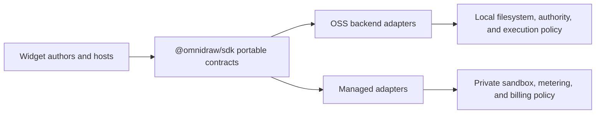

# S139 - widgets: make SDK the portable contract authority (order 3/7)
[Overview](../BASED.md)

Make `@omnidraw/sdk` the single owner of portable widget manifests, artifacts,
guest contracts, validation, descriptors, and pure canonicalization while
retaining OSS authority and execution mechanics in the backend.

## Context

The redesign already contains an Effect-free and Zod-free SDK contract tree,
but `apps/backend/src/core/widget-domain` still duplicates much of it and owns
Lucide icon validation. That copy can drift and lets backend-private imports
masquerade as portable contract ownership.

Authorities:

- [`docs/PRD.md`](../../docs/PRD.md)
- [`docs/internal/llm.widget-system.md`](../../docs/internal/llm.widget-system.md)
- [`packages/sdk`](../../packages/sdk)
- [`apps/backend/src/core/widget-domain`](../../apps/backend/src/core/widget-domain)

## Plan

No mockup is needed because this changes ownership and package boundaries, not
visual behavior.

### 1. Inventory and classify

- Classify every backend widget-domain export as portable contract or
  backend-only authority/execution policy.
- Route portable consumers through supported SDK entrypoints.
- Keep unavoidable server projections narrow and protected by strict tests.

### 2. Remove the duplicate portable owner

- Delete backend copies of portable schemas, descriptors, validators, icon
  keys, and pure canonicalizers.
- Move portable icon-key validation completely behind the SDK contract.
- Keep SDK public declarations Effect-free, Zod-free, and Capsule-neutral.

### 3. Qualify release and consumers

- Bump the SDK semantic version, regenerate the lockfile, and synchronize the
  qualified public package set and established external-consumer pins.
- Run SDK unit/conformance/pack tests, backend widget and architecture tests,
  typechecks, package-dist verification, and packed/external consumers.

## TODOS

- [x] Record and enforce the backend widget-domain symbol classification
- [x] Import every portable contract through supported SDK entrypoints
- [x] Remove duplicate backend schemas, validators, icon data, and canonicalizers
- [x] Keep backend-only authority, filesystem, execution, and policy local
- [x] Add strict ownership/inventory and SDK boundary tests
- [x] Bump SDK, regenerate the lockfile, and synchronize release evidence
- [x] Run focused and external-consumer verification
- [x] Record managed-consumer implications and close the task

## NOTES

- This is a hard ownership cut, not a compatibility layer.
- Managed must consume the same SDK entrypoints and qualified package-set
  version; its sandbox, metering, billing, auth, and storage remain private.

### LOGS

- 2026-08-13: Started from order 3/7. Read the repository workflow and PRD SDK
  authority. Initial audit found a near-complete SDK contract tree plus the
  still-live backend duplicate and backend-owned Lucide/Zod icon validator.
- 2026-08-13: Added the side-effect-free `@omnidraw/sdk/contract` entrypoint and
  routed backend portable consumers through it. Removed the complete backend
  `core/widget-domain` copy and moved its contract tests to the SDK. Backend
  source snapshots, filesystem release/publication, build and execution policy,
  Preview/signing, and function execution remain under their existing shell
  owners. A strict inventory test now rejects a restored duplicate, backend
  Lucide dependency, SDK source-tree import, unsupported entrypoint, or Zod
  projection drift.
- 2026-08-13: Made SDK validation the only portable icon and manifest rule. The
  private RPC projection delegates to SDK validators while keeping the SDK API
  Effect-free and Zod-free. Removed legacy `capsuleArtifactHash` normalization;
  portable artifacts and runtime descriptors use canonical `artifactHash` and
  `runtime` fields.
- 2026-08-13: Released the public contract change as `@omnidraw/sdk@0.8.0`,
  regenerated `bun.lock`, and synchronized the qualified package set and
  external managed-composition fixture. Updated the packed-install harnesses to
  share Bun's download cache while retaining isolated tarballs, consumer roots,
  lockfile checks, and source-resolution checks; this avoids TypeScript 7's
  platform-package deadlock in a fresh empty cache.
- 2026-08-13: Verification passed: SDK/focused contract tests (59/59), full
  backend tests (665/665), architecture tests (49/49), all seven workspace
  typechecks, five-package distribution build/pack/import verification, packed
  external composition, runtime smoke, and the packed deterministic host-free
  SDK checker.
- 2026-08-13: Managed consumers must update to the qualified SDK `0.8.0`, import
  portable contracts from `@omnidraw/sdk/contract`, and emit canonical
  `artifactHash`/`runtime` wire values. Managed Microsandbox execution,
  metering, billing, authentication, and storage remain private and unchanged.

---
