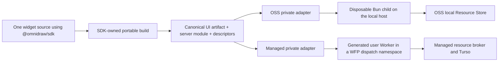

# S140 - widgets: lock one portable server ABI and two private host adapters (order 1/8)
[Overview](../BASED.md)

Replace the old runtime-by-runtime widget assumption with one SDK-owned server
module contract: OSS executes it as trusted local host code, while managed
wraps the same bytes as a Cloudflare Workers for Platforms user Worker.

## Context

The current architecture correctly requires one widget source and keeps
managed policy private, but it still names Microsandbox as the managed function
runtime and lets a widget manifest select an arbitrary `runtimeAbi`. The new
managed direction uses a Workers for Platforms user Worker for untrusted
function execution and Turso Cloud for resources. That deployment choice must
not leak into widget source or turn the OSS backend into a Cloudflare emulator.
Widget code never executes in Cloudflare Sandbox, Containers, or a Durable
Object. Those products may support managed chat/build tooling, but a widget
function invocation runs only in a Worker isolate.

Authorities and implementation evidence:

- [Product redesign](../../docs/PRD.md)
- [Widget system](../../docs/internal/llm.widget-system.md)
- [Application architecture](../../docs/internal/llm.app-architecture.md)
- [SDK contracts](../../packages/sdk/src/contracts)
- [OSS function execution](../../apps/backend/src/shell/function-execution)
- [Workers for Platforms architecture](https://developers.cloudflare.com/cloudflare-for-platforms/workers-for-platforms/how-workers-for-platforms-works/)
- [Workers for Platforms module upload](https://developers.cloudflare.com/cloudflare-for-platforms/workers-for-platforms/reference/platform-examples/)
- [Turso Cloud limitations](https://docs.turso.tech/cloud/limitations)

This task supersedes the managed-runtime choice recorded by
[E36](../e/E36.md) and [D1](../d/D1.md); it does not rewrite their historical
logs.

## Plan

No mockup is needed because this changes execution ownership and contracts, not
Canvas visuals.

### 1. Record the refactor judgment

- Define the portable server artifact as an Omnidraw module, not as Bun code,
  Cloudflare Worker code, or a complete deployable Worker script.
- Keep widget authors on `@omnidraw/sdk/server`. They do not import
  `cloudflare:workers`, receive `env`, define a Fetch handler, write Wrangler
  configuration, or maintain an OSS and cloud source variant.
- State that the managed adapter may generate a small Fetch/module wrapper
  around the exact canonical server bytes. That wrapper has a separate managed
  deployment digest and must never change the canonical widget artifact digest.
- State that Capsule remains the browser UI sandbox only. It does not execute
  server functions.
- Make portability symmetric: the OSS accepted-build boundary and managed
  accepted-build boundary accept the same SDK artifact language. OSS must not
  retain a Bun-only server extension or trusted-host escape hatch that makes a
  widget runnable locally but not in managed.
- State explicitly that managed widget code runs only as a Workers for
  Platforms user Worker. It never runs in Cloudflare Sandbox, a Container, a
  Durable Object, or the chat/build sandbox.

### 2. Fix the public/private boundary

- Keep the portable manifest, server ABI, invocation/resource envelopes,
  validators, codecs, and conformance vectors in `@omnidraw/sdk`.
- Keep the Bun child, local filesystem catalog, local Resource Store, Preview,
  and publication mechanics in `apps/backend`.
- Keep dispatch namespaces, Worker uploads, outbound-worker egress policy,
  Cloudflare bindings, tenant identity, Turso credentials, billing, per-user
  usage evidence, and plan enforcement in the private managed repository.
- Treat the managed coding/build sandbox as a separate concern from function
  execution. No managed build-container or chat-worker implementation enters
  OSS.

### 3. Update authoritative documentation and enforcement

- Update `AGENTS.md`, the PRD, and the widget-system authority to use this
  split consistently and to retain the explicit OSS trusted-host warning.
- Add architecture tests that reject Cloudflare, Wrangler, workerd,
  `@tursodatabase/serverless`, tenant, billing, and managed-policy imports from
  public packages and OSS function/resource adapters.
- Document that OSS conformance proves the portable contract and local adapter,
  while a private managed gate must still prove real WFP deployment and Turso
  behavior.

## TODOS

- [ ] Record one canonical server-module ABI and the wrapper-not-rebuild rule
- [ ] Update the PRD, widget-system authority, and repository guide
- [ ] Mark the old managed Microsandbox function decision as superseded
- [ ] Preserve the explicit trusted-local OSS execution decision
- [ ] State that widget functions run only in a WFP user Worker, never Sandbox/Containers
- [ ] Make OSS and managed accepted widget artifact languages identical
- [ ] Define the public SDK versus OSS backend versus managed ownership table
- [ ] Add dependency and import-boundary enforcement for cloud/private code
- [ ] Record the external managed qualification that OSS cannot perform

## NOTES

- Group: `[R]` portable widget server and resource hard cut.
- This is not a request to host the OSS backend on Cloudflare.
- The managed wrapper is deployment material, not a second widget artifact.
- No compatibility mode may select between a Bun ABI and a Cloudflare ABI.
- Cloudflare Workers isolation is the managed widget runtime. “Cloudflare
  Sandbox” is not used for widget execution.
- OSS has no per-user, monthly, metering, or cloud-plan quota. The workload
  bound `N` and 30 sandbox minutes per user are cost-estimation inputs for the
  managed offering, not SDK or OSS runtime requirements.

### LOGS

- 2026-08-17: Created from the Cloudflare managed-offering judgment. Planning
  only; no runtime, package, resource, or publication code changed.
- 2026-08-17: Clarified Worker-only widget execution and identical OSS/managed
  widget admission. Removed cloud cost-model limits and per-user quotas from
  the OSS/SDK refactor; they belong only in managed-offering estimates.

---
