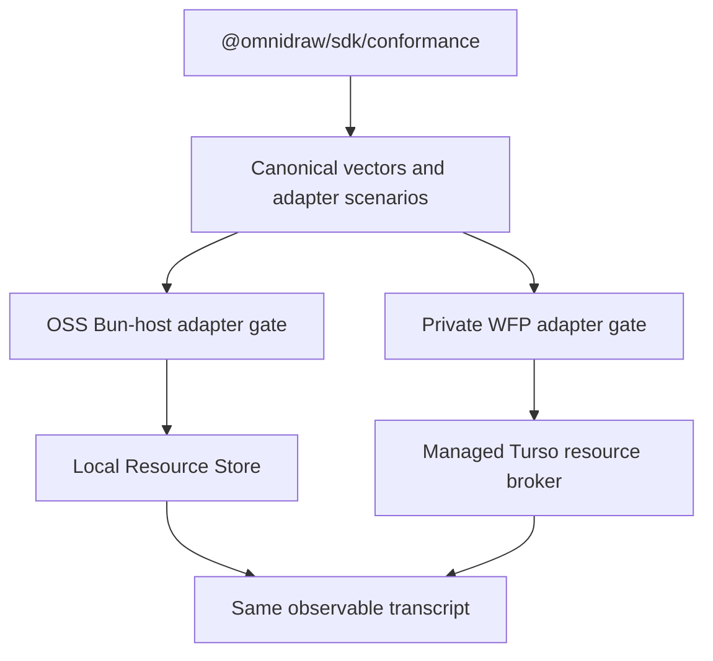

# S146 - widgets: ship cross-host function and resource conformance (order 7/8)
[Overview](../BASED.md)

Expand the SDK conformance subpath into the executable portability contract for
the canonical server module, direct functions, and resource data plane.

## Context

`@omnidraw/sdk/conformance` currently ships a small manifest, lifecycle,
state, invocation, and resource-call transcript. It does not prove that two
hosts load the same server bytes, construct the same context, enforce the same
effects and limits, encode database values identically, or return the same
failures. The OSS and private managed repositories need one versioned test kit
without adding a sixth package or sharing application implementation.

Relevant code:

- [SDK conformance vectors](../../packages/sdk/src/conformance.ts)
- [SDK conformance tests](../../packages/sdk/tests/conformance.test.ts)
- [Backend live conformance](../../apps/backend/src/conformance)
- [Direct function tests](../../apps/backend/src/shell/function-execution/tests/direct-function-runtime.test.ts)
- [Resource tests](../../apps/backend/src/shell/resources/tests)
- [Public package boundary](../../docs/PRD.md)

## Plan

### 1. Publish bounded, implementation-free fixtures

- Add one minimal server-function source fixture and its expected canonical
  manifest, module digest, descriptor bytes, artifact digest, and build
  identity inputs.
- Cover `fn`, `fx`, and `tx`; successful and invalid input/output;
  undeclared slots; effect escalation; logs; cancellation; timeout; output/log/
  resource-call limits; handler failure; and ambiguous writes.
- Cover every KV and secret-store operation plus DB named invoke, arbitrary
  query, single execute, execute batch, bigint/blob/null/JSON rows, conflicts,
  limits, and the rejected SQL profile.
- Keep fixtures framework-free and free of Cloudflare, Turso, Bun, Node,
  Capsule framework, credentials, account, organization, and billing types.
- Add negative fixtures for filesystem, process/environment, OS, subprocess,
  native modules, sockets, DNS, `fetch`, WebSocket, timers, dynamic loading,
  shared memory, and adapter-specific globals. Both acceptance paths must
  reject the same fixture set.

### 2. Provide a reusable adapter scenario

- Export narrow test-only adapter ports and deterministic scenario runners from
  `@omnidraw/sdk/conformance`; do not export a host executor, fake authority,
  or production implementation.
- Make scenarios compare canonical observable values and stable error codes,
  not process metrics, driver text, wall-clock timestamps, Worker metadata, or
  transport frames.
- Require fresh adapter state and explicit disposal for each scenario.
- Include artifact admission and malformed-wire vectors that can run without
  executing untrusted code.

### 3. Qualify OSS

- Run the same scenarios through the real accepted-build path, raw module,
  direct Bun host runner, IPC bridge, function/resource policy, and local
  providers.
- Retain separate focused tests for process-group teardown, filesystem
  publication, WAL/backup recovery, and private resource-management APIs; those
  are OSS implementation evidence, not portable conformance.
- Add a packed external consumer that installs only the staged SDK package and
  proves the conformance subpath contains no workspace or application imports.

### 4. Define the managed handoff

- Record that the private managed repository must run the same SDK version and
  scenarios against a real WFP dispatch namespace and Turso database before a
  package set is accepted.
- Require the managed test to prove the uploaded wrapper references the exact
  canonical server digest and that outbound authority remains unavailable to
  widget code.
- Require the real managed gate to invoke widget code only as a WFP user
  Worker, never through Cloudflare Sandbox, Containers, or the build/chat
  sandbox.
- Do not claim Cloudflare or Turso qualification from the OSS-only gate.

## TODOS

- [x] Add canonical server module, descriptor, artifact, and wire fixtures
- [x] Add function success/failure/effect/limit/cancellation scenarios
- [x] Add complete KV, secret-store, DB, codec, and SQL-policy scenarios
- [x] Add complete forbidden filesystem/OS/network/runtime admission vectors
- [x] Export narrow test-only adapter ports and scenario runners
- [x] Run the suite against the real OSS build/runner/resource composition
- [x] Add staged-package and external-consumer conformance tests
- [x] Document the required real WFP/Turso managed gate
- [x] Keep adapter-specific metrics and transports out of expected transcripts

## NOTES

- Group: `[R]` portable widget server and resource hard cut.
- Depends on [S143](./S143.md) and [S145](./S145.md).
- Passing an in-memory fake is not sufficient for either product's release
  gate.
- Cross-repository qualification uses an exact published SDK version from
  `public-package-set.json`.

### LOGS

- 2026-08-17: Created after auditing the existing SDK conformance fixture and
  finding that it describes but does not execute server/resource parity.
  Planning only.
- 2026-08-17: Added Worker-only managed qualification and forbidden OS/runtime
  vectors. Cloud cost-model limits remain outside OSS conformance.
- 2026-08-17: Published a framework/adapter-neutral executable kit with 16
  path-free descriptors, 16 function scenarios, 41 module-admission vectors,
  4 artifact vectors, 6 wire vectors, 13 SQL vectors, and 7 provider families/
  41 provider steps. The live OSS gate passes every provider step through both
  the canonical and real accepted-generation artifacts via disposable Bun
  child IPC and fresh KV/secret/DbResource providers (6 tests, 114 assertions).
  The SDK-only staged consumer and five-package external composition pass clean
  install/typecheck/runtime gates. Current authorities explicitly leave real
  WFP dispatch/Turso execution to the private exact-SDK managed gate.
- 2026-08-18: Review remediation added three implementation-free malformed DB
  JSON-cell decode vectors (bigint, bytes, and nested bytes). The fixed wire
  inventory is now 6 vectors and rejects those inputs as `MALFORMED_WIRE`.
- 2026-08-18: WFP compatibility review added closed-bundle computed and
  unresolved `globalThis` denial vectors. The fixed admission inventory is now
  41 vectors; private qualification still proves real outbound denial live.

---
