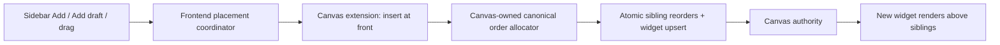

# S151 - widgets: append new canvas placements above existing content

[Overview](../BASED.md)

Remove random UUID-based layer placement for widgets. A newly placed published
widget or draft Preview must be appended at the front of its Canvas sibling
stack so it is immediately visible above existing content.

## Context

Sidebar click placement, sidebar pointer-drag placement, and automatic draft
Preview placement converge in
[`canvas-extension/index.ts`](../../apps/frontend/src/shell/framework/feature/canvas-extension/index.ts).
`commitPlacement` builds a widget frame through
[`fnPlacedWidgetNode`](../../apps/frontend/src/core/widgets/fn.placed-widget-node.ts)
and commits one `upsert` through the public Canvas extension document port.

`fnPlacedWidgetNode` currently assigns `orderKey: args.id`. The ID is a random
UUID, so its lexical position is unrelated to creation order. A new widget can
therefore sort below existing siblings and render behind them even though the
placement action selects it.

Ordinary Cangine editor creation already uses canonical append allocation:
allocate a key after the last sibling, and deterministically rebalance the
sibling set when no key remains. That Cangine mechanism is intentionally hidden
inside `@omnidraw/canvas`; the frontend application must not import Cangine or
copy its order-key alphabet/allocation algorithm.

## Plan

### 1. Add a renderer-neutral front-insertion seam

- Extend the public Canvas extension document port with a semantic insertion
  operation for one new authored node at the front of its sibling stack.
- Implement the operation inside `@omnidraw/canvas`, where Cangine is already
  encapsulated. Use Cangine's public canonical order-key helpers.
- Allocate strictly after the current last sibling. If the current keys are
  non-canonical or exhausted, deterministically rebalance existing siblings and
  assign the new node the final canonical key in the same editor mutation.
- Reject an insertion whose node ID already exists rather than silently turning
  it into an update/reorder.
- Keep the public API Effect-free and renderer-neutral; do not expose Cangine
  types or an order-key generator to the frontend.

### 2. Route every external widget placement through the seam

- Change shared `commitPlacement` to use front insertion, covering sidebar
  clicks, pointer drops, and automatic AI draft Preview placement together.
- Stop deriving durable stacking order from the random widget node ID.
- Preserve the selected/focused node behavior, viewport positioning, drag
  preview, idempotent authority command path, and published-versus-draft frame
  projection.
- Do not automatically raise an existing widget when it is selected, reloaded,
  rebuilt, or remounted. This policy applies only to newly inserted placements.

### 3. Verify ordering and package impact

- Add Canvas bridge tests for an ordinary append and the rebalance fallback,
  asserting sibling reorders and the insert are one mutation.
- Add frontend placement coverage proving the shared placement commit requests
  front insertion and the new frame is selected.
- Exercise overlapping existing content in a real browser: each newly added
  published widget and draft Preview must render above all existing siblings,
  including the previously added widget.
- Because this changes public Canvas runtime/API source, apply the required
  Canvas semantic version bump, update `public-package-set.json`, and regenerate
  the lockfile. Run Canvas and frontend typechecks/tests plus package build
  verification.

## TODOS

- [x] Add Canvas-owned semantic front insertion to the extension document port.
- [x] Allocate canonical front order and atomically rebalance when required.
- [x] Reject duplicate IDs at the insertion boundary.
- [x] Route click, drag, and automatic Preview placement through front insertion.
- [x] Add Canvas bridge coverage and verify the shared placement path live.
- [x] Bump the Canvas package version and regenerate release metadata/lockfile.
- [x] Run Canvas and frontend verification.

## Acceptance criteria

- A newly placed widget frame renders above every existing sibling on the
  Canvas, and a second new frame renders above the first.
- Click placement, pointer-drag placement, and automatic draft Preview placement
  share the same ordering policy.
- The insert and any required sibling-key rebalance are submitted as one atomic
  optimistic/authority mutation.
- Existing widgets do not change order merely because they are selected,
  remounted, reloaded, rebuilt, or published.
- Frontend code imports no Cangine API and contains no copied Cangine order-key
  constants or allocation algorithm.
- Public Canvas declarations remain Effect-free and expose no Cangine-owned
  types.

## NOTES

- Selection is not stacking order. Calling `setSelection` after the current
  UUID-keyed upsert does not bring the frame to the front.
- The Canvas contract permits opaque string order keys, while Cangine owns the
  canonical 16-character allocation and rebalance mechanics. Keep those
  mechanics behind the Canvas adapter.
- This is a subtraction because it removes random-ID ordering and avoids a
  second frontend-owned stacking algorithm.

### LOGS

- 2026-08-20: Traced sidebar, drag, and automatic Preview placement to shared
  `commitPlacement`; confirmed `fnPlacedWidgetNode` currently uses the random
  node ID as `orderKey`; reviewed the Canvas extension bridge and Cangine's
  canonical append/rebalance behavior.
- 2026-08-20: Added renderer-neutral `insertAtFront` to the Canvas extension
  document port. Canvas now allocates after the last sibling or atomically
  rebalances non-canonical/exhausted keys before the upsert, and rejects an
  existing ID. Shared frontend placement uses that seam before selection.
  Canvas bridge tests cover empty and sequential insertion, direct allocation,
  rebalance, and duplicate IDs.
- 2026-08-20: Bumped `@omnidraw/canvas` to `0.7.1`, updated the public package
  set, and regenerated the lockfile. In live Chromium, two center-overlapping
  Click Counter placements received increasing canonical keys and the second
  rendered above the first; both test placements were then deleted through the
  supported Canvas CLI. Review follow-up removed the dead UUID `orderKey` from
  the frontend projection entirely: `insertAtFront` now accepts an unordered
  authored node and Canvas alone supplies its durable key. `bun.lock` now records
  Canvas `0.7.1` and passes frozen installation. Canvas's 173 tests/build and
  the complete frontend typecheck, 194 tests, and production/inspection builds
  passed.
