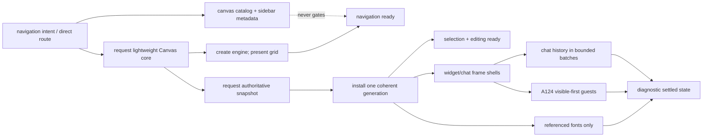

# S152 - canvas: remove the monolithic startup barrier for immediate interaction
[Overview](../BASED.md)

Make a direct Canvas route show a responsive Cangine surface immediately,
install one authoritative snapshot without waiting for fonts or product
extensions, and hydrate text, widgets, images, and AI Chat as independent,
failure-isolated lanes.

## Context

The current cold path treats unrelated work as one boot transaction. The page
therefore stays on a white **Loading canvas…** surface until the slowest
required-looking dependency has finished, even though the durable Canvas is a
JSON snapshot and Cangine can render coherent geometry before optional content
is ready.

The delay begins before `@omnidraw/canvas` mounts:

1. [`index.tsx`](../../apps/frontend/src/index.tsx) resolves `/c/:id` by
   searching `runtime.store.state.canvases`. That store begins empty, so the
   route waits on the application [`canvas-bootstrap.ts`](../../apps/frontend/src/shell/canvas/canvas-bootstrap.ts)
   `canvas.list` request before it renders `CanvasPage` or requests the lazy
   Canvas route bundle. A deep link is serialized as connection -> complete
   catalog -> route import instead of using the route's already-known Canvas
   ID.
2. [`canvas-composition.ts`](../../apps/frontend/src/shell/canvas/canvas-composition.ts)
   statically constructs the AI Chat and widget extensions. Together with the
   Canvas runtime import, the route graph reaches the component AI Chat
   implementation, SDK browser host, Capsule, font shaping, Emscripten, and
   optional framework compatibility before a minimal Canvas can become
   interactive. The inspected production build had
   a 5.1 MB raw Canvas route chunk, a 1.2 MB adapters chunk, about 1.0 MB of
   Fontkit/Emscripten JavaScript, a 708 KB Three chunk, and about 1.1 MB of
   bundled Canvas fonts. Exact hashes and sizes are build-dependent, but the
   static ownership problem is not.
3. [`runtime.ts`](../../packages/canvas/src/runtime.ts) registers and awaits all
   twelve Inter, Fraunces, and JetBrains Mono family/weight resources before it
   calls `CanvasDocumentService.start`. Those URLs are first discoverable only
   after the lazy Canvas module evaluates. Loading even one registered font
   also admits Cangine's lazy Fontkit text shaper. The runtime test currently
   codifies `fonts:preload` before `document:start` as an invariant.
4. [`CanvasDocumentService.ts`](../../packages/canvas/src/services/CanvasDocumentService.ts)
   then requests, decodes, and installs the authoritative snapshot. Image
   resources already demonstrate the intended behavior: descriptors are
   registered, image preload is forked, and scene installation continues.
   Fonts should not have stronger global startup authority than images.
5. The same root boot effect creates the editor, selection controllers, shell,
   extension bridge, every extension installation, input gate, trace owners,
   and only then attaches the editor. [`CanvasRuntimeLifecycle.ts`](../../packages/canvas/src/components/CanvasRuntimeLifecycle.ts)
   exposes only boot start/success/error, while [`Canvas.tsx`](../../packages/canvas/src/components/Canvas.tsx)
   maps that entire interval to one full-surface loading overlay. The user gets
   neither the Cangine grid nor ordinary navigation while optional work is in
   progress.
6. After snapshot installation, every eligible extension is reconciled in the
   same startup burst. Widget frames can render fixed Cangine chrome without a
   guest, and AI Chat can render a lightweight shell before history, yet their
   runtime/component work currently competes with the first interactive frame.

Cangine's local contract supports unregistered system fallback for text and
reports missing resources; it does not require every exact font before scene
replacement. The Canvas widget contract likewise keeps fixed frames separate
from guest readiness. Omnidraw should use those capabilities instead of hiding
the whole document behind resource and extension hydration.

A warm live reload of a representative Canvas reached the Cangine surface in
roughly 233 ms and removed the loading overlay around 268 ms. That is not a
cold benchmark, but it proves the core lifecycle is already fast when modules,
fonts, and artifacts are cached. The original cold run loaded media around ten
seconds after dependency optimization and then closed `/rpc` with 499 after
the browser watchdog missed its heartbeat. The 499 is a client abort symptom:
optional work must neither interrupt the Canvas root fiber nor monopolize the
browser main thread long enough to make the healthy connection look dead.

This is a subtraction because it removes the global boot barrier, eager module
graph, eager all-font preload, and all-or-nothing readiness state. It does not
introduce a second snapshot authority, persisted browser cache, partial
document generation, or another runtime owner.

## Plan

The solid arrows before `Document` are the interaction-critical path. The
resource and extension branches are scoped children of the Canvas instance:
navigation or replacement cancels them, but a branch failure cannot tear down
the engine, reload the snapshot, reset the connection generation, or revoke
already-available input.

### 1. Establish a reproducible cold-load baseline

- Add one production-build browser scenario with a fresh context and empty
  HTTP/module/font/artifact caches. Keep Vite dependency optimization and dev
  HMR measurements separate from production qualification.
- Use fixtures for an empty Canvas, ordinary shapes, referenced and
  unreferenced text fonts, an image, visible/off-screen widgets, and AI Chat
  with bounded and large history. Inject deterministic delays and failures for
  catalog, snapshot, font, media, widget, and chat work independently.
- Record navigation intent, route-module request/evaluation, engine acquisition,
  snapshot dispatch/receipt/decode/install, first presented scene frame, first
  accepted pan/zoom and its painted frame, editor attachment, each referenced
  font, frame shell, widget guest, and chat-history batch. Record browser long
  tasks/event-loop gaps and the frontend RPC connection generation.
- Define milestones precisely:
  - `surface-ready`: a themed Cangine grid/background has been presented;
  - `navigation-ready`: pan/zoom input changes the camera and presents the next
    frame, even if the document has not arrived;
  - `scene-visible`: one complete accepted snapshot generation has been
    projected and presented atomically;
  - `document-ready`: selection and mutations are reconciled against that
    authoritative generation;
  - per-resource `content-ready`: exact font, image, guest, or history content
    is ready for its own node;
  - `settled`: diagnostics only, never a UI or input gate.
- Extend the existing reproduction trace with phase durations and counts using
  monotonic time. Do not add wall-clock behavior to deterministic policy tests
  or include document/widget/chat contents in diagnostics.

### 2. Remove route and module-graph serialization

- Resolve a Canvas route directly from the validated `:id` and mount the
  Canvas composition without waiting for `canvas.list`. Run catalog loading in
  parallel for sidebar/name metadata and reconcile not-found state after the
  authoritative request answers. Do not create a Canvas or navigate away from
  a valid deep link merely because the catalog is still cold.
- Begin the lazy core route request on direct-route bootstrap and, where it is
  cheap, on deliberate sidebar navigation intent. Prefetch may improve the
  warm path but is never required for correctness.
- Split the frontend Canvas composition into a lightweight critical module and
  optional extension loaders. The initial interaction graph must not
  statically reach the SDK/Capsule guest host, AI Chat history/component
  implementation, Fontkit shaper/Emscripten, or Three. Keep the small frame
  descriptors, loading/error shells, and extension matching metadata available
  without importing their heavy implementations.
- Lazily create the SDK browser host only for the first eligible widget and the
  AI Chat component only for an accepted AI Chat frame. Schedule these imports
  after the first interactive paint so their resolution cannot create one
  simultaneous main-thread resume burst.
- Add a production manifest/chunk-graph assertion over semantic module paths,
  not hashed filenames. Establish and check a documented compressed-byte
  budget for the critical graph after recording the baseline.

### 3. Split Canvas readiness into monotonic stages

- Replace `booting: boolean` and the single boot-success callback with a small,
  monotonic readiness model owned by one `CanvasRuntimeLifecycle`. Runtime
  replacement remains serialized and one instance Scope remains the sole owner
  of engine, document, input, children, and finalizers.
- Present the engine background as soon as engine acquisition succeeds. Enable
  camera/navigation input at that point; keep document mutations disabled
  until the authoritative snapshot is installed and the editor is attached.
- Start the snapshot request as soon as the Canvas ID and transport are
  available, concurrently with engine acquisition. Join the result only where
  coherent installation needs the engine. Decode and install exactly one
  complete generation; never expose an item-by-item partial authoritative
  snapshot or create a second optimistic client.
- Attach selection/editing and expose the document-dependent toolbar as soon
  as snapshot installation completes. Do not await fonts, images, extension
  installation, widget guests, chat history, catalog refresh, database event
  decoration, or diagnostics before `document-ready`.
- Remove the full-surface loading overlay once the Cangine surface is visible.
  Before scene arrival, the grid remains responsive and may show a compact,
  non-blocking document status. Individual frames use their existing bounded
  loading/error presentation after scene arrival.
- Preserve structured Effect ownership. Optional lanes are supervised scoped
  child fibers with explicit cancellation and finalizers, not detached
  Promises. Their failure is reported locally and cannot fail the essential
  parent after `navigation-ready` or trigger boot recovery after
  `document-ready`.

### 4. Make fonts and other resources progressive

- Register font descriptors without awaiting all twelve resources. Derive the
  exact family/weight set referenced by the accepted snapshot and warm only
  that set; preload default creation fonts and unused weights later at low
  priority or on intent.
- Render text initially with Cangine's supported system fallback. When an exact
  font becomes ready, invalidate and present only affected text projection
  without changing durable Canvas JSON, command revision, selection identity,
  history, or transport generation.
- If exact metrics are required for a text-specific operation, gate only that
  node's text edit/hit-test operation with truthful local status. Pan, zoom,
  other-node selection, and non-text editing stay interactive.
- Keep font/media failure recoverable and local. A missing font must not
  restart the Canvas, request another snapshot, or repeatedly break/recover a
  root fiber.
- Generalize the existing progressive image-resource pattern where possible.
  Schedule CPU-heavy decode, validation, and projection work after a paint and
  chunk/yield work that measurement shows can exceed a frame budget. Effect
  concurrency alone does not make synchronous browser work responsive.
- Preserve atomic snapshot semantics. If a very large coherent scene replace
  itself remains a measured long task, document a Cangine-focused follow-up
  rather than publishing a partially accepted Canvas generation.

### 5. Hydrate frames after interaction

- Reconcile fixed widget and AI Chat frame chrome as ordinary scene geometry;
  never wait for a guest, artifact, history request, or optional component
  import before the frame and the rest of the Canvas are interactive.
- Integrate with [A124](../a/A124.md): after the first interactive paint, its
  bounded scheduler starts visible/focused/maximized widget guests first,
  defers cold off-screen guests, and shares immutable artifact preparation
  without sharing guest authority. S152 owns when the enhancement lane may
  begin; A124 owns ordering, concurrency, visibility, and artifact reuse inside
  that lane.
- Preserve [B116](../b/B116.md)'s truthful build-versus-runtime states. A cold
  frame shows a bounded **Loading widget…** state; it never shows **Building**
  unless build work is actually running and never appears as unexplained white
  content.
- Mount an AI Chat shell first, restore history asynchronously, and render
  large history in bounded/virtualized batches if profiling proves it blocks a
  frame. Defer embedded media/tool-result decode until near the visible
  viewport. Chat failure remains inside its frame.
- Keep catalog refresh and database/sidebar event streams non-blocking. The
  authoritative Canvas snapshot request and user input take priority over
  background catalog work on a direct route.

### 6. Qualify responsiveness, failure isolation, and lifetime

- Add runtime tests that hold the font promise unresolved and prove snapshot
  dispatch, surface presentation, navigation, coherent scene installation,
  editor attachment, and non-text mutation can complete in the required order.
- Prove direct `/c/:id` dispatches both the core import and snapshot path
  without awaiting `canvas.list`; a slow or failed catalog does not blank a
  valid Canvas.
- Prove each optional lane can be slow, fail, cancel, or return stale output
  without replacing the engine, reloading the document, rolling back user
  actions, resetting readiness, reopening `/rpc`, or changing the active
  connection generation.
- Prove Canvas navigation/replacement cancels and finalizes every route import
  consumer, resource warmup, guest/chat loader, observer, and queued job once,
  while preserving D16's reverse-acquisition lifetime guarantees.
- In a documented stable local production-browser qualification profile,
  require cold direct navigation-to-`navigation-ready` at or below 1,000 ms
  p95 and snapshot-receipt-to-`document-ready` at or below 100 ms p95 for the
  standard non-widget fixture. Require the first input response within two
  animation frames and 100 ms after its corresponding readiness milestone,
  with no task longer than 50 ms between `scene-visible` and
  `document-ready`. Keep these absolute budgets out of hardware-variable unit
  tests; those use deterministic ordering assertions.
- Keep mandatory relative gates: route work does not await catalog; snapshot
  does not await font settlement; navigation and document readiness do not
  await optional lanes; visible widgets do not wait behind off-screen work;
  and optional failures never invoke root boot recovery.
- Run a cold heartbeat qualification with delayed resources and multiple
  frames. It must retain one healthy RPC generation with no client-abort 499.
  Any remaining 499 must be correlated with an actual navigation/disposal,
  not a missed main-thread heartbeat.

## TODOS

- [ ] Add cold production-browser milestones, long-task evidence, and stable fixtures.
- [ ] Mount direct Canvas routes without awaiting `canvas.list` and load catalog metadata in parallel.
- [ ] Split the Canvas critical module graph from SDK/Capsule, AI Chat, Fontkit, and Three implementations.
- [ ] Add a semantic chunk-graph gate and documented critical-byte budget.
- [ ] Replace global boot success with monotonic surface/navigation/scene/document readiness.
- [ ] Start engine acquisition and authoritative snapshot retrieval concurrently.
- [ ] Present the Cangine grid and attach navigation before document/resource hydration.
- [ ] Attach selection/editing immediately after one coherent snapshot is installed.
- [ ] Replace all-font blocking preload with referenced-font progressive hydration and fallback repaint.
- [ ] Start widget and AI Chat enhancement lanes only after the first interactive paint.
- [ ] Isolate optional failures/cancellation from root boot recovery and RPC connection generation.
- [ ] Add ordering, stale-result, failure, teardown, heartbeat, and real-browser responsiveness coverage.
- [ ] Update Canvas lifecycle documentation and screen-atlas loading/status descriptions.
- [ ] Bump every affected public runtime package semantically and regenerate lockfile/release evidence.

## Acceptance criteria

- A valid direct Canvas link begins core loading and authoritative snapshot work
  without waiting for the complete Canvas catalog.
- The Cangine background becomes visible and pan/zoom becomes responsive before
  fonts, images, widget guests, AI Chat history, and extension implementations
  have settled.
- One complete accepted snapshot generation becomes visible without waiting
  for any font preload; selection and non-text editing follow immediately.
- Font arrival repaints affected text without durable mutation, history entry,
  connection reset, snapshot reload, or loss of user input. Font failure stays
  local and recoverable.
- Fixed widget/chat frames never hold Canvas interaction. Visible widget guests
  enter A124's bounded scheduler after the interactive paint; cold off-screen
  guests remain deferred.
- The initial Canvas interaction graph does not statically include SDK/Capsule
  guest implementation, AI Chat history/component implementation,
  Fontkit/Emscripten, or Three, and it remains inside the checked byte budget.
- The full-surface **Loading canvas…** overlay does not cover an already
  presented surface or scene. Pending content has compact, truthful, local
  status instead of an unexplained white frame.
- Slow, failed, cancelled, or stale optional work cannot tear down/recreate the
  runtime, regress readiness, reload the snapshot, break/recover the root
  fiber, or cause a heartbeat-related `/rpc` 499.
- Runtime replacement and disposal retain one instance-owned Effect scope,
  structured cancellation, exact finalization, and no leaked work.
- In the documented local production qualification profile, cold direct
  navigation reaches `navigation-ready` within 1,000 ms p95 and a received
  standard snapshot reaches `document-ready` within 100 ms p95. Input is
  visibly reflected within two frames/100 ms after readiness, with no
  post-scene task longer than 50 ms.
- No Canvas document schema, persistence format, backend authority, widget
  artifact format, browser durable snapshot cache, or compatibility path is
  added.

## NOTES

- [A124](../a/A124.md) owns widget visibility priority, bounded guest startup,
  and immutable artifact caching. S152 must not duplicate that scheduler.
- [B116](../b/B116.md) owns truthful widget build/loading presentation. S152
  consumes its in-frame states as progressive content.
- [D16](../d/D16.md) established one scoped Canvas lifetime and serialized
  replacement. This task splits readiness and child work without weakening
  that ownership.
- Follow the [application architecture](../../docs/internal/llm.app-architecture.md)
  and [widget system](../../docs/internal/llm.widget-system.md) authorities:
  keep public ports Effect-free, use exact `effect@4.0.0-rc.108` internally,
  and keep guest absence/failure bounded inside its fixed frame.
- Update the existing [screen atlas](../../docs/internal/screens/SCREENS.md)
  rather than inventing a parallel loading-state specification.
- Cangine's system fallback makes early text rendering possible. Exact-font
  correctness still requires explicit invalidation and focused editing tests;
  fallback is not permission to persist substituted metrics or font identity.
- Preload/prefetch hints are optional warm-path improvements. Correct first
  interaction cannot depend on a browser honoring them or download every font
  for users who never enter a Canvas.
- No mockup is needed. The screen atlas already defines the Canvas, fixed
  frames, and bounded loading/error language; this task changes sequencing and
  readiness, represented by the inline flow diagram.

### LOGS

- 2026-08-20: Traced direct routing, application bootstrap, frontend Canvas
  composition, package runtime acquisition, snapshot installation, fonts,
  editor attach, extension reconciliation, widget/AI Chat startup, and Effect
  lifetime ownership. Confirmed the direct route waits for `canvas.list` before
  the lazy Canvas page is requested.
- 2026-08-20: Inspected the existing production build graph. The Canvas path
  was dominated by a 5.1 MB raw route chunk plus statically reachable adapter,
  Fontkit/Emscripten, Three, and font assets. These are investigation numbers,
  not permanent hash-specific budgets.
- 2026-08-20: Confirmed all twelve Canvas fonts are awaited before
  `documentService.start`, while document image resources already preload
  progressively after registration. Confirmed the root lifecycle reports
  success only after extension installation and editor attachment.
- 2026-08-20: Exercised the tailnet Canvas in the browser. A representative
  warm reload presented the Cangine surface around 233 ms and removed the
  overlay around 268 ms; recorded this only as evidence that cached core boot
  is fast, not as a cold-load benchmark. Planning only; no runtime code changed.

---
