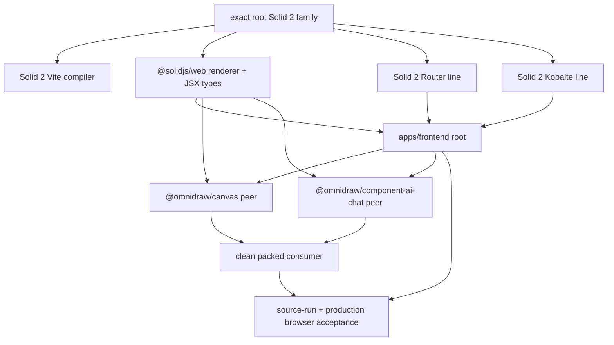

# S153 - frontend/canvas: hard-cut from Solid 1 to Solid 2
[Overview](../BASED.md)

Move the browser application and public Canvas host onto one qualified Solid 2
runtime, remove Solid 1-only source and generated-code assumptions, and prove
the cut through source-run, packed-package, and browser composition.

## Context

The migration authority is the vendored upstream
[`llm.MIGRATION.md`](../../docs/external/solid/llm.MIGRATION.md). Solid 2 is not
a source-compatible dependency bump. It moves the web renderer into
`@solidjs/web`, changes JSX type ownership, defers signal/store visibility to a
microtask flush, splits effect computation from application, removes
`onMount`, changes store setters to draft-first semantics, and removes several
DOM and context forms used here.

The requested implementation centers on
[`apps/frontend`](../../apps/frontend) and
[`packages/canvas`](../../packages/canvas), but those directories do not form
an isolated Solid runtime:

- The frontend source-runs `@omnidraw/canvas` and
  `@omnidraw/component-ai-chat` in the same render root. The AI Chat package
  imports `batch`, `onMount`, `solid-js/store`, and `solid-js/web`; leaving it
  on Solid 1 would make the migrated frontend load removed APIs from the same
  externalized peer runtime. This task therefore includes the minimum
  Solid-2 compatibility and release work in `packages/component-ai-chat`; it
  does not redesign AI Chat.
- `@omnidraw/canvas` is public and externalizes Solid. Its generated JSX,
  declarations, peer dependencies, standalone fixture, package qualification,
  and release marker must all agree with the host renderer. Passing only the
  workspace source build is insufficient.
- The root catalog, lockfile, public package set, packaging scripts, and clean
  consumer fixtures are part of the cut even though the product code stays in
  the owning application/package.

### Repository inventory

The 2026-08-20 scan found the following migration surface in the requested
directories:

| Surface | Current evidence | Solid 2 consequence |
| --- | --- | --- |
| Renderer/config | Both TS configs use `jsxImportSource: "solid-js"`; production and tests import `solid-js/web`; frontend imports `solid-js/store` | Use `@solidjs/web` for JSX/runtime/types and import stores from `solid-js` |
| Effects | 26 one-phase `createEffect` calls, including asynchronous loads, dialog resets, store writes, DOM subscriptions, Canvas runtime replacement, and theme synchronization | Compute dependencies without effects, perform writes/DOM/async launch in the apply phase, and return per-run cleanup |
| Lifecycle | 5 `onMount` calls in Canvas, trace controls, application bootstrap, widget catalog, and sidebar resources | Use owned `onSettled` setup and returned cleanup; refs are assigned by then |
| DOM JSX | 65 `on:*` handlers and 7 `classList` bindings | Use camel-case handlers and `class` object/array values; requalify propagation across roots and portals |
| Context/types | Two `.Provider` usages and one `JSX.Element` type imported from `solid-js` | Render the context itself as provider; import web JSX types from `@solidjs/web` or core `Element` for renderer-neutral contracts |
| Store | `createFrontendStore` forwards Solid 1 path setters, then immediately rereads the store to persist it | Use draft/storePath-compatible writes and persist from settled state; immediate post-set reads are stale in Solid 2 |
| Canvas activation | `Canvas.tsx` uses the removed effect initial-value argument and launches runtime replacement in the tracked function | Preserve the previous-key policy in compute output and run serialized replacement only in apply |
| Dev diagnostics | Several components seed signals from live props at component top level, and many effects write signals while tracking | Remove top-level reactive reads and owned-scope writes instead of suppressing diagnostics globally |

There are no current `Index`, `createResource`, `Suspense`, `use:` directive,
or `/*@once*/` migrations in the requested frontend/Canvas sources. Existing
ref callbacks only capture elements; none registers cleanup from the unowned
ref callback. Keep those non-problems out of the implementation unless the
compiler exposes a real case.

### Ecosystem constraint

Registry metadata was checked on 2026-08-20 because prerelease tags and peer
ranges are moving independently:

- [`solid-js`](https://www.npmjs.com/package/solid-js?activeTab=versions) and
  [`@solidjs/web`](https://www.npmjs.com/package/%40solidjs%2Fweb?activeTab=versions)
  had advanced to `2.0.0-rc.1` on the `next` tag.
- [`@solidjs/router`](https://www.npmjs.com/package/%40solidjs%2Frouter?activeTab=versions)
  `2.0.0-next.17` requires the RC.1 pair, while `2.0.0-next.16` accepts RC.0.
- [`@kobalte/core`](https://www.npmjs.com/package/%40kobalte%2Fcore?activeTab=versions)
  has only one Solid-2 build, `2.0.0-alpha.0`, and it pins both core and web to
  `2.0.0-rc.0` exactly.
- [`vite-plugin-solid`](https://www.npmjs.com/package/vite-plugin-solid?activeTab=versions)
  uses its `3.0.0-next.*` line for the Solid-2 compiler.
- The installed `lucide-solid` output is compiled against `solid-js/web`,
  `splitProps`, `mergeProps`, and the Solid-owned JSX namespace. No published
  Lucide Solid build declares Solid 2 compatibility.
- The installed `solid-devtools` line declares only Solid 1 and Vite through 7
  compatibility. Solid 2's release notes also warn that dev hooks are not yet
  a stable migration surface.

The newest coherent set available at investigation time is therefore the
exact RC.0 family: `solid-js@2.0.0-rc.0`,
`@solidjs/web@2.0.0-rc.0`, `@solidjs/router@2.0.0-next.16`,
`@kobalte/core@2.0.0-alpha.0`, and a matching
`vite-plugin-solid@3.0.0-next.*`. Tags must not enter manifests or the lockfile.
At implementation start, re-read peer metadata once and select the newest
single coherent family; do not mix RC.0 and RC.1 merely to use each package's
latest tag.

This is a subtraction because it deletes the Solid 1 compiler/runtime surface,
legacy JSX forms, obsolete lifecycle/effect shapes, and incompatible framework
adapters. It does not adopt Solid 2 async data APIs, redesign routes/dialogs,
change Canvas authority, or intentionally change the UI.

## Plan

One physical Solid core and one web renderer must own every application root,
Canvas component, AI Chat extension, portal, and test mount. No compatibility
alias, nested Solid 1 copy, or dual-renderer bridge is permitted.

### 1. Freeze the cut and make stale Solid 1 forms discoverable

- Record the currently green frontend and Canvas typechecks and run the focused
  unit/browser baselines before changing dependencies. Preserve unrelated
  failures as explicit evidence rather than weakening the migration gate.
- Add a focused architecture/source check for the migrated surfaces and packed
  declarations. Reject `solid-js/web`, `solid-js/store`,
  `solid-js/(jsx-runtime|jsx-dev-runtime)`, `jsxImportSource: "solid-js"`,
  `on:*` JSX, `classList`, `onMount`, and context `.Provider` after the cut.
  Do not use a filename allowlist for reactive behavior.
- Inventory every `createEffect`, component-top-level prop read, store write,
  and setter-then-read sequence. Classify intent before editing: pure
  derivation, side-effect subscription, local reset, async launch, or
  imperative read-after-write.
- Keep a temporary migration checklist in this task log rather than adding a
  permanent compatibility layer or codemod dependency.

### 2. Install one exact Solid 2 toolchain and renderer graph

- Re-resolve the ecosystem peer matrix once at implementation start. Pin the
  selected coherent prerelease versions exactly in the root catalog and every
  direct manifest; never use `latest`, `next`, `alpha`, caret ranges over a
  moving prerelease family, overrides that lie about peers, or `--force`.
- Add `@solidjs/web` as a direct frontend dependency. Make `solid-js` and
  `@solidjs/web` peer dependencies of both public Solid renderers, with matching
  dev dependencies so local tests compile against the same pair. Ensure
  Canvas and AI Chat bundlers externalize both packages and their subpaths.
- Move frontend, Canvas, AI Chat, Vitest, inspection, and standalone fixture
  compilation to the Solid-2 Vite plugin line. Set every web TS config's
  `jsxImportSource` to `@solidjs/web`.
- Move the frontend to the Solid-2 Router and Kobalte lines selected by the
  matrix. Exercise only the currently used primitives; do not absorb unrelated
  upstream API redesigns.
- Remove `solid-devtools`, its Vite plugin, and the dynamic development import
  until an upstream version explicitly supports the selected Solid 2 pair.
  Preserve ordinary Vite HMR and use Solid 2 dev diagnostics for migration
  qualification.
- Remove `lucide-solid`. Generate or author the small set of used icons as
  package-local Solid-2-native SVG components from the licensed
  framework-neutral Lucide data. Keep only used icon nodes, preserve accessible
  passthrough props and current sizing/stroke behavior, and do not ship a
  runtime SVG parser, all-icons registry, or private cross-application package.
- Regenerate `bun.lock` and assert that the application/packed consumer resolves
  one `solid-js`, one `@solidjs/signals`, and one `@solidjs/web` version. A
  transitive Solid 1 copy is a failed cut, not a warning to ignore.

### 3. Perform the mechanical API and JSX migration

- Replace production and test `render`/`Portal` imports with `@solidjs/web` and
  move store APIs to `solid-js`. Move web `JSX`/`ComponentProps` types to
  `@solidjs/web`; use `Element` from `solid-js` only where a public contract is
  intentionally renderer-neutral.
- Replace the two context provider wrappers with the context-as-provider form.
  Retain domain-named `useFrontendRuntime`/`useWidgetCatalog` helpers if useful,
  but remove redundant `undefined` narrowing because a default-less Solid 2
  context throws `ContextNotFoundError` itself.
- Convert all `on:*` handlers to supported camel-case handlers. Verify that
  toolbar/selection controls still stop pointer, wheel, and keyboard events
  before they reach Cangine and that nested Canvas/AI Chat render roots and
  portals do not synthesize cross-root delegated events.
- Replace every `classList` with a `class` array/object expression while
  preserving base classes, CSS-module names, active/attention/recording states,
  and falsy optional classes.
- Replace `onMount` with `onSettled`. Co-locate setup and teardown in the
  returned cleanup for document/window listeners, timers, subscriptions,
  application bootstrap, widget catalog streams, and Canvas input ownership.
  Keep element capture in refs and lifecycle ownership in the component scope.
- Remove obsolete helper imports and update README examples, Canvas public
  component types, standalone fixture imports, and generated declaration
  expectations to the new renderer ownership.

### 4. Migrate reactive semantics instead of papering over them

- Rewrite all one-phase effects as explicit compute -> apply effects. Compute
  functions may read and return immutable intent only. Signal/store writes,
  DOM changes, subscriptions, navigation, RPC launches, and runtime lifecycle
  calls belong in apply functions or event/action handlers.
- For dialog/form reset effects, compute a reset key/input snapshot and apply
  the local setters together. Do not opt broad application state into
  `ownedWrite`; any narrow internal exception requires a comment and a test
  proving why an apply phase cannot own it.
- For route/resource/widget/database loads, compute the request identity and
  apply the cancellable launch. Preserve current generation fencing, stale
  response rejection, Effect-owned timers, and component-disposal cleanup.
  Solid transitions must not become a second request authority.
- In `Canvas.tsx`, make runtime activation a pure computation over source,
  container readiness, and the previous activation key. Apply
  `lifecycle.replace` only for a `shouldReplace` result. Replace the removed
  effect initial-value argument with an explicit first-run default and retain
  serialized, idempotent disposal.
- Split Canvas trace-listener and theme synchronization effects. Return the
  exact subscription/listener cleanup from the apply phase; do not mutate
  theme revision while tracking or leave an old theme subscriber alive during
  replacement.
- Split the Selection Style normalization effect so its tracked computation
  cannot call `endOpacity` or write `fontSizeFactor`. Preserve continuous
  opacity transaction boundaries and selection-change cancellation.
- Remove top-level live prop reads. Use a derived memo when a value must track,
  `untrack` only for a deliberate one-time seed, and apply-phase reset logic
  for dialogs and controls that reinitialize when opened.
- Redesign `createFrontendStore` around Solid 2 draft setters. Prefer an
  explicit application store write surface; use `storePath` only as a bounded
  bridge if keeping the existing path call sites materially reduces risk.
  Persist a plain `snapshot` from settled reactive state instead of calling a
  setter and immediately serializing stale reads. Keep Canvas identities
  backend-authoritative and excluded from browser persistence.
- Audit imperative read-after-write sites in theme memory, sidebar toggles,
  selection/toolbar interactions, trace state, and tests. Refactor production
  logic to pass the computed next value forward. Reserve `flush()` for a truly
  synchronous external boundary or a focused test, with a comment explaining
  the contract; do not scatter it after setters to recreate Solid 1 globally.

### 5. Cut the shared AI Chat and ecosystem boundary with the app

- Apply the same import, JSX, lifecycle, effect, batching, store, context, DOM,
  and test rules to the minimum `@omnidraw/component-ai-chat` surface required
  by frontend composition. Preserve its Effect-free public injected contract,
  stream cancellation, approvals, editor behavior, and Canvas extension ABI.
- Replace AI Chat `batch` calls with ordinary Solid 2 batched writes and fix any
  immediate reads by carrying next values or using a narrowly justified
  boundary. Convert `reconcile`/store writes to the Solid 2 draft-first API.
- Qualify Kobalte dialogs, menus, tabs, text fields, scroll areas, and toasts in
  the frontend, including focus return, Escape handling, outside click,
  keyboard traversal, portals, and controlled open/value changes.
- Qualify Router navigation and search-parameter updates for direct Canvas,
  resource, and widget routes, back/forward navigation, lazy route modules,
  and disposal. Router state remains the navigation authority.
- If the selected Kobalte build cannot share the exact selected core/web pair,
  stop and update the whole matrix or replace only the used primitives with
  owned accessible components. Never install two Solid runtimes or carry a
  peer override as the solution.

### 6. Update tests for deferred visibility and root-scoped events

- Move all component tests to `@solidjs/web` render and a shared settled-update
  helper. Await the real microtask/effect boundary for behavior tests; call
  `flush()` only where the test intentionally asserts an imperative
  synchronous boundary.
- Add focused frontend-store tests proving that one write and a burst of writes
  persist the newest settled theme/sidebar state exactly once and never persist
  backend canvas identities. Add theme-memory tests for rapid appearance
  changes without stale reads.
- Extend Canvas tests around runtime replacement, theme subscription cleanup,
  trace subscription/timer teardown, selection-style reset, pointer capture,
  toolbar event containment, and two simultaneous Canvas roots.
- Extend frontend component tests around form reset/open transitions, async
  request generation fencing, route/search-param effects, Kobalte focus/portal
  behavior, catalog stream cleanup, and HMR/root disposal.
- Add a development-mode browser smoke that fails on uncaught exceptions and
  Solid dev diagnostics, then navigates welcome -> Canvas -> resource -> widget,
  opens representative dialogs/toasts, interacts with the toolbar, mounts an
  AI Chat extension, and tears the application down. Production build success
  alone cannot detect top-level-read warnings or owned-scope write errors.
- Re-run the existing frontend conformance/simulation suites. Do not introduce
  real time, browser globals, or Solid scheduling as new ordering authorities
  in deterministic core/sim code.

### 7. Qualify public distributions and make the breaking release explicit

- Update `scripts/public-packages.ts`, architecture boundaries,
  `verify-package-dists`, packed composition scripts, Canvas consumer fixtures,
  external-composition fixtures, and `public-package-set.json` for the exact
  Solid 2 core/web/compiler expectations.
- Extend packed-consumer checks from one shared `solid-js` path to one shared
  `solid-js`, `@solidjs/signals`, and `@solidjs/web` graph. Inspect emitted JS
  and declarations to ensure no `solid-js/web`, `solid-js/store`, or Solid-owned
  JSX namespace remains.
- Because Canvas public runtime/generated output and its peer contract change,
  reserve the next unpublished breaking `0.x` release (expected `0.8.0`), update
  its package version and README compatibility line, update
  `public-package-set.json`, and regenerate the lockfile. If AI Chat changes in
  this coordinated cut, give it its own next unpublished semantic version
  (expected `0.2.0`). Never republish an existing version.
- Run, in increasing scope: Canvas typecheck/test/build; AI Chat
  typecheck/test/build; frontend typecheck/unit/build/inspection verification;
  public build and architecture checks; source-run build stability; packed
  public composition; packed Canvas browser smoke; frontend conformance; and
  the live browser acceptance suite.
- Compare representative before/after screenshots and keyboard/pointer flows.
  This task has no intended visual change, so any layout, icon geometry,
  focus-ring, portal stacking, or Canvas interaction difference is a regression
  unless separately approved.

## TODOS

- [ ] Record the green Solid 1 baseline and add stale-Solid-1 source/dist guards
- [ ] Select and pin one exact coherent Solid 2 core/web/compiler/router/Kobalte family
- [ ] Update root, frontend, Canvas, AI Chat, Vitest, inspection, and fixture dependency/config graphs
- [ ] Remove Solid-1-only devtools and replace `lucide-solid` with bounded Solid-2-native icons
- [ ] Migrate renderer/store imports, JSX type ownership, contexts, DOM events, classes, and lifecycle APIs
- [ ] Split every migrated effect into pure compute and side-effect apply phases
- [ ] Redesign frontend store persistence and audit every imperative setter/read boundary
- [ ] Apply the minimum coordinated Solid 2 migration to the AI Chat package used by frontend
- [ ] Update component tests and add dev-diagnostic, deferred-write, event-root, and cleanup regressions
- [ ] Update public package qualification, packed fixtures, declarations, release markers, and lockfile
- [ ] Pass focused package, frontend, conformance, architecture, packed-consumer, and live browser gates
- [ ] Record final versions, commands, browser evidence, and any approved behavior change in this task log

## NOTES

- No mockup is needed: the intended product behavior and appearance are
  unchanged. Existing screen and browser baselines are acceptance evidence.
- The local migration documentation is currently untracked input and was not
  modified during planning.
- Both requested package typechecks passed before planning on 2026-08-20:
  `bun run --cwd packages/canvas typecheck` and
  `bun run --cwd apps/frontend typecheck`.
- Kobalte is the present version-selection constraint. Prefer a later coherent
  family if one exists when implementation starts, but record exact peer
  metadata and lock exact versions before editing source.
- A temporary loss of Solid devtools is acceptable for the framework cut; a
  second Solid 1 runtime, peer override, or permanent compatibility shim is
  not.
- Solid 2's larger full runtime makes the existing production chunk/packed
  checks relevant. Measure the actual tree-shaken frontend and Canvas outputs;
  do not reject the migration solely from upstream whole-package numbers.

### LOGS

- 2026-08-20: Read the complete Solid 2 migration guide, repository and Canvas
  authorities, package/build/test configuration, public package qualification,
  and existing S-task format.
- 2026-08-20: Counted 26 one-phase effects, 5 `onMount` sites, 65 `on:*`
  handlers, 7 `classList` bindings, two context providers, old store/web import
  paths, and the Canvas effect initial-value dependency across frontend/Canvas.
- 2026-08-20: Verified current npm peer metadata. The newest coherent family
  was RC.0 because Kobalte `2.0.0-alpha.0` pins RC.0 while the newest Solid and
  Router prereleases had advanced to RC.1.
- 2026-08-20: Confirmed that current Lucide Solid output and Solid devtools are
  compiled/peered to Solid 1, and that AI Chat must join the cut because it is
  rendered in the same frontend root and imports removed Solid 1 APIs.
- 2026-08-20: Ran the current Canvas and frontend typechecks successfully and
  created this implementation plan without changing runtime code.

---
