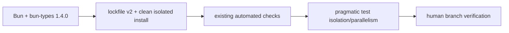

# S154 - toolchain: update to Bun 1.4 and simplify build/test workflows
[Overview](../BASED.md)

Move every repository-owned Bun pin to 1.4.0, qualify the rewritten runtime
against Omnidraw's native database, PTY, browser, WebSocket, child-process,
and package surfaces, and adopt the Bun 1.4 workflow improvements that plainly
reduce install or test work.

## Context

The [Bun 1.4 release](https://bun.com/blog/bun-v1.4) is unusually broad. Bun
was rewritten from Zig to Rust, reports Node.js 26 compatibility, adds 1,517
Node test-suite cases, fixes more than 2,900 issues, and reports lower startup,
CPU, and memory costs. The directly relevant additions are isolated installs
backed by a global virtual store, parallel and isolated test execution, test
timings, package deduplication checks, Markdown CPU/heap profiles, and stronger
process/stream/network behavior.

Omnidraw is pinned consistently but still on 1.3.14:

| Surface | Current state | Bun 1.4 obligation |
| --- | --- | --- |
| Root toolchain | [`package.json`](../../package.json) declares `packageManager: "bun@1.3.14"` and `bun-types: ^1.3.14` | Pin runtime and types to the same exact 1.4.0 contract |
| CI | [`.github/workflows/test.yml`](../../.github/workflows/test.yml) installs 1.3.14 | Run the complete clean acceptance path on 1.4.0 |
| Clean container | [`final-acceptance.Dockerfile`](../../scripts/docker/final-acceptance.Dockerfile) installs and asserts 1.3.14 | Qualify the Linux runtime and native dependencies on 1.4.0 |
| Lock/install layout | [`bun.lock`](../../bun.lock) is lockfile version 1 with config version 1; the current install uses `node_modules/.bun` | Regenerate version 2 without dependency drift and prove the isolated/global-store layout on a clean install |
| Test orchestration | Root workspace typechecks and tests are forced through `bun run --sequential`; Bun-owned test suites run without `--isolate` or timing evidence | Try isolation and parallelism only on independent lanes and keep the change when it is clearly faster and stable |

This is a compatibility-sensitive runtime change, not only a package-manager
bump:

- Bun 1.4 reports Node module ABI 147. The backend loads the native
  `@tursodatabase/database` binding through
  [`turso-native.ts`](../../apps/backend/src/shell/database/DbServiceTurso/turso-native.ts),
  so a successful install is insufficient; the exact database feature and WAL
  gates must open and exercise the addon on supported hosts.
- [`AgentBashCapability.ts`](../../apps/backend/src/shell/agent/AgentBashCapability.ts)
  relies on `Bun.Terminal` and `Bun.spawn()` for PTY output, resize, signals,
  cancellation, timeout, and bounded retention. Bun 1.4 improves the PTY and
  child-process implementation, but its behavior must remain exact.
- The backend owns long-lived Bun subprocesses, process-group teardown,
  streams, file watchers, and `Bun.serve()` for the verified Preview shell.
  The frontend and source-run CLI depend on native WebSocket, `fetch`, abort,
  and reconnect semantics.
- Preview inspection and browser acceptance use Playwright and an installed
  Chromium. Bun 1.4 newly supports Playwright running under Bun, which makes
  the existing arrangement better supported but does not make it equivalent
  to `Bun.WebView`.

The task must preserve the architecture authorities: Effect continues to own
the backend's only physical application server and lifecycle; controlled
Layers continue to own time and scheduling in simulation; public browser
packages remain host-neutral; and the supported package/build/browser
checks remain authoritative. A human will review and manually verify the
branch before merge, so this task should not construct a second exhaustive
qualification framework around the existing gates.

## Plan

### 1. Upgrade one exact toolchain

- Change the root `packageManager`, root `bun-types`, GitHub Actions setup,
  and final-acceptance Docker argument to exact `1.4.0`. Do not leave a range
  that can make runtime types newer than the executable.
- Regenerate `bun.lock` with Bun 1.4 so it uses lockfile version 2. Preserve
  resolved application dependencies except for the intentional `bun-types`
  update; investigate every other lockfile resolution change instead of
  accepting a broad refresh.
- Preserve the current isolated-linker policy and prove that a clean install
  uses Bun 1.4's shared global virtual store. Add an explicit root linker
  setting only if the lockfile does not make the existing policy deterministic;
  do not change to hoisted layout.
- Run a second frozen install after regeneration and prove it leaves the
  lockfile and tracked tree unchanged. Exercise the local-registry link/reset
  workflow so lockfile-version changes do not bypass its public-URL sanitizer.
- Use `bun pm diff bun-types@1.3.14 1.4.0` as review evidence. Run
  `bun audit fix --dry-run` and `bun pm licenses --prod --json` for a baseline,
  but do not automatically mutate dependencies or invent a license policy in
  this task.

### 2. Qualify Bun 1.4 where Omnidraw actually depends on it

- Run the repository's existing test and final-acceptance commands under Bun
  1.4. Let those established gates cover database, package, browser, transport,
  and architecture behavior instead of duplicating their matrices here.
- Run focused smoke checks for the highest-risk runtime integrations: load and
  use the Turso native database, exercise Agent Bash through `Bun.Terminal`,
  start and stop a disposable function child, and launch Playwright Chromium.
- Start the development stack, use the application normally, reconnect once,
  and manually exercise a widget Preview and Bash command. Record any visible
  regression for repair before merge.
- Treat a native-addon load failure, broken PTY/process cleanup, browser launch
  failure, or complete existing-gate failure as a blocker. Do not require a
  bespoke cross-platform/repetition suite beyond CI and the human branch
  review.

### 3. Remove avoidable serial test work

- Record a simple before/after wall time for the affected test command. Use Bun
  1.4 `--timings` temporarily when it helps identify slow files; do not commit
  a machine-local timings file.
- Change Bun-owned suites to `bun test --isolate` where each file is intended
  to be independent. Fix genuine leaked globals, module state, ports, timers,
  watchers, servers, and subprocesses rather than opting the whole repository
  out. Keep an explicitly documented narrow exception only when cross-file
  state is an intentional contract.
- Evaluate a bounded `bun test --parallel=2 --isolate` first for backend and
  other large Bun-owned suites. Keep it when one complete local run and CI are
  clean and it is meaningfully faster. Allocate ports, databases, and temp
  roots per worker using `BUN_TEST_WORKER_ID` only where a real collision
  exists.
- Replace root `bun run --sequential` for workspace typechecks with
  `bun run --parallel` after proving the lanes are read-only and independent.
  Do not parallelize `build:public`: Theme/Canvas Contract/Canvas/AI Chat have
  a real package dependency order. Do not parallelize the whole workspace test
  command if frontend builds or package qualification share output paths.
- Keep `--changed` as an optional developer shortcut only. Never use it for
  final acceptance, and do not use `--retry` to hide nondeterminism.
- Record the before/after command and approximate result in this task. Drop a
  concurrency change if it makes the suite flaky, harder to understand, or
  slower.

### 4. Adopt small package and diagnostic improvements

- Add `bun dedupe --check` after the frozen CI install if it is stable with the
  catalog/workspace/public-lockfile workflow. A failure should require an
  intentional lockfile dedupe, not a CI-time mutation.
- Use `--cpu-prof-md` or `--heap-prof-md` only when the upgrade exposes an
  actual performance or memory problem. Do not add permanent profiling scripts
  or ambient memory-pressure policy speculatively.

### 5. Keep attractive but unsuitable replacements out

- Do not replace Playwright with `Bun.WebView` in this task. The production
  inspection service and live acceptance use isolated contexts, rich locators,
  keyboard/mouse APIs, request/response/console/error events, runtime identity,
  and a qualified Chromium revision. Replacing only the simple smoke test
  would retain both stacks and remove nothing.
- Do not replace the pure bounded PNG validator with `Bun.Image`. Omnidraw is
  validating adversarial bytes and exact structure, not resizing or
  transcoding images. Reconsider `Bun.Image` only when a shell-owned thumbnail
  or conversion feature exists.
- Do not move AI Chat Markdown parsing to `Bun.markdown`; the public component
  runs in browsers, owns a narrow structured renderer and URL policy, and must
  remain Bun-independent.
- Do not replace Effect/simulation timers with `Bun.cron()`, or the Effect HTTP
  server with `Bun.serve()` directory routes. The Preview shell also requires
  token-bound, digest-verified exact bytes that generic directory serving
  cannot authorize.
- Do not add experimental HTTP/3, production source maps, standalone binary
  compilation, or bytecode. Omnidraw has removed binary distribution, and none
  of these features removes current machinery or satisfies a current product
  requirement.

## TODOS

- [ ] Pin Bun and bun-types to exact 1.4.0 in local, CI, and Docker surfaces
- [ ] Regenerate lockfile version 2 without unrelated dependency drift
- [ ] Prove frozen isolated/global-store installs and local-registry sanitation
- [ ] Run existing gates plus focused Turso, PTY, child, and browser smoke checks
- [ ] Adopt useful Bun test isolation and bounded parallel lanes
- [ ] Parallelize only independent workspace typechecks
- [ ] Add a stable `bun dedupe --check` CI gate
- [ ] Record a simple before/after test time
- [ ] Pass normal CI and complete human branch verification

## Acceptance criteria

- `package.json`, GitHub Actions, final-acceptance Docker, and `bun-types` all
  name exact Bun 1.4.0; no active toolchain surface remains on 1.3.14.
- `bun.lock` is version 2, retains the intended isolated layout and public npm
  URLs, contains no unexplained dependency refresh, and is unchanged by a
  second Bun 1.4 frozen install.
- The existing repository test/final-acceptance commands pass, and focused
  Turso, PTY, disposable-child, and Playwright smoke checks work under Bun 1.4.
- Adopted isolation/parallelism is understandable, passes locally and in CI,
  and is visibly faster. Serial dependency-ordered builds remain serial.
- CI checks lockfile publication and deduplication without mutating the tree.
  Dependency vulnerability or license findings are recorded for separate
  policy work rather than silently fixed here.
- No `Bun.WebView`, `Bun.Image`, `Bun.markdown`, `Bun.cron`, generic static
  directory server, HTTP/3, bytecode, or standalone-binary migration is added.
- No public package version bump is made for toolchain, test, build-script, or
  private-backend-only changes. If public runtime source changes unexpectedly,
  stop and apply the repository's semantic-version rule explicitly.
- A human manually verifies the branch's development stack, application
  navigation/reconnect, widget Preview, and Bash behavior before merge.

## NOTES

- This is a subtraction because the upgrade is used to remove serial test
  time and duplicate install copies—not to add parallel infrastructure or a
  second browser, scheduler, server, image, or Markdown stack.
- Bun 1.4's production CPU/memory numbers are upstream benchmarks, not an
  Omnidraw guarantee. Omnidraw measurements decide whether an optional adoption
  remains in the task.
- The existing lockfile's `configVersion: 1` and `node_modules/.bun` layout are
  evidence that this checkout already uses the isolated linker. Verify the
  clean behavior before adding configuration.
- The official `bun-types@1.4.0` package exists on npm. Keep it exact so APIs
  such as `Bun.Terminal` and the test flags are checked against the deployed
  executable.

### LOGS

- 2026-08-20: Created from the official Bun 1.4 release notes and a repository
  inventory. Planning/report only; no runtime, package, configuration, lockfile,
  CI, or application code changed.
- 2026-08-20: Removed all build-tool adoption work because the Bun build path
  will be removed separately. Reduced qualification to existing gates, focused
  smoke checks, and final human branch verification.

---
