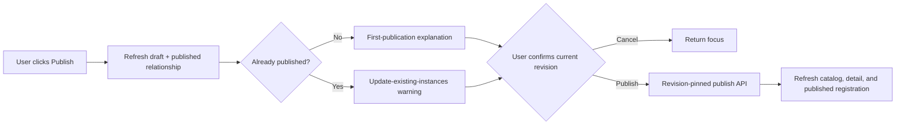

# S99 - widget publish: explicit confirmation from Preview and draft detail
[Overview](../BASED.md)

Make publication an unmistakably user-owned action: expose **Publish** in a draft Preview title bar and require the same explanatory confirmation dialog there and on the draft detail page.

## Context

The supplied Preview reference shows the target frame and title-bar location. Draft Preview frames are registered in [`packages/ai-chat/src/canvas-extension/DraftPreview.plugin.ts`](../../packages/ai-chat/src/canvas-extension/DraftPreview.plugin.ts), rendered through [`packages/ai-chat/src/draft-preview/DraftPreviewFrameService.ts`](../../packages/ai-chat/src/draft-preview/DraftPreviewFrameService.ts), and already use the generic hosted-widget title-action infrastructure in [`packages/ai-chat/src/widget/attach-dom-portal.ts`](../../packages/ai-chat/src/widget/attach-dom-portal.ts).

The draft detail header in [`packages/ai-chat/src/sidebar/widgets/WidgetDetailPage.tsx`](../../packages/ai-chat/src/sidebar/widgets/WidgetDetailPage.tsx) currently publishes immediately. Both entry points must instead open one consistent confirmation flow. The copy must be derived from current catalog/detail state: first publication explains that the draft will become available as a published widget; republishing explains that the published definition and all existing canvas instances will be updated. Publication remains revision-pinned and must not proceed from stale UI state.

The model has no publish tool, but [`packages/service-agent/src/prompts/prompt.tools.md`](../../packages/service-agent/src/prompts/prompt.tools.md) should be more explicit about the user path: a draft can only be published by the user through **Publish** in its Preview title bar or draft detail page.

## Plan

### 1. Define one publication confirmation contract

- Add a shared AI Chat publication-confirmation helper/component or coordinator that both Preview and widget detail can invoke without duplicating copy or result handling.
- Resolve whether the draft already has a published sibling from authoritative widget catalog/detail data at dialog-open time, not from Preview age or button history.
- For a first publication, explain that validation runs and the draft becomes a published toolbar/widget definition.
- For an update, explicitly warn that publication replaces the existing published definition and reloads/updates all existing canvas instances while preserving their instance identity/data according to the existing publication behavior.
- Show the widget display name and expected draft revision, use **Publish** as the confirm label, and provide **Cancel** with focus restoration.
- Keep validation errors, stale revision, permission failure, publication failure, recovery failure, progress, and success distinguishable. Never close as success when the API returns `published: false`.

### 2. Add Publish to the draft Preview title bar

- Register a **Publish** title-bar action for `DRAFT_PREVIEW_WIDGET_KIND`, positioned with the generic title actions before the three-dot host menu in contained and fullscreen modes.
- Bind the action through the existing title-bar portal during Preview mount; do not place publication controls inside guest widget content.
- Open the shared confirmation flow for the Preview payload's draft identity and the latest authoritative draft revision.
- Disable the title action while draft/catalog state is loading, the dialog is open, or publication is running; expose an accessible busy label/state.
- If the Preview is pinned to an older revision, explain that publication targets the current draft revision and require the user to refresh/reconfirm rather than silently publishing stale Preview content.
- After success, refresh widget catalogs/registration and leave the Preview in a clear current/stale state without remounting unrelated widget content.

### 3. Require the dialog on draft detail

- Replace the draft detail page's immediate `publish` handler with the same confirmation flow.
- Use `TWidgetDetail.relation`/published sibling state to choose first-publish versus update copy dynamically.
- Re-read detail before confirmation or submission so navigation, rename, validation, and revision changes cannot publish the wrong draft.
- Preserve existing notifications and refresh behavior, but centralize publication result mapping so Preview and detail communicate failures consistently.
- Keep published detail pages unchanged: they continue to offer **Edit as draft**, not direct publication.

### 4. Make the AI publication boundary explicit

- Update the widget system prompt to state that the AI cannot publish a draft and must not imply that validation publishes it.
- Tell the AI that only the user can publish by clicking **Publish** in the draft Preview title bar or draft detail page and confirming the dialog.
- Add prompt-contract assertions so future prompt edits cannot reintroduce model-callable publication or ambiguous “ready means published” language.

### 5. Verify the trusted user flow

- Add focused tests for title-action registration, contained/fullscreen dispatch, disabled/busy state, cleanup, and no publication without a direct user click plus confirmation.
- Cover first-publish and republish dialog copy, including the existing-instance update warning only when a published sibling exists.
- Cover cancel, stale revision, validation failure, transport/publication/recovery failure, duplicate clicks, and success refresh from both entry points.
- Verify the latest draft revision is submitted and that an older pinned Preview cannot silently publish what it displays.
- Run AI Chat tests/typecheck, service-agent prompt tests/typecheck, functional-core checks, and the relevant frontend build. Refresh [`docs/internal/screens/SCREENS.md`](../../docs/internal/screens/SCREENS.md) after implementation if the Preview capture changes materially.

## TODOS

- [x] Create one shared, dynamically worded publication-confirmation flow.
- [x] Add the Publish title action to draft Preview frames.
- [x] Wire Preview publication to current draft/catalog state and expected revision.
- [x] Replace direct draft-detail publication with the shared dialog.
- [x] Refresh catalog, detail, Preview state, and published registration after success.
- [x] Update the AI system prompt with the Preview/detail user-button boundary.
- [x] Add focused confirmation, publication-result, title-action, and prompt tests.
- [x] Run relevant tests, typechecks, functional-core checks, and frontend build.
- [x] Update the screen atlas if implementation materially changes its Preview image.

## Acceptance criteria

- Every draft Preview frame exposes **Publish** in its host title bar before the three-dot menu in contained and fullscreen modes.
- Clicking Preview **Publish** opens a confirmation dialog; it never publishes immediately.
- Clicking **Publish** on a draft detail page opens the same confirmation dialog.
- First-publication copy and republish copy are selected from current authoritative state.
- Republish copy clearly says that existing canvas instances will be updated.
- Publication requires a direct user click, explicit confirmation, and the expected current draft revision.
- Cancel, stale revisions, validation blockers, failures, and success are clear and consistent at both entry points.
- The AI has no publication tool and its system prompt directs users to the Preview title bar or draft detail **Publish** button.
- Existing Preview interaction, fullscreen behavior, draft detail navigation, and widget content remain intact.

## NOTES

- The supplied 642×554 PNG was stored as an 11,466-byte lossless WebP (`S99.webp`) instead of the 38,161-byte source.
- “Existing instances” means instances of an already published definition; Preview actor instances are temporary and are not the warning's subject.
- Do not infer republish state solely from a pinned Preview revision. Use current draft/published relationship data.

### LOGS

- 2026-07-20: Created the plan from the supplied draft Preview reference; no product code changed.
- 2026-07-21: Added the shared authoritative, revision-pinned publication dialog to draft Preview host chrome and draft detail, including first-publish/update copy, stale Preview refresh/reconfirmation, result-specific failures, catalog/Preview refresh, and focused tests.
- 2026-07-21: Clarified the AI publication boundary, refreshed the screen-atlas description and file index, and verified AI Chat tests/typecheck, service-agent prompt tests/typecheck, functional-core lint, and the frontend production build.
- 2026-07-21: Applied browser review feedback: authoritative published-sibling state now changes the action label to Republish, technical revision hashes were removed from user-facing Preview/publication copy, draft sidebar rows gained theme-aware warning tinting, and publication buttons gained filled theme-aware emphasis. Verified the resulting dark and light UI in the local app.
- 2026-07-21: Refined browser feedback: draft sidebar rows now use warning-colored text and icons without a persistent fill, draft placement tools use an explicit warning tone in the canvas toolbar, and publication dialog actions have wider spacing and consistent target sizes. Verified the resulting light and dark UI in the local app.
- 2026-07-21: Fixed draft-detail header action spacing at narrow content widths by preventing action shrinkage and preserving explicit inline padding for Publish/Republish while keeping the sidebar toggle compact.

---
